# Diagrama de Arquitectura - Antartur

**Versión:** 2.0  
**Última actualización:** Enero 2025  
**Arquitectura:** Clean Architecture orientada a features

---

## Arquitectura General

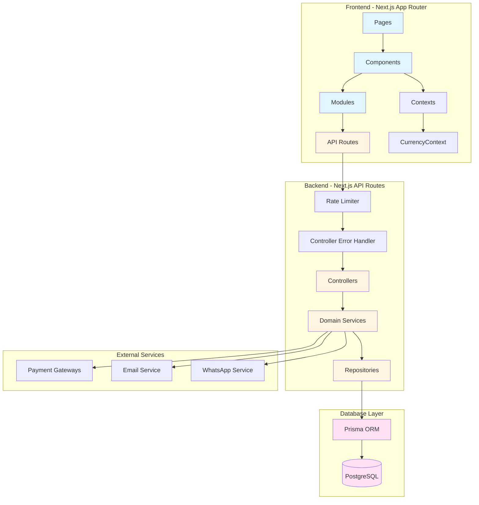

**Nota:** El handler layer fue eliminado en diciembre 2024. Los controllers se llaman directamente desde las API routes con `withControllerErrorHandler`.

---

## Flujo de Datos - Creación de Reserva

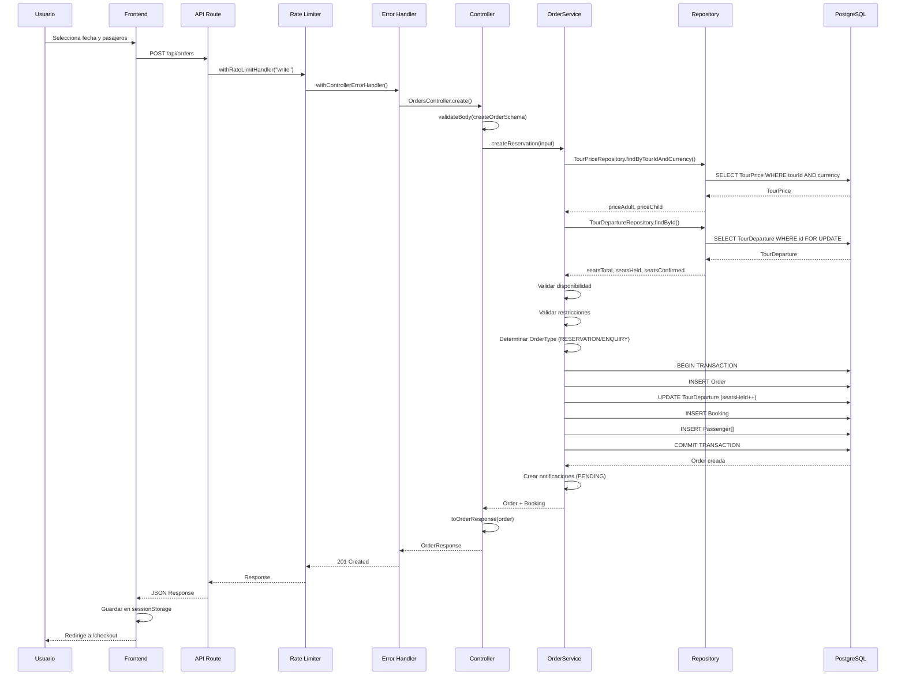

---

## Estructura de Módulos (Actualizada - Sin Handler Layer)

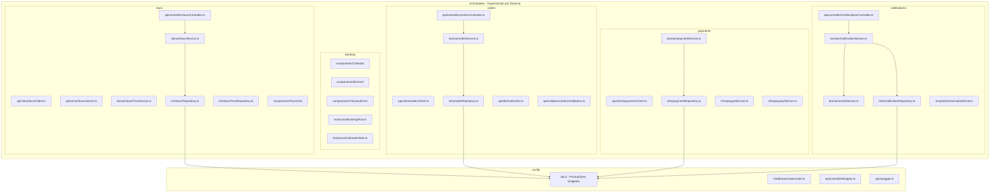

**Cambios clave:**
- ✅ Handler layer eliminado (diciembre 2024)
- ✅ Controllers llaman directamente a Domain Services
- ✅ API clients organizados por dominio
- ✅ Domain services contienen lógica de negocio
- ✅ Repositories solo acceden a datos

---

## Flujo de Autenticación (JWT + Refresh Tokens)

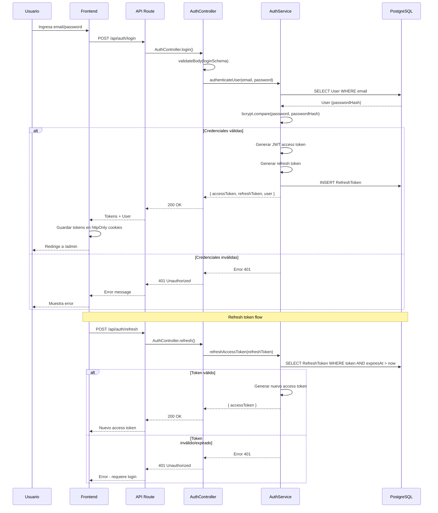

---

## Flujo de Pago - PayPal

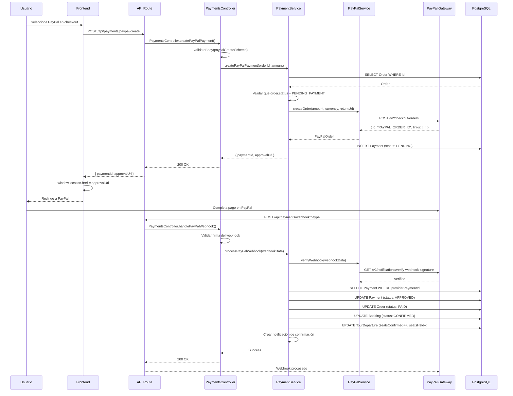

---

## Flujo de Pago - Payway

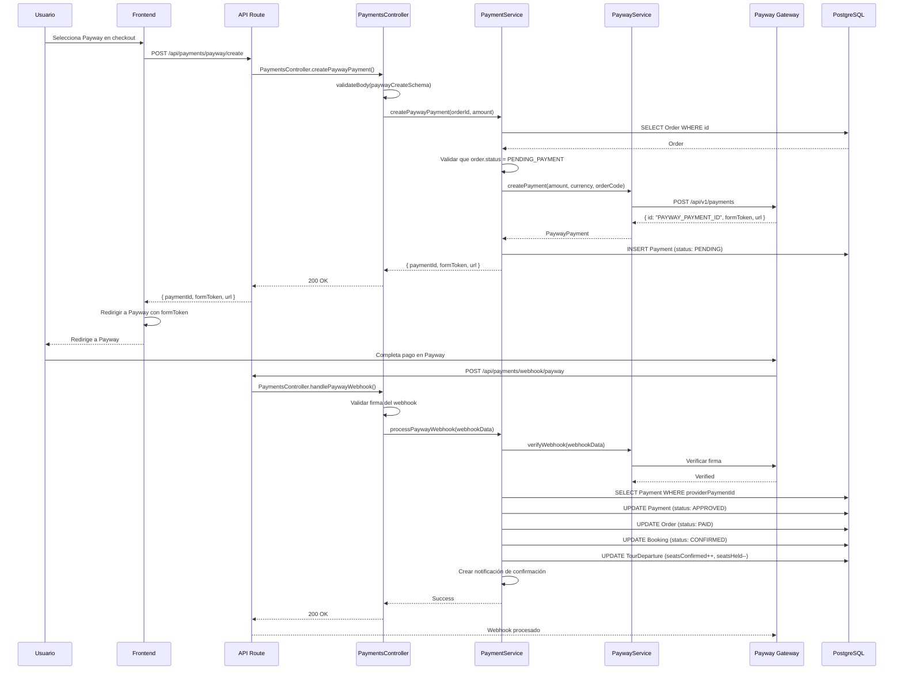

---

## Flujo de Pago - Transferencia Bancaria

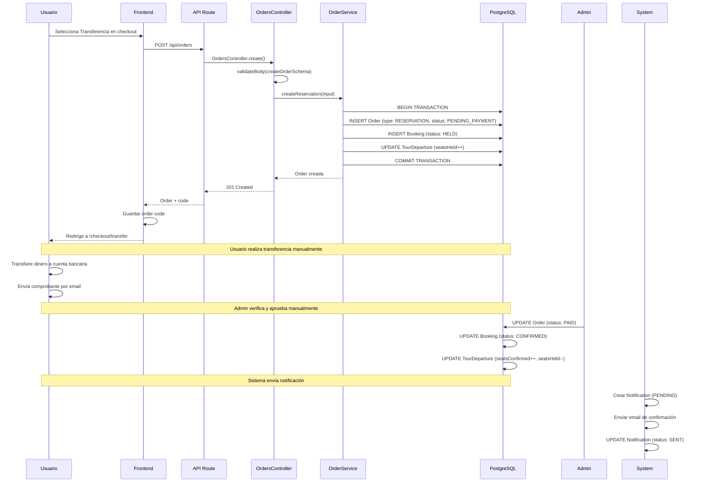

---

## Flujo de Notificaciones con Reintentos

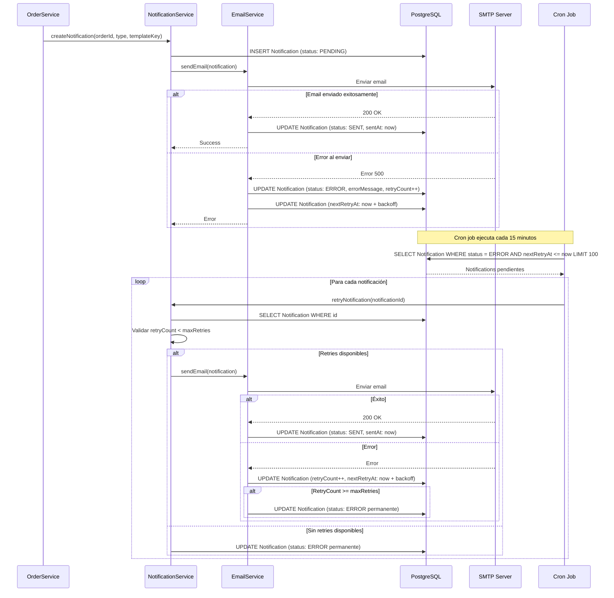

---

## Flujo de Expiración de Órdenes

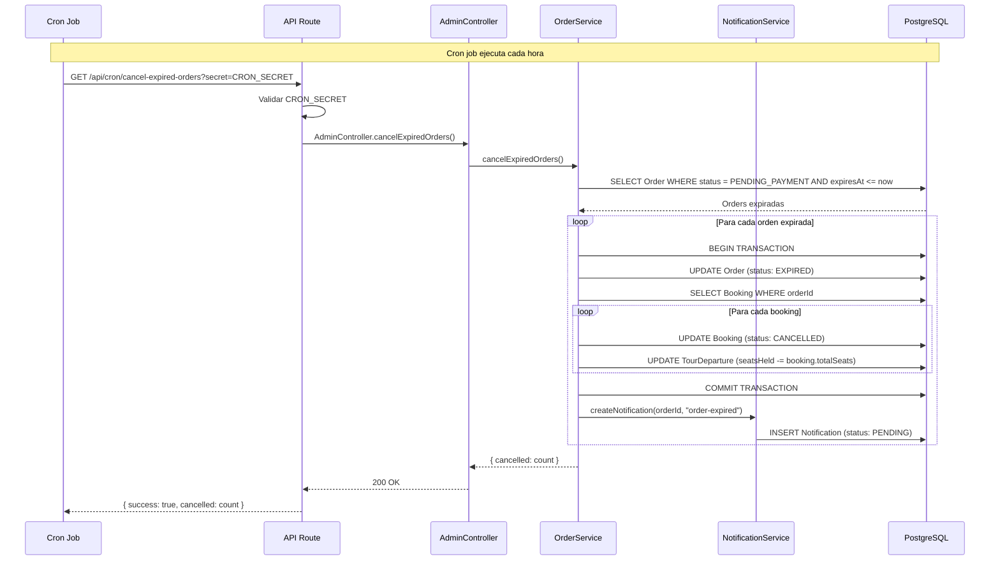

---

## Arquitectura de Capas

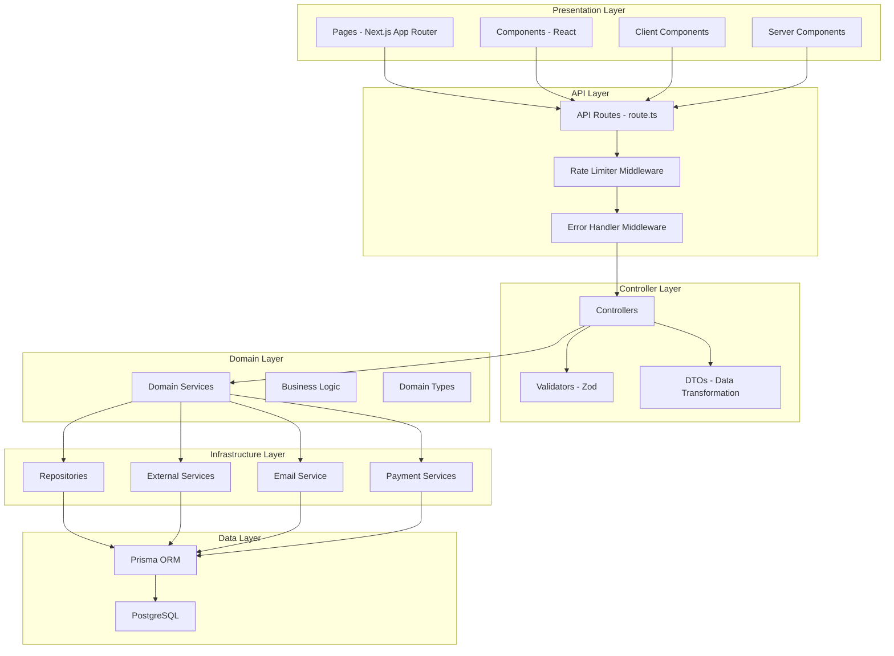

**Principios:**
- **Separación de responsabilidades**: Cada capa tiene una responsabilidad clara
- **Dependencias unidireccionales**: Las capas superiores dependen de las inferiores
- **Domain-driven**: La lógica de negocio está en Domain Services
- **Infrastructure agnostic**: Domain no conoce detalles de implementación

---

## Flujo de Precios por Moneda (Frontend)

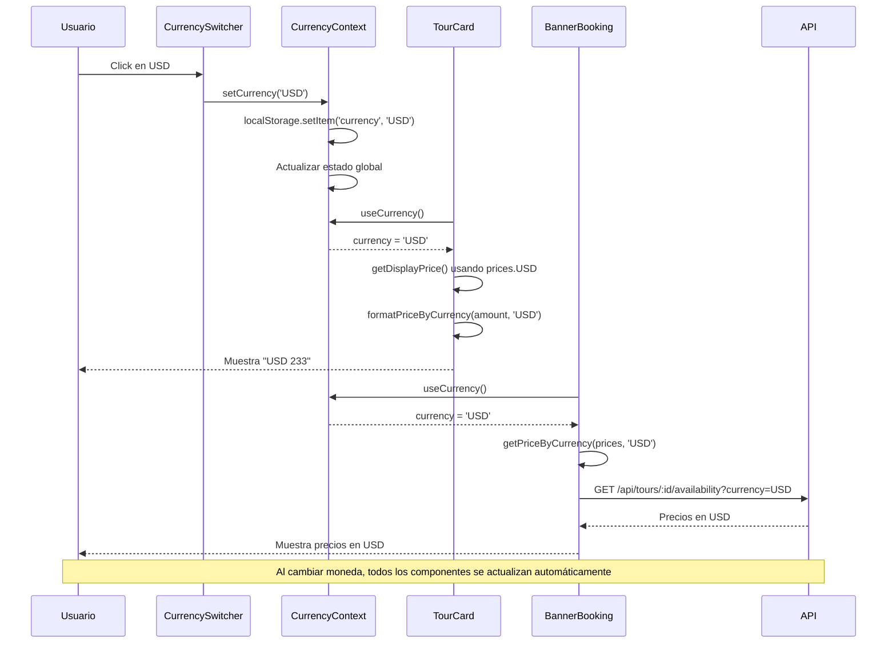

---

## Rate Limiting por Endpoint

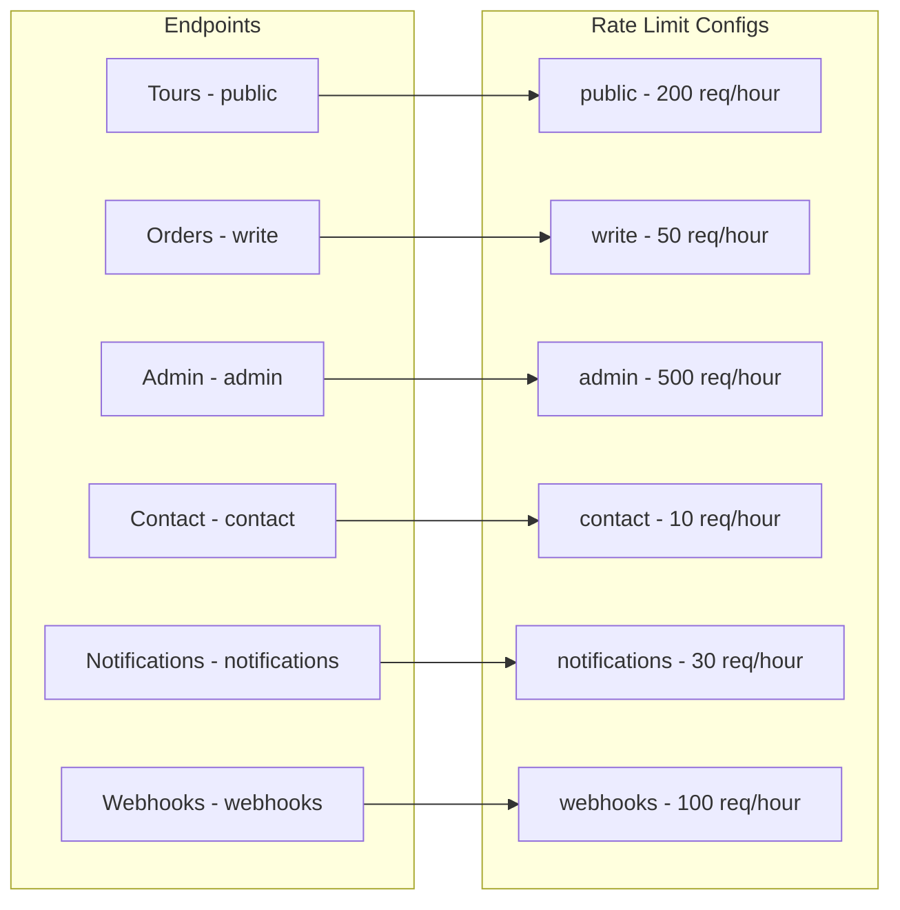

**Configuración:**
- **public**: Endpoints de lectura (tours, availability) - 200 req/hour
- **write**: Endpoints de escritura (orders, bookings) - 50 req/hour
- **admin**: Endpoints administrativos - 500 req/hour
- **contact**: Formulario de contacto - 10 req/hour
- **notifications**: Endpoints de notificaciones - 30 req/hour
- **webhooks**: Webhooks de pagos - 100 req/hour

---

## Consideraciones de Arquitectura

### Ventajas de la Arquitectura Actual

1. **Sin Handler Layer**: Menos capas, código más directo
2. **Domain Services**: Lógica de negocio centralizada y testeable
3. **Repositories**: Acceso a datos abstracto, fácil de mockear
4. **Rate Limiting**: Protección en todos los endpoints
5. **Error Handling**: Centralizado en `controllerWrapper`
6. **Type Safety**: TypeScript estricto en todas las capas

### Mejoras Futuras

1. **Caching Layer**: Redis para queries frecuentes
2. **Event Bus**: Para desacoplar notificaciones
3. **Queue System**: Para procesar notificaciones asíncronas
4. **API Versioning**: Para cambios sin romper clientes

---

**Documento actualizado:** Enero 2025  
**Próxima revisión:** Cuando se agreguen nuevas capas o servicios significativos
