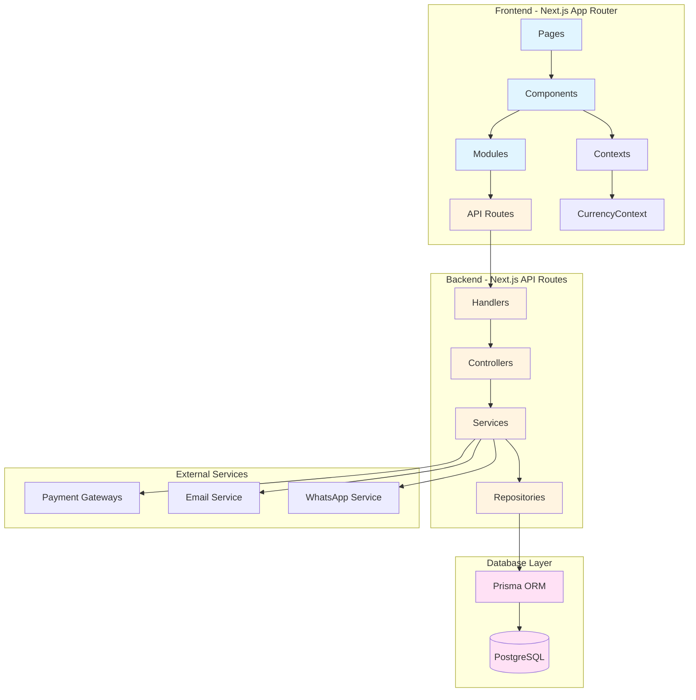
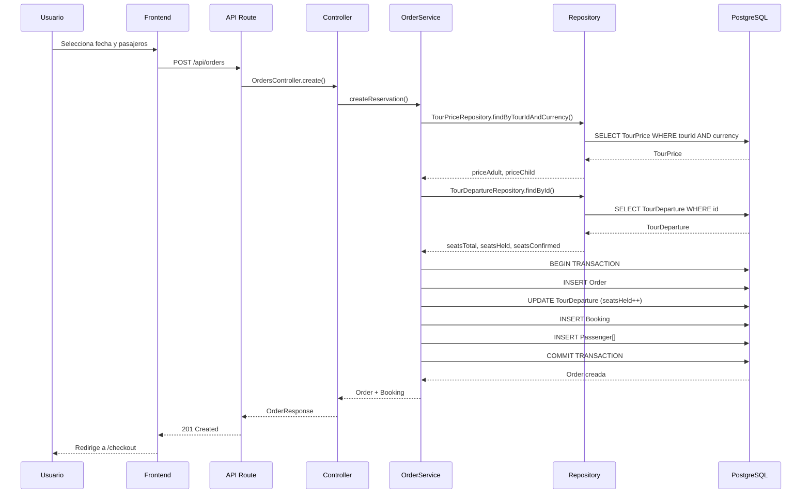
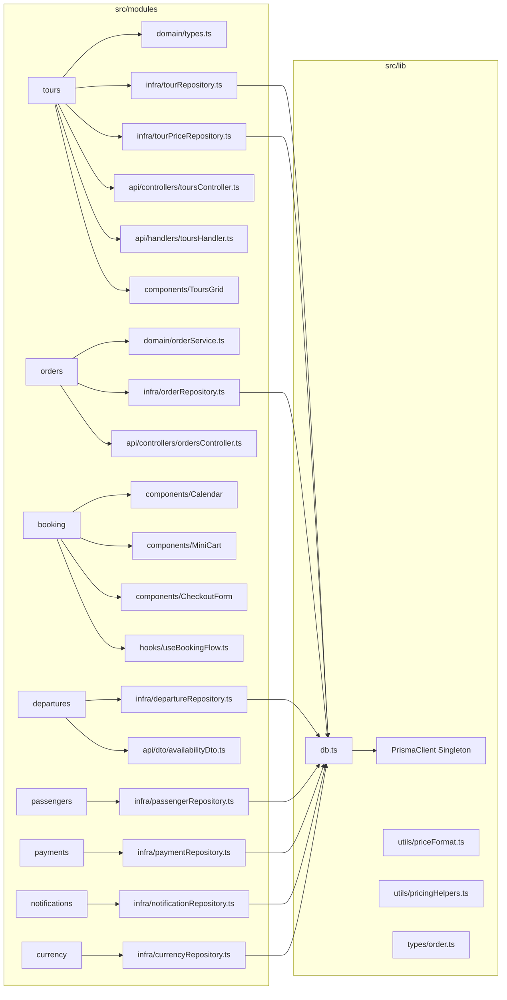
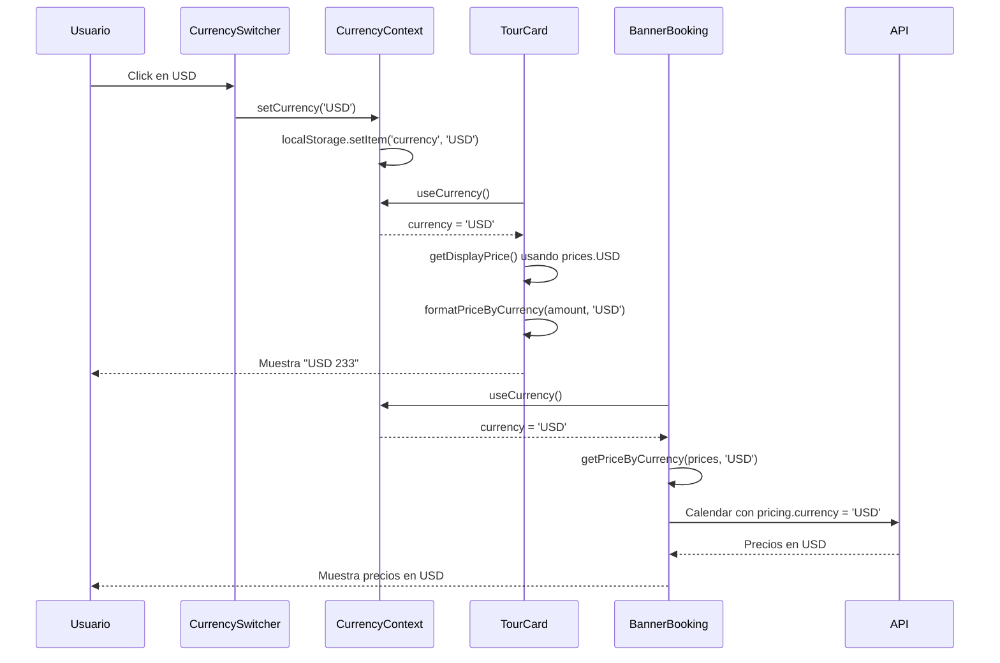

# Diagrama de Arquitectura - Antartur

## Arquitectura General

```mermaid
graph TB
    subgraph "Frontend - Next.js App Router"
        A[Pages] --> B[Components]
        B --> C[Modules]
        C --> D[API Routes]
        B --> E[Contexts]
        E --> F[CurrencyContext]
    end
    
    subgraph "Backend - Next.js API Routes"
        D --> G[Handlers]
        G --> H[Controllers]
        H --> I[Services]
        I --> J[Repositories]
    end
    
    subgraph "Database Layer"
        J --> K[Prisma ORM]
        K --> L[(PostgreSQL)]
    end
    
    subgraph "External Services"
        I --> M[Payment Gateways]
        I --> N[Email Service]
        I --> O[WhatsApp Service]
    end
    
    style A fill:#e1f5ff
    style B fill:#e1f5ff
    style C fill:#e1f5ff
    style D fill:#fff4e1
    style G fill:#fff4e1
    style H fill:#fff4e1
    style I fill:#fff4e1
    style J fill:#fff4e1
    style K fill:#ffe1f5
    style L fill:#ffe1f5
```

## Flujo de Datos - Creación de Reserva

```mermaid
sequenceDiagram
    participant U as Usuario
    participant F as Frontend
    participant API as API Route
    participant C as Controller
    participant S as OrderService
    participant R as Repository
    participant DB as PostgreSQL
    
    U->>F: Selecciona fecha y pasajeros
    F->>API: POST /api/orders
    API->>C: OrdersController.create()
    C->>S: createReservation()
    
    S->>R: TourPriceRepository.findByTourIdAndCurrency()
    R->>DB: SELECT TourPrice WHERE tourId AND currency
    DB-->>R: TourPrice
    R-->>S: priceAdult, priceChild
    
    S->>R: TourDepartureRepository.findById()
    R->>DB: SELECT TourDeparture WHERE id
    DB-->>R: TourDeparture
    R-->>S: seatsTotal, seatsHeld, seatsConfirmed
    
    S->>DB: BEGIN TRANSACTION
    S->>DB: INSERT Order
    S->>DB: UPDATE TourDeparture (seatsHeld++)
    S->>DB: INSERT Booking
    S->>DB: INSERT Passenger[]
    S->>DB: COMMIT TRANSACTION
    
    DB-->>S: Order creada
    S-->>C: Order + Booking
    C-->>API: OrderResponse
    API-->>F: 201 Created
    F-->>U: Redirige a /checkout
```

## Estructura de Módulos

```mermaid
graph LR
    subgraph "src/modules"
        A[tours] --> A1[domain/types.ts]
        A --> A2[infra/tourRepository.ts]
        A --> A3[infra/tourPriceRepository.ts]
        A --> A4[api/controllers/toursController.ts]
        A --> A5[api/handlers/toursHandler.ts]
        A --> A6[components/ToursGrid]
        
        B[orders] --> B1[domain/orderService.ts]
        B --> B2[infra/orderRepository.ts]
        B --> B3[api/controllers/ordersController.ts]
        
        C[booking] --> C1[components/Calendar]
        C --> C2[components/MiniCart]
        C --> C3[components/CheckoutForm]
        C --> C4[hooks/useBookingFlow.ts]
        
        D[departures] --> D1[infra/departureRepository.ts]
        D --> D2[api/dto/availabilityDto.ts]
        
        E[passengers] --> E1[infra/passengerRepository.ts]
        
        F[payments] --> F1[infra/paymentRepository.ts]
        
        G[notifications] --> G1[infra/notificationRepository.ts]
        
        H[currency] --> H1[infra/currencyRepository.ts]
    end
    
    subgraph "src/lib"
        I[db.ts] --> J[PrismaClient Singleton]
        K[utils/priceFormat.ts]
        L[utils/pricingHelpers.ts]
        M[types/order.ts]
    end
    
    A2 --> I
    A3 --> I
    B2 --> I
    D1 --> I
    E1 --> I
    F1 --> I
    G1 --> I
    H1 --> I
```

## Flujo de Precios por Moneda

```mermaid
sequenceDiagram
    participant U as Usuario
    participant CS as CurrencySwitcher
    participant CC as CurrencyContext
    participant TC as TourCard
    participant BC as BannerBooking
    participant API as API
    
    U->>CS: Click en USD
    CS->>CC: setCurrency('USD')
    CC->>CC: localStorage.setItem('currency', 'USD')
    
    TC->>CC: useCurrency()
    CC-->>TC: currency = 'USD'
    TC->>TC: getDisplayPrice() usando prices.USD
    TC->>TC: formatPriceByCurrency(amount, 'USD')
    TC-->>U: Muestra "USD 233"
    
    BC->>CC: useCurrency()
    CC-->>BC: currency = 'USD'
    BC->>BC: getPriceByCurrency(prices, 'USD')
    BC->>API: Calendar con pricing.currency = 'USD'
    API-->>BC: Precios en USD
    BC-->>U: Muestra precios en USD
```

