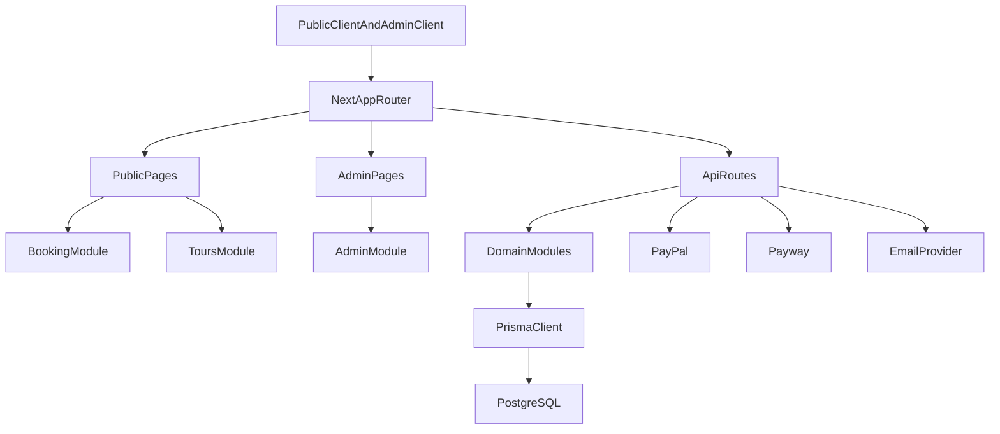

# Current Architecture

Arquitectura actual del sistema basada en Next.js App Router y modulos de dominio.

## High level

## Estructura principal

- `src/app`: rutas publicas, admin y API.
- `src/modules`: logica por dominio (`booking`, `tours`, `orders`, `payments`, `notifications`, `admin`, `auth`, `departures`, `settings`).
- `src/components`: UI reutilizable.
- `src/lib`: auth, middleware, wrappers API y utilidades.
- `prisma/schema.prisma`: modelo de datos y enums.

## Rutas frontend activas

### Publicas

- `/`
- `/tours`
- `/tours/[id]`
- `/checkout`
- `/checkout/success`
- `/checkout/transfer`
- `/checkout/error`
- `/checkout/payment-error`
- `/checkout/paypal/return`
- `/contacto`, `/antartida`, `/verano`, `/invierno`, `/ushuaia`, `/ushuaia/hoteles`, `/ushuaia/gastronomia`, `/turismo-corporativo`, `/clima`, `/politicas-de-privacidad`, `/terminos-y-condiciones`

### Admin

- `/admin/login`
- `/admin/dashboard`
- `/admin/orders`
- `/admin/orders/[id]`
- `/admin/bookings` (redireccion a ordenes)
- `/admin/bookings/[id]`
- `/admin/tours`
- `/admin/tours/new`
- `/admin/tours/[id]`
- `/admin/users`
- `/admin/notifications`
- `/admin/notifications/[id]`
- `/admin/settings`
- `/admin/settings/site`
- `/admin/settings/payments`
- `/admin/email-preview`
- `/admin-api-docs`

## Flujos criticos

### Booking y checkout

1. Usuario configura reserva en detalle de tour.
2. Frontend guarda estado temporal y va a checkout.
3. Checkout crea orden en `POST /api/orders`.
4. El flujo sigue por transferencia, PayPal o Payway.
5. Admin gestiona ordenes, reservas y notificaciones.

### Auth admin

1. Login en `POST /api/auth/login`.
2. Endpoints admin protegidos con JWT y `withAuth`.
3. Renovacion con `POST /api/auth/refresh`.

## Controles transversales

- Auth y roles: `src/lib/auth/middleware.ts`
- Rate limit: `src/lib/middleware/rateLimiter.ts`
- Error handling de controllers: `src/lib/api/controllerWrapper.ts`
