# Diagrama de Secuencia - Flujo de Checkout Completo

```mermaid
sequenceDiagram
    actor Usuario
    participant UI as Página Checkout
    participant Form as CheckoutForm
    participant Validation as Validaciones
    participant Storage as localStorage
    participant API as API Backend
    participant DB as Base de Datos
    participant PayPal as PayPal Gateway
    participant Payway as Payway Gateway
    participant Bank as Transferencia

    Note over Usuario,Bank: FASE 1: INICIALIZACIÓN Y CARGA DE DATOS

    Usuario->>UI: Accede a /checkout
    UI->>Storage: Obtener bookingData pendiente
    Storage-->>UI: bookingData (tourId, fecha, pasajeros, pricing)
    UI->>API: GET /api/tours/{slug}?includeContent=true
    API->>DB: Consultar tour con additionals y restricciones
    DB-->>API: Tour data
    API-->>UI: Tour completo
    UI->>Form: Inicializar con bookingData y tour
    Form->>Validation: Cargar pasajeros iniciales desde localStorage
    Validation-->>Form: passengers[], billingInfo

    Note over Usuario,Bank: FASE 2: COMPLETAR FORMULARIO - INFORMACIÓN DE FACTURACIÓN

    Usuario->>Form: Completa campo facturacion (nombreCompleto)
    Form->>Validation: validateBillingField(nombreCompleto, value)
    Validation-->>Form: error o null
    alt Campo vacio
        Validation-->>Form: El campo es obligatorio
    else Campo valido
        Validation-->>Form: null
    end
    Form->>Storage: Actualizar billingInfo en localStorage

    Usuario->>Form: Completa campo facturacion (apellidos)
    Form->>Validation: validateBillingField(apellidos, value)
    Validation-->>Form: error o null
    Form->>Storage: Actualizar billingInfo

    Usuario->>Form: Completa campo facturacion (email)
    Form->>Validation: validateBillingField(email, value)
    alt Email invalido
        Validation-->>Form: El email debe ser valido
    else Email valido
        Validation-->>Form: null
    end
    Form->>Storage: Actualizar billingInfo

    Usuario->>Form: Completa campos restantes facturacion (telefono, direccion, ciudad, provincia, codigoPostal, pais, documento)
    Form->>Validation: validateBillingField(field, value)
    Validation-->>Form: error o null
    Form->>Storage: Actualizar billingInfo

    Note over Usuario,Bank: FASE 3: COMPLETAR FORMULARIO - INFORMACIÓN DE PASAJEROS

    loop Para cada pasajero (adultos + niños + infantes)
        Usuario->>Form: Completa información pasajero
        Form->>Form: Determinar tipo pasajero (ADULT/CHILD/INFANT)<br/>basado en fechaNacimiento y pricing
        
        Usuario->>Form: Completa nombreCompleto
        Form->>Validation: validatePassengerField(passenger, index)
        alt Campo vacio
            Validation-->>Form: El campo es obligatorio
        end

        Usuario->>Form: Completa fechaNacimiento
        Form->>Validation: validatePassengerField(passenger, index)
        Form->>Validation: calculateAge(fechaNacimiento)
        Validation-->>Form: age
        Form->>Validation: validatePassengerAge(age, isAdult, isInfant)
        alt Pasajero es INFANT y age mayor a infantMaxAge
            Validation-->>Form: Los infantes deben tener entre 0 y infantMaxAge anos
        else Pasajero es ADULT y age menor a 18
            Validation-->>Form: Los adultos deben tener al menos 18 anos
        else Pasajero es CHILD y age mayor o igual a 18
            Validation-->>Form: Los menores deben tener menos de 18 anos
        end
        Form->>Validation: validateMinAge(age, tour.minAge)
        alt tour.minAge existe y age menor a tour.minAge
            Validation-->>Form: No cumple edad minima del tour
        end

        Usuario->>Form: Completa documento
        Form->>Validation: validatePassengerField(passenger, index)
        alt Campo vacio
            Validation-->>Form: El campo es obligatorio
        end

        Usuario->>Form: Completa direccion
        Form->>Validation: validatePassengerField(passenger, index)
        alt Campo vacio
            Validation-->>Form: El campo es obligatorio
        end

        Usuario->>Form: Completa telefono
        Form->>Validation: validatePassengerField(passenger, index)
        alt Campo vacio
            Validation-->>Form: El campo es obligatorio
        end

        Usuario->>Form: Selecciona restricciones alimentarias
        Form->>Validation: validatePassengerField(passenger, index)
        alt tieneRestriccionesAlimentarias es undefined
            Validation-->>Form: El campo es obligatorio
        else tieneRestriccionesAlimentarias es true y alergias es true y alergiasDetalle vacio
            Validation-->>Form: El campo es obligatorio
        end

        alt Pasajero es ADULT y tour tiene restriccion de embarazo
            Usuario->>Form: Selecciona si esta embarazada
            Form->>Validation: validatePassengerField(passenger, index)
            alt embarazada es undefined
                Validation-->>Form: El campo es obligatorio
            else embarazada es true
                Form->>Form: hasRestrictionViolations igual a true
                Form->>UI: Notificar violacion de restriccion
            end
        end

        alt Pasajero es ADULT y tour tiene restriccion de salud
            Usuario->>Form: Selecciona si tiene problemas de columna o salud
            Form->>Validation: validatePassengerField(passenger, index)
            alt problemasColumnaSalud es undefined
                Validation-->>Form: El campo es obligatorio
            else problemasColumnaSalud es true
                Form->>Form: hasRestrictionViolations igual a true
                Form->>UI: Notificar violacion de restriccion
            end
        end

        Form->>Storage: Actualizar passenger en localStorage
    end

    Note over Usuario,Bank: FASE 4: VALIDACIÓN COMPLETA DEL FORMULARIO

    Usuario->>Form: Click en "Continuar con el pago"
    Form->>Validation: validateAllFields()
    Validation->>Validation: validateBillingInfo(billingInfo)
    Validation->>Validation: validatePassengers(passengers, restrictions)
    
    alt Hay errores de validacion
        Validation-->>Form: errors object, isValid false
        Form->>UI: Mostrar mensaje de validacion
        Form->>UI: Scroll a primer campo con error
        UI-->>Usuario: Mostrar errores en campos
    else Formulario valido
        Validation-->>Form: errors vacio, isValid true
    end

    Note over Usuario,Bank: FASE 5: CREACIÓN DE LA ORDEN

    alt Formulario valido
        Form->>Form: Determinar orderType
        alt exceedsAvailability es true O hasRestrictionViolations es true O paymentMethod es undefined
            Form->>Form: orderType igual a consulta (ENQUIRY)
        else
            Form->>Form: orderType igual a reserva (RESERVATION)
        end

        Form->>Form: Convertir passengers a formato API (separar nombreCompleto en firstName y lastName, determinar type: ADULT, CHILD o INFANT)
        
        Form->>API: POST /api/orders
        Note right of API: Validaciones del servidor: tourId existe, departure existe y esta activo, numAdults mayor a 0, numChildren mayor o igual a 0, numInfants mayor o igual a 0, totalSeats mayor o igual a tour.minPassengers, para cada passenger con birthDate age mayor o igual a tour.minAge, departureDate es dia disponible segun tour.mondayAvailable, disponibilidad de cupos
        
        API->>DB: BEGIN TRANSACTION
        API->>DB: SELECT FOR UPDATE TourDeparture
        API->>DB: Verificar disponibilidad
        alt Sin disponibilidad suficiente
            DB-->>API: Error: Insufficient availability
            API-->>Form: 400 Bad Request
            Form->>UI: Mostrar error
        else Disponibilidad OK
            API->>DB: Verificar edad mínima de pasajeros
            alt Algún pasajero no cumple edad mínima
                DB-->>API: Error: Age requirement not met
                API-->>Form: 400 Bad Request
                Form->>UI: Mostrar error
            else Validaciones OK
                API->>DB: Generar orderCode unico
                API->>DB: Crear Order con status PENDING_PAYMENT
                API->>DB: Crear Booking con status HELD
                API->>DB: Crear Passengers
                API->>DB: Actualizar seatsHeld en TourDeparture
                API->>DB: COMMIT TRANSACTION
                DB-->>API: Order creada
                API-->>Form: id, code, status y otros datos
                Form->>Storage: Guardar orderId y code
                Form->>Storage: clearPendingBooking
            end
        end
    end

    Note over Usuario,Bank: FASE 6: SELECCIÓN Y PROCESAMIENTO DE PAGO

    alt orderType es consulta
        Form->>UI: Redirigir a checkout success con code igual a orderCode
        UI-->>Usuario: Mostrar confirmacion de consulta
    else orderType es reserva
        alt paymentMethod es transferencia
            Form->>UI: Redirigir a checkout transfer
            UI-->>Usuario: Mostrar instrucciones de transferencia
        else paymentMethod es paypal
            Form->>API: POST /api/payments/paypal/create
            API->>PayPal: Crear orden de PayPal
            PayPal-->>API: { orderId, approvalUrl }
            API-->>Form: { redirectUrl }
            Form->>UI: Redirigir a redirectUrl (PayPal)
            UI-->>Usuario: Completar pago en PayPal
            Usuario->>PayPal: Aprobar pago
            PayPal->>UI: Redirect a checkout paypal return con orderId, token y PayerID
            UI->>API: POST api payments paypal capture
            API->>PayPal: Capturar pago
            PayPal-->>API: status COMPLETED, transactionId
            API->>DB: confirmPayment con Order.status igual a PAID, Payment.status igual a APPROVED
            DB-->>API: Payment confirmado
            API-->>UI: success true
            UI->>UI: usePaymentVerification con polling hasta order.status sea PAID
            UI->>UI: Redirigir a checkout success con orderId
            UI-->>Usuario: Mostrar confirmacion de pago
        else paymentMethod es payway
            Form->>API: POST /api/payments/payway/create
            API->>API: Generar transactionId único
            API->>API: Generar firma HMAC
            API->>API: Construir redirectUrl con parámetros
            API-->>Form: { redirectUrl }
            Form->>UI: Redirigir a redirectUrl (Payway)
            UI-->>Usuario: Completar pago en Payway
            Usuario->>Payway: Aprobar pago
            Payway->>UI: Redirect a checkout payway return con orderId, transaction_id, status y signature
            UI->>API: POST api payments payway verify
            API->>API: verifyPaywayPayment validar firma HMAC
            alt Firma invalida
                API-->>UI: verified false, status invalid_signature
                UI-->>Usuario: Mostrar error de verificacion
            else Firma valida y status es approved
                API->>DB: confirmPayment con Order.status igual a PAID, Payment.status igual a APPROVED
                DB-->>API: Payment confirmado
                API-->>UI: verified true, status approved
                UI->>UI: usePaymentVerification con polling hasta order.status sea PAID
                UI->>UI: Redirigir a checkout success con orderId
                UI-->>Usuario: Mostrar confirmacion de pago
            else status es pending
                API->>DB: Actualizar Payment.status igual a PENDING
                API-->>UI: verified true, status pending
                UI->>UI: usePaymentVerification con polling y retries
            else status es failure o cancelled
                API->>DB: Actualizar Payment.status igual a FAILED
                API-->>UI: verified true, status rejected
                UI-->>Usuario: Mostrar error de pago
            end
        end
    end

    Note over Usuario,Bank: FASE 7: CONFIRMACIÓN FINAL

    UI->>API: GET api orders orderId con includePayments igual a true
    API->>DB: Consultar Order con Payments
    DB-->>API: Order completa
    API-->>UI: Order data
    UI-->>Usuario: Mostrar pagina de exito con detalles de la orden
```

## Validaciones Detalladas

### Información de Facturación (10 campos requeridos)
1. **nombreCompleto**: Requerido, no vacío
2. **apellidos**: Requerido, no vacío
3. **email**: Requerido, formato valido (regex: /^[^\s@]+@[^\s@]+\.[^\s@]+$/)
4. **telefono**: Requerido, no vacío
5. **direccion**: Requerido, no vacío
6. **ciudad**: Requerido, no vacío
7. **provincia**: Requerido, no vacío
8. **codigoPostal**: Requerido, no vacío
9. **pais**: Requerido, no vacío
10. **documento**: Requerido, no vacío

### Información de Pasajeros (por cada pasajero)
1. **nombreCompleto**: Requerido, no vacío
2. **fechaNacimiento**: Requerido, formato YYYY-MM-DD
3. **documento**: Requerido, no vacío
4. **direccion**: Requerido, no vacío
5. **telefono**: Requerido, no vacío
6. **tieneRestriccionesAlimentarias**: Requerido (boolean)
   - Si es true y alergias es true: alergiasDetalle requerido
7. **embarazada**: Requerido si tour.hasPregnancyRestriction es true y pasajero es ADULT
8. **problemasColumnaSalud**: Requerido si tour.hasHealthRestriction es true y pasajero es ADULT

### Validaciones de Edad
- **ADULT**: edad mayor o igual a 18 anos
- **CHILD**: edad menor a 18 anos y edad mayor o igual a 0
- **INFANT**: edad mayor o igual a 0 y edad menor o igual a infantMaxAge (default: 3)
- **Edad minima del tour**: Si tour.minAge existe, todos los pasajeros deben cumplir age mayor o igual a tour.minAge

### Validaciones del Servidor (API)
1. **Tour existe**: `tourId` válido
2. **Departure existe y esta activo**: departure.isActive es true
3. **Numero de pasajeros**: numAdults mayor a 0, numChildren mayor o igual a 0, numInfants mayor o igual a 0
4. **Minimo de pasajeros**: totalSeats mayor o igual a tour.minPassengers (si existe)
5. **Edad minima**: Para cada pasajero con birthDate, age mayor o igual a tour.minAge (si existe)
6. **Dia disponible**: La fecha del departure debe ser un dia disponible segun tour.mondayAvailable, tour.tuesdayAvailable, etc.
7. **Disponibilidad de cupos**: departure.availableSeats mayor o igual a totalSeats (con SELECT FOR UPDATE para prevenir race conditions)

### Validaciones de Restricciones
- **Restriccion de embarazo**: Si passenger.embarazada es true y tour.hasPregnancyRestriction es true entonces hasRestrictionViolations es true entonces orderType es consulta
- **Restriccion de salud**: Si passenger.problemasColumnaSalud es true y tour.hasHealthRestriction es true entonces hasRestrictionViolations es true entonces orderType es consulta

### Validaciones de Pago
- **PayPal**: Verificación de firma y captura del pago
- **Payway**: Verificación de firma HMAC antes de confirmar pago
- **Transferencia**: No requiere validación adicional (se procesa manualmente)
