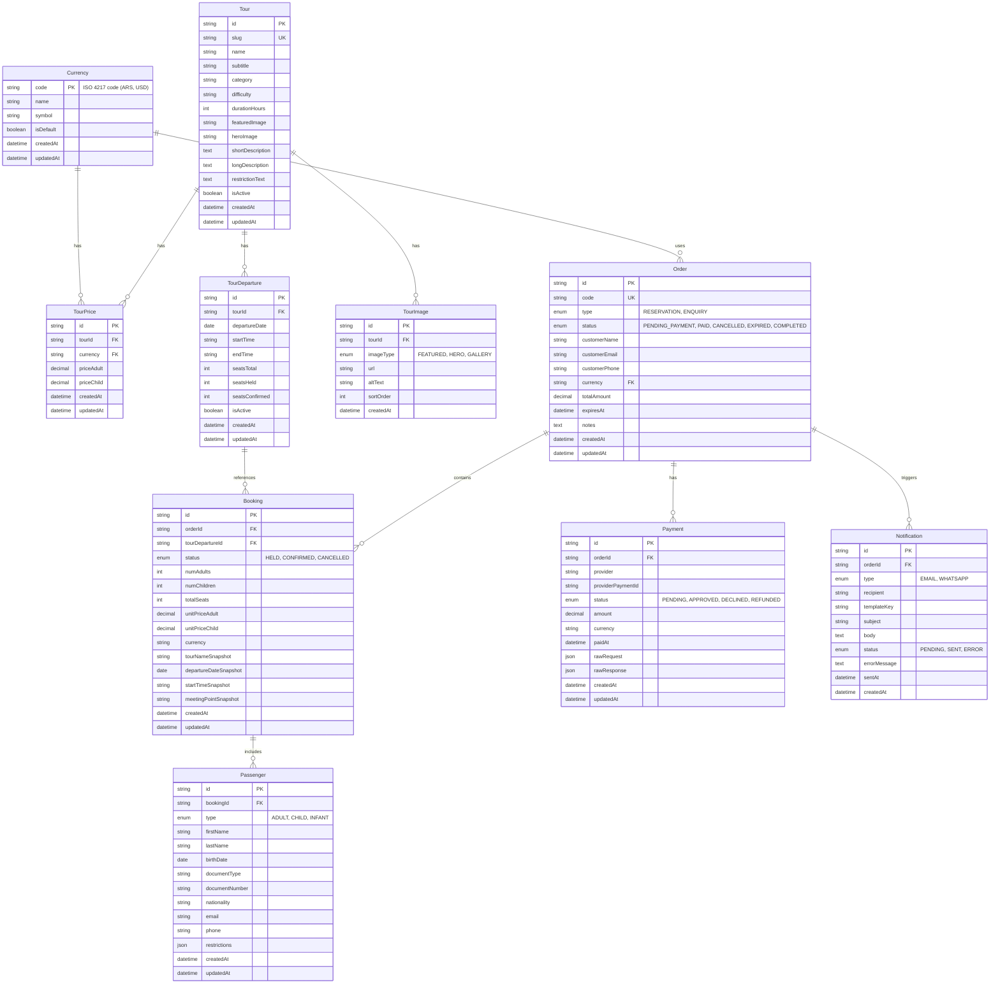

# Esquema de Base de Datos - Antartur

## Diagrama ER Completo

## Modelos Detallados

### Currency

Almacena información de monedas disponibles en el sistema.

**Campos:**
- `code` (PK): Código ISO 4217 (ARS, USD, etc.)
- `name`: Nombre completo de la moneda
- `symbol`: Símbolo de la moneda ($, USD, etc.)
- `isDefault`: Indica si es la moneda por defecto
- `createdAt`, `updatedAt`: Timestamps

**Relaciones:**
- `tourPrices`: Precios de tours en esta moneda
- `orders`: Órdenes que usan esta moneda

### Tour

Información principal de los tours.

**Campos:**
- `id` (PK): Identificador único
- `slug` (UK): URL-friendly identifier
- `name`: Nombre del tour
- `subtitle`: Subtítulo opcional
- `category`: Categoría (summer, winter)
- `difficulty`: Nivel de dificultad
- `durationHours`: Duración en horas
- `featuredImage`: URL de imagen destacada
- `heroImage`: URL de imagen hero
- `shortDescription`: Descripción corta
- `longDescription`: Descripción larga
- `restrictionText`: Texto de restricciones
- `isActive`: Si el tour está activo
- `createdAt`, `updatedAt`: Timestamps

**Relaciones:**
- `prices`: Precios del tour por moneda
- `images`: Imágenes del tour
- `departures`: Salidas disponibles del tour

### TourPrice

Precios individuales de un tour por moneda.

**Campos:**
- `id` (PK): Identificador único
- `tourId` (FK): Referencia al tour
- `currency` (FK): Código de moneda
- `priceAdult`: Precio para adultos
- `priceChild`: Precio para niños
- `createdAt`, `updatedAt`: Timestamps

**Índices:**
- Único: `(tourId, currency)` - Un tour solo puede tener un precio por moneda
- Índice en `tourId` para búsquedas rápidas
- Índice en `currency` para filtros

### TourImage

Imágenes asociadas a un tour.

**Campos:**
- `id` (PK): Identificador único
- `tourId` (FK): Referencia al tour
- `imageType`: Tipo de imagen (FEATURED, HERO, GALLERY)
- `url`: URL de la imagen
- `altText`: Texto alternativo
- `sortOrder`: Orden de visualización
- `createdAt`: Timestamp

**Índices:**
- `(tourId, imageType)` para búsquedas por tipo
- `sortOrder` para ordenamiento

### TourDeparture

Salidas programadas de un tour.

**Campos:**
- `id` (PK): Identificador único
- `tourId` (FK): Referencia al tour
- `departureDate`: Fecha de salida
- `startTime`: Hora de inicio (HH:mm)
- `endTime`: Hora de fin (HH:mm, opcional)
- `seatsTotal`: Total de asientos disponibles
- `seatsHeld`: Asientos reservados temporalmente
- `seatsConfirmed`: Asientos confirmados (pagados)
- `isActive`: Si la salida está activa
- `createdAt`, `updatedAt`: Timestamps

**Índices:**
- Único: `(tourId, departureDate, startTime)` - No puede haber dos salidas iguales del mismo tour
- `(tourId, departureDate)` para búsquedas por fecha
- `(departureDate, isActive)` para consultas de disponibilidad

### Order

Órdenes/reservas del sistema.

**Campos:**
- `id` (PK): Identificador único
- `code` (UK): Código único de orden (ANT-YYYY-NNNN)
- `type`: Tipo de orden (RESERVATION, ENQUIRY)
- `status`: Estado de la orden
- `customerName`: Nombre del cliente
- `customerEmail`: Email del cliente
- `customerPhone`: Teléfono del cliente
- `currency` (FK): Moneda de la orden
- `totalAmount`: Monto total
- `expiresAt`: Fecha de expiración (para reservas pendientes)
- `notes`: Notas adicionales
- `createdAt`, `updatedAt`: Timestamps

**Relaciones:**
- `bookings`: Bookings asociados a esta orden
- `payments`: Pagos realizados
- `notifications`: Notificaciones enviadas

**Índices:**
- `code` para búsquedas rápidas
- `status` para filtros
- `expiresAt` para expiración automática
- `(status, expiresAt)` para consultas combinadas

### Booking

Reservas específicas dentro de una orden.

**Campos:**
- `id` (PK): Identificador único
- `orderId` (FK): Referencia a la orden
- `tourDepartureId` (FK): Referencia a la salida
- `status`: Estado del booking
- `numAdults`: Cantidad de adultos
- `numChildren`: Cantidad de niños
- `totalSeats`: Total de asientos
- `unitPriceAdult`: Precio unitario adulto (snapshot)
- `unitPriceChild`: Precio unitario niño (snapshot)
- `currency`: Moneda del booking (snapshot)
- `tourNameSnapshot`: Nombre del tour (snapshot histórico)
- `departureDateSnapshot`: Fecha de salida (snapshot histórico)
- `startTimeSnapshot`: Hora de inicio (snapshot histórico)
- `meetingPointSnapshot`: Punto de encuentro (snapshot histórico)
- `createdAt`, `updatedAt`: Timestamps

**Relaciones:**
- `passengers`: Pasajeros del booking

**Índices:**
- `orderId` para búsquedas por orden
- `tourDepartureId` para búsquedas por salida
- `status` para filtros

### Passenger

Información de pasajeros.

**Campos:**
- `id` (PK): Identificador único
- `bookingId` (FK): Referencia al booking
- `type`: Tipo de pasajero (ADULT, CHILD, INFANT)
- `firstName`: Nombre
- `lastName`: Apellido
- `birthDate`: Fecha de nacimiento
- `documentType`: Tipo de documento
- `documentNumber`: Número de documento
- `nationality`: Nacionalidad
- `email`: Email
- `phone`: Teléfono
- `restrictions`: Restricciones alimentarias/médicas (JSON)
- `createdAt`, `updatedAt`: Timestamps

**Índices:**
- `bookingId` para búsquedas por booking

### Payment

Registros de pagos.

**Campos:**
- `id` (PK): Identificador único
- `orderId` (FK): Referencia a la orden
- `provider`: Proveedor de pago (PAYPAL, PAYWAY, etc.)
- `providerPaymentId`: ID del pago en el proveedor
- `status`: Estado del pago
- `amount`: Monto pagado
- `currency`: Moneda del pago
- `paidAt`: Fecha de pago
- `rawRequest`: Request raw al proveedor (JSON)
- `rawResponse`: Response raw del proveedor (JSON)
- `createdAt`, `updatedAt`: Timestamps

**Índices:**
- `orderId` para búsquedas por orden
- `(provider, providerPaymentId)` para búsquedas por ID externo
- `status` para filtros

### Notification

Registros de notificaciones enviadas.

**Campos:**
- `id` (PK): Identificador único
- `orderId` (FK): Referencia a la orden (opcional)
- `type`: Tipo de notificación (EMAIL, WHATSAPP)
- `recipient`: Destinatario
- `templateKey`: Clave del template usado
- `subject`: Asunto (para email)
- `body`: Cuerpo del mensaje
- `status`: Estado de la notificación
- `errorMessage`: Mensaje de error si falla
- `sentAt`: Fecha de envío
- `createdAt`: Timestamp

**Índices:**
- `orderId` para búsquedas por orden
- `status` para filtros
- `(type, status)` para consultas combinadas

## Enums

### OrderType
- `RESERVATION`: Reserva con pago requerido
- `ENQUIRY`: Consulta sin pago

### OrderStatus
- `PENDING_PAYMENT`: Esperando pago
- `PAID`: Pagado
- `CANCELLED`: Cancelado
- `EXPIRED`: Expirado
- `COMPLETED`: Completado

### BookingStatus
- `HELD`: Reservado temporalmente
- `CONFIRMED`: Confirmado (pagado)
- `CANCELLED`: Cancelado

### PassengerType
- `ADULT`: Adulto
- `CHILD`: Niño
- `INFANT`: Bebé

### PaymentStatus
- `PENDING`: Pendiente
- `APPROVED`: Aprobado
- `DECLINED`: Rechazado
- `REFUNDED`: Reembolsado

### NotificationType
- `EMAIL`: Email
- `WHATSAPP`: WhatsApp

### NotificationStatus
- `PENDING`: Pendiente
- `SENT`: Enviado
- `ERROR`: Error

### ImageType
- `FEATURED`: Imagen destacada
- `HERO`: Imagen hero
- `GALLERY`: Imagen de galería

## Relaciones Clave

1. **Tour → TourPrice**: Un tour puede tener múltiples precios (uno por moneda)
2. **Tour → TourDeparture**: Un tour puede tener múltiples salidas
3. **TourDeparture → Booking**: Una salida puede tener múltiples bookings
4. **Order → Booking**: Una orden puede contener múltiples bookings
5. **Booking → Passenger**: Un booking puede tener múltiples pasajeros
6. **Order → Payment**: Una orden puede tener múltiples intentos de pago
7. **Order → Notification**: Una orden puede generar múltiples notificaciones

## Índices Estratégicos

- **TourPrice**: `(tourId, currency)` único - Garantiza un precio por moneda por tour
- **TourDeparture**: `(tourId, departureDate, startTime)` único - Evita duplicados
- **Order**: `(status, expiresAt)` - Para expiración automática eficiente
- **Payment**: `(provider, providerPaymentId)` - Para búsquedas por ID externo

## Consideraciones de Performance

1. **TourPrice**: Los índices permiten búsquedas rápidas por tour y moneda
2. **TourDeparture**: Los índices optimizan consultas de disponibilidad
3. **Order**: Los índices facilitan búsquedas por estado y expiración
4. **Snapshots en Booking**: Permiten mantener información histórica sin joins costosos

