# Esquema de Base de Datos - Antartur

**Versión:** 2.0  
**Última actualización:** Enero 2025  
**Basado en:** `prisma/schema.prisma`

---

## Diagrama ER Completo

```mermaid
erDiagram
    Currency ||--o{ TourPrice : "has"
    Currency ||--o{ TourAdditionalPrice : "has"
    Currency ||--o{ Order : "uses"
    
    Tour ||--o{ TourPrice : "has"
    Tour ||--o{ TourImage : "has"
    Tour ||--o{ TourDeparture : "has"
    Tour ||--o{ TourAdditional : "has"
    Tour ||--o{ TourTimelineItem : "has"
    Tour ||--o{ TourFeaturedInfo : "has"
    Tour ||--o{ TourTestimonial : "has"
    Tour ||--o{ TourQuickInfoItem : "has"
    Tour ||--o{ TourRestriction : "has"
    
    TourAdditional ||--o{ TourAdditionalPrice : "has"
    
    TourDeparture ||--o{ Booking : "references"
    
    Order ||--o{ Booking : "contains"
    Order ||--o{ Payment : "has"
    Order ||--o{ Notification : "triggers"
    
    Booking ||--o{ Passenger : "includes"
    
    User ||--o{ RefreshToken : "has"
    
    Currency {
        string code PK "ISO 4217 code (ARS, USD)"
        string name
        string symbol
        boolean isDefault
        datetime createdAt
        datetime updatedAt
    }
    
    Tour {
        string id PK
        string slug UK
        string name
        string subtitle
        string category
        string difficulty
        int durationHours
        string featuredImage
        string heroImage
        string heroSubheadline
        text shortDescription
        text longDescription
        text restrictionText
        boolean isActive
        string metaTitle
        text metaDescription
        string canonicalUrl
        string ogImage
        string ctaLabel
        string ctaHref
        string alternativeText
        string alternativePrice
        text timelineImportantNote
        int minAge
        int minPassengers
        boolean allowsInfants
        boolean mondayAvailable
        boolean tuesdayAvailable
        boolean wednesdayAvailable
        boolean thursdayAvailable
        boolean fridayAvailable
        boolean saturdayAvailable
        boolean sundayAvailable
        datetime createdAt
        datetime updatedAt
    }
    
    TourPrice {
        string id PK
        string tourId FK
        string currency FK
        decimal priceAdult
        decimal priceChild
        boolean priceInfantFree
        string childAgeRange
        enum childPriceType "FULL_CHILD_PRICE, HALF_ADULT_PRICE, ADULT_PRICE"
        int infantMaxAge
        datetime createdAt
        datetime updatedAt
    }
    
    TourImage {
        string id PK
        string tourId FK
        enum imageType "FEATURED, HERO, GALLERY"
        string url
        string altText
        int sortOrder
        datetime createdAt
        datetime updatedAt
    }
    
    TourDeparture {
        string id PK
        string tourId FK
        date departureDate
        string startTime
        string endTime
        int seatsTotal
        int seatsHeld
        int seatsConfirmed
        boolean isActive
        datetime createdAt
        datetime updatedAt
    }
    
    TourAdditional {
        string id PK
        string tourId FK
        string name
        text description
        boolean isActive
        int sortOrder
        datetime createdAt
        datetime updatedAt
    }
    
    TourAdditionalPrice {
        string id PK
        string tourAdditionalId FK
        string currency FK
        decimal priceAdult
        decimal priceChild
        datetime createdAt
        datetime updatedAt
    }
    
    TourTimelineItem {
        string id PK
        string tourId FK
        string timeLabel
        string title
        text description
        int sortOrder
        datetime createdAt
        datetime updatedAt
    }
    
    TourFeaturedInfo {
        string id PK
        string tourId FK
        string icon
        string title
        text description
        int sortOrder
        datetime createdAt
        datetime updatedAt
    }
    
    TourTestimonial {
        string id PK
        string tourId FK
        text text
        string author
        string avatar
        string country
        int sortOrder
        datetime createdAt
        datetime updatedAt
    }
    
    TourQuickInfoItem {
        string id PK
        string tourId FK
        string icon
        string label
        string value
        int sortOrder
        datetime createdAt
        datetime updatedAt
    }
    
    TourRestriction {
        string id PK
        string tourId FK
        text text
        int sortOrder
        datetime createdAt
        datetime updatedAt
    }
    
    Order {
        string id PK
        string code UK
        enum type "RESERVATION, ENQUIRY"
        enum status "PENDING_PAYMENT, PAID, CANCELLED, EXPIRED, COMPLETED"
        string customerName
        string customerEmail
        string customerPhone
        string currency FK
        decimal totalAmount
        datetime expiresAt
        text notes
        datetime createdAt
        datetime updatedAt
    }
    
    Booking {
        string id PK
        string orderId FK
        string tourDepartureId FK
        enum status "HELD, CONFIRMED, CANCELLED"
        int numAdults
        int numChildren
        int totalSeats
        decimal unitPriceAdult
        decimal unitPriceChild
        string currency
        string tourNameSnapshot
        date departureDateSnapshot
        string startTimeSnapshot
        string meetingPointSnapshot
        datetime createdAt
        datetime updatedAt
    }
    
    Passenger {
        string id PK
        string bookingId FK
        enum type "ADULT, CHILD, INFANT"
        string firstName
        string lastName
        date birthDate
        string documentType
        string documentNumber
        string nationality
        string email
        string phone
        json restrictions
        datetime createdAt
        datetime updatedAt
    }
    
    Payment {
        string id PK
        string orderId FK
        string provider
        string providerPaymentId
        enum status "PENDING, APPROVED, DECLINED, REFUNDED"
        decimal amount
        string currency
        datetime paidAt
        json rawRequest
        json rawResponse
        datetime createdAt
        datetime updatedAt
    }
    
    Notification {
        string id PK
        string orderId FK
        enum type "EMAIL, WHATSAPP"
        string recipient
        string templateKey
        string subject
        text body
        enum status "PENDING, SENT, ERROR"
        text errorMessage
        datetime sentAt
        int retryCount
        int maxRetries
        datetime nextRetryAt
        datetime createdAt
        datetime updatedAt
    }
    
    User {
        string id PK
        string email UK
        string passwordHash
        string name
        enum role "ADMIN, OPERATOR"
        boolean isActive
        datetime lastLoginAt
        datetime createdAt
        datetime updatedAt
    }
    
    RefreshToken {
        string id PK
        string token UK
        string userId FK
        datetime expiresAt
        datetime createdAt
    }
    
    PaymentGateway {
        string id PK
        string provider UK
        boolean isActive
        boolean isSandbox
        string displayName
        string currency
        json config
        datetime createdAt
        datetime updatedAt
    }
    
    BankTransfer {
        string id PK
        boolean isActive
        string accountName
        string accountNumber
        string bank
        string cuit
        string cbu
        string alias
        datetime createdAt
        datetime updatedAt
    }
```

---

## Modelos Detallados

### Currency

Almacena información de monedas disponibles en el sistema.

**Campos:**
- `code` (PK): Código ISO 4217 (ARS, USD, etc.) - VarChar(3)
- `name`: Nombre completo de la moneda
- `symbol`: Símbolo de la moneda ($, USD, etc.)
- `isDefault`: Indica si es la moneda por defecto (solo una puede ser true)
- `createdAt`, `updatedAt`: Timestamps

**Relaciones:**
- `tourPrices`: Precios de tours en esta moneda
- `tourAdditionalPrices`: Precios de adicionales en esta moneda
- `orders`: Órdenes que usan esta moneda

**Constraints:**
- Solo una moneda puede tener `isDefault = true` (enforced a nivel de aplicación)

---

### Tour

Información principal de los tours.

**Campos básicos:**
- `id` (PK): Identificador único (cuid)
- `slug` (UK): URL-friendly identifier
- `name`: Nombre del tour
- `subtitle`: Subtítulo opcional
- `category`: Categoría (summer, winter, antarctica, corporate)
- `difficulty`: Nivel de dificultad (Baja, Media, Alta)
- `durationHours`: Duración en horas
- `featuredImage`: URL de imagen destacada
- `heroImage`: URL de imagen hero
- `heroSubheadline`: Subtítulo del hero (opcional)
- `shortDescription`: Descripción corta (Text)
- `longDescription`: Descripción larga (Text)
- `restrictionText`: Texto de restricciones (Text)
- `isActive`: Si el tour está activo (default: true)

**SEO Metadata:**
- `metaTitle`: Título para SEO (VarChar(200), opcional)
- `metaDescription`: Descripción para SEO (Text, opcional)
- `canonicalUrl`: URL canónica (opcional)
- `ogImage`: Imagen para Open Graph (opcional)

**CTA y Pricing alternativo:**
- `ctaLabel`: Etiqueta del botón CTA (opcional)
- `ctaHref`: URL del botón CTA (opcional)
- `alternativeText`: Texto alternativo de precio (opcional)
- `alternativePrice`: Precio alternativo (opcional)

**Timeline:**
- `timelineImportantNote`: Nota importante del timeline (Text, opcional)

**Restricciones y validaciones:**
- `minAge`: Edad mínima permitida (Int, opcional)
- `minPassengers`: Mínimo de pasajeros requeridos (Int, opcional)
- `allowsInfants`: Si el tour acepta infantes 0-3 años (Boolean, default: false)

**Disponibilidad por día de semana:**
- `mondayAvailable`: Disponible los lunes (Boolean, default: true)
- `tuesdayAvailable`: Disponible los martes (Boolean, default: true)
- `wednesdayAvailable`: Disponible los miércoles (Boolean, default: true)
- `thursdayAvailable`: Disponible los jueves (Boolean, default: true)
- `fridayAvailable`: Disponible los viernes (Boolean, default: true)
- `saturdayAvailable`: Disponible los sábados (Boolean, default: true)
- `sundayAvailable`: Disponible los domingos (Boolean, default: true)

**Relaciones:**
- `images`: Imágenes del tour (TourImage[])
- `departures`: Salidas disponibles del tour (TourDeparture[])
- `prices`: Precios del tour por moneda (TourPrice[])
- `additionals`: Adicionales del tour (TourAdditional[])
- `timelineItems`: Items del timeline (TourTimelineItem[])
- `featuredInfos`: Información destacada (TourFeaturedInfo[])
- `testimonials`: Testimonios (TourTestimonial[])
- `quickInfoItems`: Items de información rápida (TourQuickInfoItem[])
- `restrictions`: Restricciones del tour (TourRestriction[])

**Índices:**
- `slug` (único)
- `category`
- `isActive`

---

### TourPrice

Precios individuales de un tour por moneda.

**Campos:**
- `id` (PK): Identificador único (cuid)
- `tourId` (FK): Referencia al tour
- `currency` (FK): Código de moneda (VarChar(3))
- `priceAdult`: Precio para adultos (Decimal(10, 2))
- `priceChild`: Precio para niños (Decimal(10, 2))

**Sistema de rangos de edad:**
- `priceInfantFree`: Si los infantes (0-3 años) son gratis (Boolean, default: false)
- `childAgeRange`: Rango de edad para niños, ej: "4-11" o "0-11" (String, opcional)
- `childPriceType`: Tipo de precio para menores (ChildPriceType, default: FULL_CHILD_PRICE)
  - `FULL_CHILD_PRICE`: Precio completo de niño
  - `HALF_ADULT_PRICE`: Mitad del precio de adulto
  - `ADULT_PRICE`: Mismo precio que adulto
- `infantMaxAge`: Edad máxima para considerar "infant" (Int, default: 3)

**Relaciones:**
- `tour`: Tour al que pertenece (onDelete: Cascade)
- `currencyRef`: Moneda (Currency)

**Índices:**
- Único: `(tourId, currency)` - Un tour solo puede tener un precio por moneda
- `tourId` para búsquedas rápidas
- `currency` para filtros

---

### TourImage

Imágenes asociadas a un tour.

**Campos:**
- `id` (PK): Identificador único (cuid)
- `tourId` (FK): Referencia al tour
- `imageType`: Tipo de imagen (ImageType)
  - `FEATURED`: Imagen destacada
  - `HERO`: Imagen hero
  - `GALLERY`: Imagen de galería
- `url`: URL de la imagen
- `altText`: Texto alternativo para accesibilidad
- `sortOrder`: Orden de visualización (Int, default: 0)
- `createdAt`, `updatedAt`: Timestamps

**Relaciones:**
- `tour`: Tour al que pertenece (onDelete: Cascade)

**Índices:**
- `(tourId, imageType)` para búsquedas por tipo
- `sortOrder` para ordenamiento

---

### TourDeparture

Salidas programadas de un tour.

**Campos:**
- `id` (PK): Identificador único (cuid)
- `tourId` (FK): Referencia al tour
- `departureDate`: Fecha de salida (Date)
- `startTime`: Hora de inicio (String, formato HH:mm)
- `endTime`: Hora de fin (String, formato HH:mm, opcional)
- `seatsTotal`: Total de asientos disponibles (Int)
- `seatsHeld`: Asientos reservados temporalmente (Int, default: 0)
- `seatsConfirmed`: Asientos confirmados/pagados (Int, default: 0)
- `isActive`: Si la salida está activa (Boolean, default: true)
- `createdAt`, `updatedAt`: Timestamps

**Cálculo de disponibilidad:**
- Cupos disponibles = `seatsTotal - seatsHeld - seatsConfirmed`
- Los infantes NO descuentan cupo

**Relaciones:**
- `tour`: Tour al que pertenece (onDelete: Cascade)
- `bookings`: Bookings asociados a esta salida

**Índices:**
- Único: `(tourId, departureDate, startTime)` - No puede haber dos salidas iguales del mismo tour
- `(tourId, departureDate)` para búsquedas por fecha
- `(departureDate, isActive)` para consultas de disponibilidad

---

### TourAdditional

Adicionales opcionales que se pueden agregar a un tour (ej: "Con Canoas").

**Campos:**
- `id` (PK): Identificador único (cuid)
- `tourId` (FK): Referencia al tour
- `name`: Nombre del adicional (ej: "Con Canoas")
- `description`: Descripción del adicional (Text, opcional)
- `isActive`: Si el adicional está activo (Boolean, default: true)
- `sortOrder`: Orden de visualización (Int, default: 0)
- `createdAt`, `updatedAt`: Timestamps

**Relaciones:**
- `tour`: Tour al que pertenece (onDelete: Cascade)
- `prices`: Precios del adicional por moneda (TourAdditionalPrice[])

**Índices:**
- `tourId` para búsquedas por tour
- `(tourId, isActive)` para filtrar activos
- `sortOrder` para ordenamiento

---

### TourAdditionalPrice

Precios de adicionales por moneda.

**Campos:**
- `id` (PK): Identificador único (cuid)
- `tourAdditionalId` (FK): Referencia al adicional
- `currency` (FK): Código de moneda (VarChar(3))
- `priceAdult`: Precio para adultos (Decimal(10, 2))
- `priceChild`: Precio para niños (Decimal(10, 2))
- `createdAt`, `updatedAt`: Timestamps

**Relaciones:**
- `tourAdditional`: Adicional al que pertenece (onDelete: Cascade)
- `currencyRef`: Moneda (Currency)

**Índices:**
- Único: `(tourAdditionalId, currency)` - Un adicional solo puede tener un precio por moneda
- `tourAdditionalId` para búsquedas rápidas
- `currency` para filtros

---

### TourTimelineItem

Items del timeline/itinerario de un tour.

**Campos:**
- `id` (PK): Identificador único (cuid)
- `tourId` (FK): Referencia al tour
- `timeLabel`: Etiqueta de tiempo (ej: "9:00 AM")
- `title`: Título del item
- `description`: Descripción detallada (Text)
- `sortOrder`: Orden de visualización (Int, default: 0)
- `createdAt`, `updatedAt`: Timestamps

**Relaciones:**
- `tour`: Tour al que pertenece (onDelete: Cascade)

**Índices:**
- `tourId` para búsquedas por tour
- `(tourId, sortOrder)` para ordenamiento

---

### TourFeaturedInfo

Información destacada del tour (ej: "Incluye almuerzo", "Equipamiento incluido").

**Campos:**
- `id` (PK): Identificador único (cuid)
- `tourId` (FK): Referencia al tour
- `icon`: Icono a mostrar (ej: "clock", "difficulty", "family")
- `title`: Título de la información
- `description`: Descripción detallada (Text)
- `sortOrder`: Orden de visualización (Int, default: 0)
- `createdAt`, `updatedAt`: Timestamps

**Relaciones:**
- `tour`: Tour al que pertenece (onDelete: Cascade)

**Índices:**
- `tourId` para búsquedas por tour
- `(tourId, sortOrder)` para ordenamiento

---

### TourTestimonial

Testimonios de clientes sobre el tour.

**Campos:**
- `id` (PK): Identificador único (cuid)
- `tourId` (FK): Referencia al tour
- `text`: Texto del testimonio (Text)
- `author`: Nombre del autor
- `avatar`: URL del avatar
- `country`: País del autor
- `sortOrder`: Orden de visualización (Int, default: 0)
- `createdAt`, `updatedAt`: Timestamps

**Relaciones:**
- `tour`: Tour al que pertenece (onDelete: Cascade)

**Índices:**
- `tourId` para búsquedas por tour
- `(tourId, sortOrder)` para ordenamiento

---

### TourQuickInfoItem

Items de información rápida del tour (ej: "Duración: 4 horas", "Dificultad: Media").

**Campos:**
- `id` (PK): Identificador único (cuid)
- `tourId` (FK): Referencia al tour
- `icon`: Icono a mostrar (ej: "clock", "difficulty", "family")
- `label`: Etiqueta (ej: "Duración")
- `value`: Valor (ej: "4 horas")
- `sortOrder`: Orden de visualización (Int, default: 0)
- `createdAt`, `updatedAt`: Timestamps

**Relaciones:**
- `tour`: Tour al que pertenece (onDelete: Cascade)

**Índices:**
- `tourId` para búsquedas por tour
- `(tourId, sortOrder)` para ordenamiento

---

### TourRestriction

Restricciones del tour (texto libre, múltiples restricciones posibles).

**Campos:**
- `id` (PK): Identificador único (cuid)
- `tourId` (FK): Referencia al tour
- `text`: Texto de la restricción (Text)
- `sortOrder`: Orden de visualización (Int, default: 0)
- `createdAt`, `updatedAt`: Timestamps

**Relaciones:**
- `tour`: Tour al que pertenece (onDelete: Cascade)

**Índices:**
- `tourId` para búsquedas por tour
- `(tourId, sortOrder)` para ordenamiento

---

### Order

Órdenes/reservas del sistema.

**Campos:**
- `id` (PK): Identificador único (cuid)
- `code` (UK): Código único de orden (formato: ANT-YYYY-NNNN)
- `type`: Tipo de orden (OrderType)
  - `RESERVATION`: Reserva con pago requerido
  - `ENQUIRY`: Consulta sin pago requerido
- `status`: Estado de la orden (OrderStatus, default: PENDING_PAYMENT)
  - `PENDING_PAYMENT`: Esperando pago
  - `PAID`: Pagado
  - `CANCELLED`: Cancelado
  - `EXPIRED`: Expirado (automático)
  - `COMPLETED`: Completado
- `customerName`: Nombre del cliente
- `customerEmail`: Email del cliente
- `customerPhone`: Teléfono del cliente
- `currency` (FK): Moneda de la orden (VarChar(3))
- `totalAmount`: Monto total (Decimal(10, 2))
- `expiresAt`: Fecha de expiración (DateTime, opcional)
  - Para RESERVATION: 5 horas desde creación
  - Para ENQUIRY: null
- `notes`: Notas adicionales (Text, opcional)
- `createdAt`, `updatedAt`: Timestamps

**Relaciones:**
- `currencyRef`: Moneda (Currency)
- `bookings`: Bookings asociados a esta orden
- `payments`: Pagos realizados
- `notifications`: Notificaciones enviadas

**Índices:**
- `code` (único) para búsquedas rápidas
- `status` para filtros
- `expiresAt` para expiración automática
- `(status, expiresAt)` para consultas combinadas (cron jobs)

**Reglas de negocio:**
- Las órdenes PENDING_PAYMENT expiran automáticamente después de 5 horas
- Al expirar, se liberan los cupos (seatsHeld se reduce)
- Una orden puede tener múltiples bookings (múltiples tours/fechas)

---

### Booking

Reservas específicas dentro de una orden.

**Campos:**
- `id` (PK): Identificador único (cuid)
- `orderId` (FK): Referencia a la orden
- `tourDepartureId` (FK): Referencia a la salida
- `status`: Estado del booking (BookingStatus, default: HELD)
  - `HELD`: Reservado temporalmente (pendiente de pago)
  - `CONFIRMED`: Confirmado (pagado)
  - `CANCELLED`: Cancelado
- `numAdults`: Cantidad de adultos (Int)
- `numChildren`: Cantidad de niños (Int)
- `totalSeats`: Total de asientos (Int) = numAdults + numChildren
- `unitPriceAdult`: Precio unitario adulto al momento de la reserva (Decimal(10, 2), snapshot)
- `unitPriceChild`: Precio unitario niño al momento de la reserva (Decimal(10, 2), snapshot)
- `currency`: Moneda del booking (VarChar(3), snapshot)

**Campos snapshot (históricos):**
- `tourNameSnapshot`: Nombre del tour al momento de la reserva
- `departureDateSnapshot`: Fecha de salida al momento de la reserva (Date)
- `startTimeSnapshot`: Hora de inicio al momento de la reserva (String, HH:mm)
- `meetingPointSnapshot`: Punto de encuentro al momento de la reserva (String, opcional)

**Relaciones:**
- `order`: Orden a la que pertenece (onDelete: Cascade)
- `tourDeparture`: Salida reservada
- `passengers`: Pasajeros del booking

**Índices:**
- `orderId` para búsquedas por orden
- `tourDepartureId` para búsquedas por salida
- `status` para filtros

**Reglas de negocio:**
- Los snapshots permiten mantener información histórica aunque el tour cambie
- Al crear un booking, se incrementa `seatsHeld` en el TourDeparture
- Al confirmar (pagar), se mueve de `seatsHeld` a `seatsConfirmed`
- Al cancelar, se liberan los cupos

---

### Passenger

Información de pasajeros.

**Campos:**
- `id` (PK): Identificador único (cuid)
- `bookingId` (FK): Referencia al booking
- `type`: Tipo de pasajero (PassengerType)
  - `ADULT`: Adulto
  - `CHILD`: Niño
  - `INFANT`: Bebé (0-3 años, no descuenta cupo)
- `firstName`: Nombre
- `lastName`: Apellido
- `birthDate`: Fecha de nacimiento (Date, opcional)
- `documentType`: Tipo de documento (String, opcional, ej: "DNI", "Passport")
- `documentNumber`: Número de documento (String, opcional)
- `nationality`: Nacionalidad (String, opcional, código ISO)
- `email`: Email (String, opcional)
- `phone`: Teléfono (String, opcional)
- `restrictions`: Restricciones alimentarias/médicas (Json, opcional)
  - Estructura flexible: `{ "dietary": [...], "medical": [...], "pregnancy": boolean, "healthIssues": boolean }`
- `createdAt`, `updatedAt`: Timestamps

**Relaciones:**
- `booking`: Booking al que pertenece (onDelete: Cascade)

**Índices:**
- `bookingId` para búsquedas por booking

**Reglas de negocio:**
- Los infantes no descuentan cupo en TourDeparture
- Las restricciones se validan contra las restricciones del tour
- Si hay violaciones de restricciones, la orden se convierte en ENQUIRY

---

### Payment

Registros de pagos.

**Campos:**
- `id` (PK): Identificador único (cuid)
- `orderId` (FK): Referencia a la orden
- `provider`: Proveedor de pago (String, ej: "PAYPAL", "PAYWAY", "TRANSFER")
- `providerPaymentId`: ID del pago en el proveedor (String, opcional)
- `status`: Estado del pago (PaymentStatus, default: PENDING)
  - `PENDING`: Pendiente
  - `APPROVED`: Aprobado
  - `DECLINED`: Rechazado
  - `REFUNDED`: Reembolsado
- `amount`: Monto pagado (Decimal(10, 2))
- `currency`: Moneda del pago (VarChar(3))
- `paidAt`: Fecha de pago (DateTime, opcional)
- `rawRequest`: Request raw al proveedor (Json, opcional, para debugging)
- `rawResponse`: Response raw del proveedor (Json, opcional, para debugging)
- `createdAt`, `updatedAt`: Timestamps

**Relaciones:**
- `order`: Orden a la que pertenece (onDelete: Cascade)

**Índices:**
- `orderId` para búsquedas por orden
- `(provider, providerPaymentId)` para búsquedas por ID externo
- `status` para filtros

**Reglas de negocio:**
- Una orden puede tener múltiples intentos de pago
- Solo un pago APPROVED por orden
- Los webhooks actualizan el estado del pago

---

### Notification

Registros de notificaciones enviadas (emails, WhatsApp).

**Campos:**
- `id` (PK): Identificador único (cuid)
- `orderId` (FK): Referencia a la orden (opcional, puede ser null para notificaciones independientes)
- `type`: Tipo de notificación (NotificationType)
  - `EMAIL`: Email
  - `WHATSAPP`: WhatsApp (futuro)
- `recipient`: Destinatario (String, email o número de teléfono)
- `templateKey`: Clave del template usado (String, ej: "reservation-confirmation", "payment-confirmation")
- `subject`: Asunto (String, opcional, para emails)
- `body`: Cuerpo del mensaje (Text, opcional)
- `status`: Estado de la notificación (NotificationStatus, default: PENDING)
  - `PENDING`: Pendiente de envío
  - `SENT`: Enviado exitosamente
  - `ERROR`: Error al enviar
- `errorMessage`: Mensaje de error si falla (Text, opcional)
- `sentAt`: Fecha de envío (DateTime, opcional)
- `retryCount`: Número de reintentos realizados (Int, default: 0)
- `maxRetries`: Número máximo de reintentos (Int, default: 5)
- `nextRetryAt`: Fecha del próximo reintento (DateTime, opcional)
- `createdAt`, `updatedAt`: Timestamps

**Relaciones:**
- `order`: Orden asociada (opcional, onDelete: SetNull)

**Índices:**
- `orderId` para búsquedas por orden
- `status` para filtros
- `(type, status)` para consultas combinadas
- `(status, nextRetryAt)` para cron jobs de reintento

**Reglas de negocio:**
- Las notificaciones fallidas se reintentan automáticamente (cron job)
- Máximo 5 reintentos por notificación
- El cron job procesa hasta 100 notificaciones por ejecución

---

### User

Usuarios del sistema (administradores, operadores).

**Campos:**
- `id` (PK): Identificador único (cuid)
- `email` (UK): Email del usuario (único)
- `passwordHash`: Hash de la contraseña (bcrypt)
- `name`: Nombre del usuario (String, opcional)
- `role`: Rol del usuario (UserRole, default: ADMIN)
  - `ADMIN`: Administrador (acceso completo)
  - `OPERATOR`: Operador (acceso limitado)
- `isActive`: Si el usuario está activo (Boolean, default: true)
- `lastLoginAt`: Última fecha de login (DateTime, opcional)
- `createdAt`, `updatedAt`: Timestamps

**Relaciones:**
- `refreshTokens`: Tokens de refresh para sesiones (RefreshToken[])

**Índices:**
- `email` (único) para búsquedas rápidas
- `(role, isActive)` para filtros

**Reglas de negocio:**
- Autenticación mediante JWT
- Refresh tokens para mantener sesiones
- Roles determinan permisos en el sistema

---

### RefreshToken

Tokens de refresh para mantener sesiones de usuario.

**Campos:**
- `id` (PK): Identificador único (cuid)
- `token` (UK): Token de refresh (único)
- `userId` (FK): Referencia al usuario
- `expiresAt`: Fecha de expiración (DateTime)
- `createdAt`: Timestamp de creación

**Relaciones:**
- `user`: Usuario al que pertenece (onDelete: Cascade)

**Índices:**
- `token` (único) para búsquedas rápidas
- `userId` para búsquedas por usuario
- `expiresAt` para limpieza de tokens expirados

**Reglas de negocio:**
- Los tokens expirados se eliminan automáticamente
- Un usuario puede tener múltiples tokens activos (múltiples dispositivos)

---

### PaymentGateway

Configuración de gateways de pago (PayPal, Payway).

**Campos:**
- `id` (PK): Identificador único (cuid)
- `provider` (UK): Proveedor (String, único, ej: "PAYPAL", "PAYWAY")
- `isActive`: Si el gateway está activo (Boolean, default: false)
- `isSandbox`: Si está en modo sandbox (Boolean, default: true)
- `displayName`: Nombre a mostrar (String, ej: "PayPal", "Payway")
- `currency`: Moneda soportada (VarChar(3), ej: "USD", "ARS")
- `config`: Configuración adicional no sensible (Json, opcional)
  - Ej: URLs de endpoints, IDs de aplicación (no credenciales)
- `createdAt`, `updatedAt`: Timestamps

**Índices:**
- `provider` (único) para búsquedas rápidas
- `isActive` para filtrar gateways activos

**Reglas de negocio:**
- Solo los gateways activos aparecen como opciones de pago
- Las credenciales sensibles se almacenan en variables de entorno
- El campo `config` solo almacena datos no sensibles

---

### BankTransfer

Configuración de transferencia bancaria directa.

**Campos:**
- `id` (PK): Identificador único (String, no cuid, valor fijo: "default")
- `isActive`: Si la transferencia bancaria está activa (Boolean, default: false)
- `accountName`: Nombre del titular de la cuenta (String)
- `accountNumber`: Número de cuenta (String)
- `bank`: Nombre del banco (String)
- `cuit`: CUIT del titular (String)
- `cbu`: CBU (String)
- `alias`: Alias de la cuenta (String)
- `createdAt`, `updatedAt`: Timestamps

**Reglas de negocio:**
- Solo hay un registro de configuración (id: "default")
- Si está activo, aparece como opción de pago para ARS
- Se muestra en la página de checkout/transfer

---

## Enums

### OrderType
- `RESERVATION`: Reserva con pago requerido
- `ENQUIRY`: Consulta sin pago requerido (cuando hay restricciones o excede disponibilidad)

### OrderStatus
- `PENDING_PAYMENT`: Esperando pago
- `PAID`: Pagado
- `CANCELLED`: Cancelado
- `EXPIRED`: Expirado (automático después de 5 horas)
- `COMPLETED`: Completado

### BookingStatus
- `HELD`: Reservado temporalmente (pendiente de pago)
- `CONFIRMED`: Confirmado (pagado)
- `CANCELLED`: Cancelado

### PassengerType
- `ADULT`: Adulto
- `CHILD`: Niño
- `INFANT`: Bebé (0-3 años, no descuenta cupo)

### PaymentStatus
- `PENDING`: Pendiente
- `APPROVED`: Aprobado
- `DECLINED`: Rechazado
- `REFUNDED`: Reembolsado

### NotificationType
- `EMAIL`: Email
- `WHATSAPP`: WhatsApp (futuro)

### NotificationStatus
- `PENDING`: Pendiente de envío
- `SENT`: Enviado exitosamente
- `ERROR`: Error al enviar

### ImageType
- `FEATURED`: Imagen destacada
- `HERO`: Imagen hero
- `GALLERY`: Imagen de galería

### ChildPriceType
- `FULL_CHILD_PRICE`: Precio completo de niño
- `HALF_ADULT_PRICE`: Mitad del precio de adulto
- `ADULT_PRICE`: Mismo precio que adulto

### UserRole
- `ADMIN`: Administrador (acceso completo)
- `OPERATOR`: Operador (acceso limitado)

---

## Relaciones Clave

1. **Currency → TourPrice**: Una moneda puede tener múltiples precios de tours
2. **Currency → TourAdditionalPrice**: Una moneda puede tener múltiples precios de adicionales
3. **Currency → Order**: Una moneda puede ser usada en múltiples órdenes
4. **Tour → TourPrice**: Un tour puede tener múltiples precios (uno por moneda)
5. **Tour → TourDeparture**: Un tour puede tener múltiples salidas
6. **Tour → TourAdditional**: Un tour puede tener múltiples adicionales
7. **Tour → TourImage**: Un tour puede tener múltiples imágenes
8. **Tour → TourTimelineItem**: Un tour puede tener múltiples items de timeline
9. **Tour → TourFeaturedInfo**: Un tour puede tener múltiples informaciones destacadas
10. **Tour → TourTestimonial**: Un tour puede tener múltiples testimonios
11. **Tour → TourQuickInfoItem**: Un tour puede tener múltiples items de información rápida
12. **Tour → TourRestriction**: Un tour puede tener múltiples restricciones
13. **TourAdditional → TourAdditionalPrice**: Un adicional puede tener múltiples precios (uno por moneda)
14. **TourDeparture → Booking**: Una salida puede tener múltiples bookings
15. **Order → Booking**: Una orden puede contener múltiples bookings
16. **Order → Payment**: Una orden puede tener múltiples intentos de pago
17. **Order → Notification**: Una orden puede generar múltiples notificaciones
18. **Booking → Passenger**: Un booking puede tener múltiples pasajeros
19. **User → RefreshToken**: Un usuario puede tener múltiples tokens de refresh

---

## Índices Estratégicos

### Índices Únicos
- **TourPrice**: `(tourId, currency)` - Garantiza un precio por moneda por tour
- **TourAdditionalPrice**: `(tourAdditionalId, currency)` - Garantiza un precio por moneda por adicional
- **TourDeparture**: `(tourId, departureDate, startTime)` - Evita duplicados de salidas
- **Tour**: `slug` - URL-friendly identifier único
- **Order**: `code` - Código de orden único
- **User**: `email` - Email único
- **RefreshToken**: `token` - Token único
- **PaymentGateway**: `provider` - Proveedor único

### Índices Compuestos
- **Order**: `(status, expiresAt)` - Para expiración automática eficiente (cron jobs)
- **Payment**: `(provider, providerPaymentId)` - Para búsquedas por ID externo
- **Notification**: `(type, status)` - Para consultas combinadas
- **Notification**: `(status, nextRetryAt)` - Para cron jobs de reintento
- **TourImage**: `(tourId, imageType)` - Para búsquedas por tipo
- **TourDeparture**: `(tourId, departureDate)` - Para búsquedas por fecha
- **TourDeparture**: `(departureDate, isActive)` - Para consultas de disponibilidad

### Índices Simples
- Todos los campos FK tienen índices para joins eficientes
- Campos de filtrado frecuente: `status`, `isActive`, `category`, etc.

---

## Consideraciones de Performance

1. **TourPrice**: Los índices permiten búsquedas rápidas por tour y moneda (O(log n))
2. **TourDeparture**: Los índices optimizan consultas de disponibilidad por fecha
3. **Order**: Los índices facilitan búsquedas por estado y expiración (cron jobs eficientes)
4. **Snapshots en Booking**: Permiten mantener información histórica sin joins costosos
5. **Notification**: Índices optimizados para cron jobs de reintento
6. **Connection Pooling**: Prisma maneja el pool de conexiones automáticamente
7. **Cascade Deletes**: Optimizan la limpieza de datos relacionados

---

## Constraints y Validaciones

### A Nivel de Base de Datos
- **TourPrice**: Constraint único `(tourId, currency)`
- **TourAdditionalPrice**: Constraint único `(tourAdditionalId, currency)`
- **TourDeparture**: Constraint único `(tourId, departureDate, startTime)`
- **Tour**: Constraint único `slug`
- **Order**: Constraint único `code`
- **User**: Constraint único `email`
- **RefreshToken**: Constraint único `token`
- **PaymentGateway**: Constraint único `provider`

### A Nivel de Aplicación
- **Currency**: Solo una moneda puede tener `isDefault = true` (validado en seed y updates)
- **TourDeparture**: `seatsHeld + seatsConfirmed <= seatsTotal` (validado en lógica de negocio)
- **Order**: `expiresAt` solo se establece para RESERVATION (validado en orderService)
- **Booking**: `totalSeats = numAdults + numChildren` (validado en orderService)
- **Passenger**: Validación de edad según tipo (validado en orderService)

---

## Migraciones y Versionado

- Todas las migraciones se almacenan en `prisma/migrations/`
- El schema se versiona junto con el código
- Las migraciones se ejecutan en producción con `prisma migrate deploy`

---

**Documento actualizado:** Enero 2025  
**Próxima revisión:** Cuando se agreguen nuevas entidades o campos significativos
