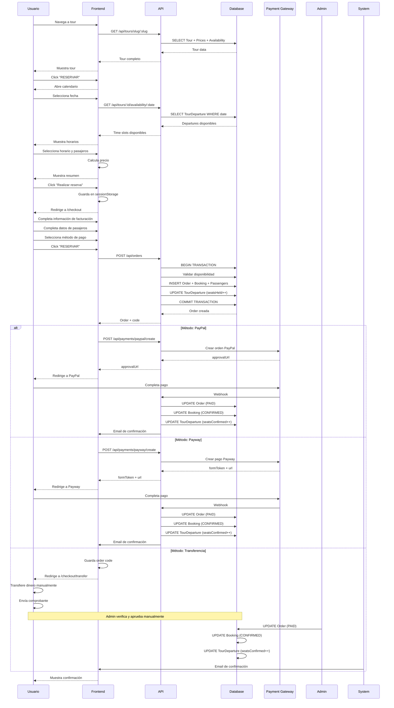
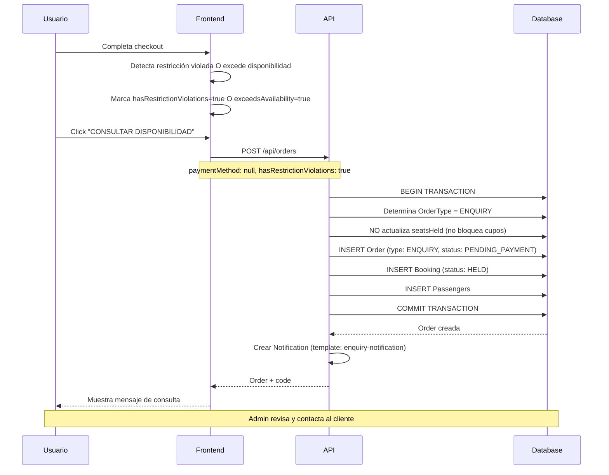
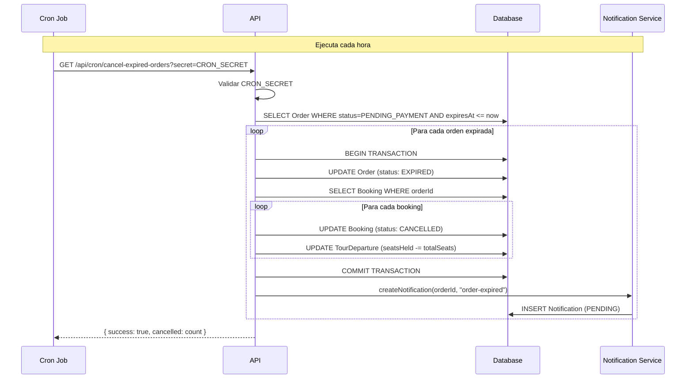
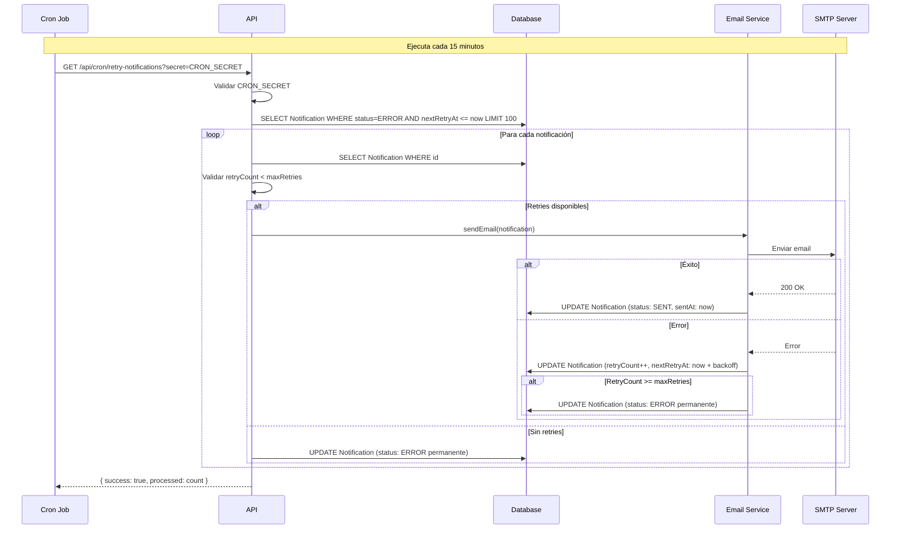
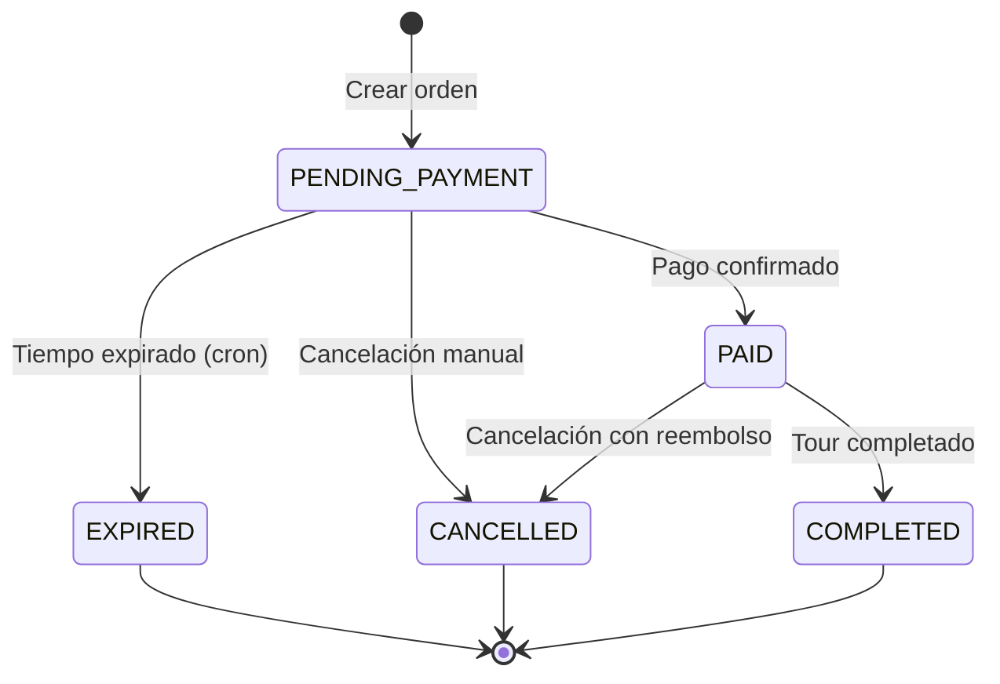
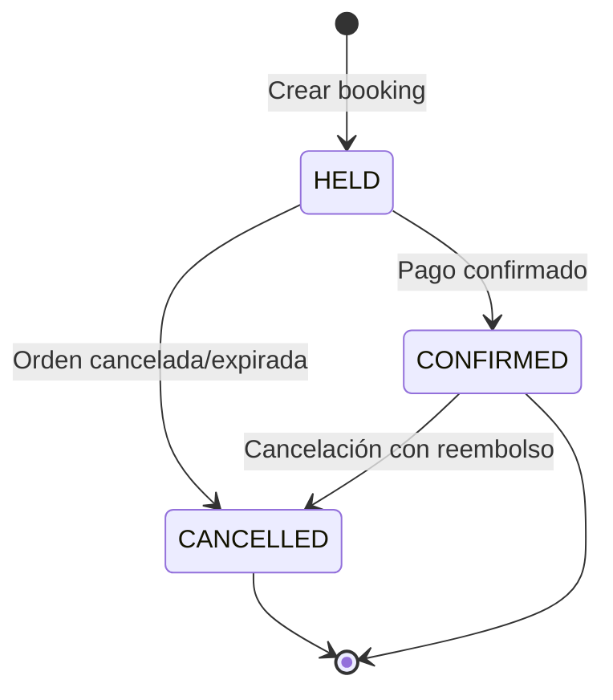
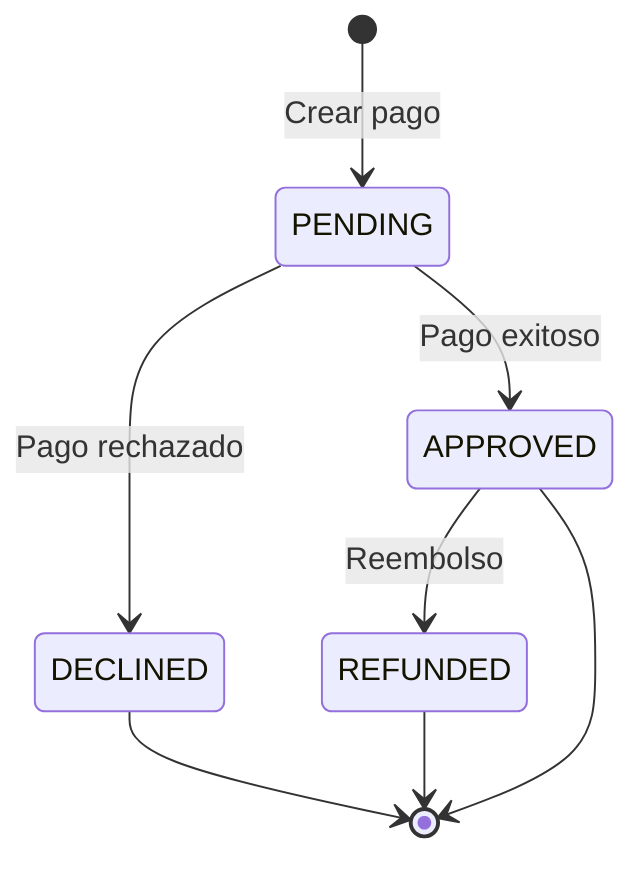
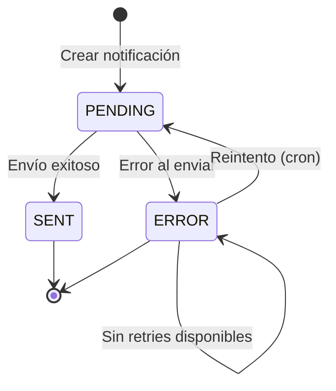

# Antartur - Documentación de Producto

**Versión:** 2.0  
**Última actualización:** Enero 2025  
**Product Owner:** Antartur Team

---

## Tabla de Contenidos

1. [Descripción del Producto](#descripción-del-producto)
2. [Features Principales](#features-principales)
3. [Flujos Principales](#flujos-principales)
4. [Reglas de Negocio del Checkout](#reglas-de-negocio-del-checkout)
5. [Estados y Transiciones](#estados-y-transiciones)
6. [Métodos de Pago](#métodos-de-pago)
7. [Validaciones y Restricciones](#validaciones-y-restricciones)
8. [Notificaciones](#notificaciones)
9. [Cron Jobs](#cron-jobs)

---

## Descripción del Producto

### ¿Qué es Antartur?

Antartur es una plataforma digital de reservas para tours y experiencias de aventura en Tierra del Fuego, Argentina. El sistema permite a los clientes explorar, reservar y pagar tours de manera online, mientras que los administradores gestionan disponibilidad, precios y órdenes desde un panel de control.

### Propósito

Conectar viajeros con experiencias únicas en Ushuaia y Tierra del Fuego, ofreciendo un proceso de reserva simple, transparente y confiable.

### Audiencia

- **Clientes internacionales**: Turistas que buscan experiencias de aventura, prefieren pagar en USD
- **Clientes locales**: Argentinos que buscan tours, prefieren pagar en ARS
- **Administradores**: Personal de Antartur que gestiona tours, disponibilidad y órdenes

### Estado Actual

**Fase:** Producción  
**Stack:** Next.js 15, TypeScript, PostgreSQL, Prisma ORM  
**Deployment:** VPS con Docker

---

## Features Principales

### 1. Gestión de Tours

- **CRUD completo** de tours
- **Precios multi-moneda** (ARS/USD)
- **Galería de imágenes** (hero, featured, gallery)
- **Timeline/itinerario** detallado
- **Testimonios** de clientes
- **Información destacada** (incluye, equipamiento, etc.)
- **Restricciones** configurables
- **SEO metadata** personalizable
- **Disponibilidad por día de semana**

### 2. Sistema de Reservas

- **Calendario interactivo** con disponibilidad en tiempo real
- **Múltiples horarios** por día
- **Selección de pasajeros** (adultos, niños, infantes)
- **Adicionales opcionales** (ej: "Con Canoas")
- **Validación de restricciones** (edad, embarazo, salud)
- **Validación de disponibilidad** automática
- **Snapshots históricos** de información del tour

### 3. Checkout Completo

- **Información de facturación**
- **Datos de pasajeros** (múltiples formularios dinámicos)
- **Validación en tiempo real**
- **Resumen de orden** con desglose de precios
- **Selección de método de pago** según moneda
- **Persistencia de datos** en sessionStorage

### 4. Sistema de Pagos

- **PayPal** (USD) - Integración completa con webhooks
- **Payway** (ARS) - Integración completa con webhooks
- **Transferencia bancaria** (ARS) - Proceso manual
- **Configuración de gateways** desde admin panel
- **Datos bancarios** configurables

### 5. Gestión de Órdenes

- **Códigos únicos** de orden (ANT-YYYY-NNNN)
- **Estados** (PENDING_PAYMENT, PAID, CANCELLED, EXPIRED, COMPLETED)
- **Tipos** (RESERVATION, ENQUIRY)
- **Expiración automática** de órdenes pendientes
- **Historial completo** de pagos y notificaciones

### 6. Notificaciones

- **Emails automáticos** de confirmación
- **Templates** personalizables
- **Reintentos automáticos** de notificaciones fallidas
- **Sistema de cola** para procesamiento asíncrono

### 7. Administración

- **Panel de administración** completo
- **Gestión de tours** con formulario avanzado
- **Gestión de disponibilidad** (crear, editar, eliminar salidas)
- **Gestión de órdenes** (ver, actualizar estado, cancelar)
- **Configuración de pagos** (activar/desactivar gateways)
- **Configuración bancaria** (editar datos de transferencia)
- **Estadísticas** del sistema

### 8. Autenticación y Autorización

- **JWT tokens** para autenticación
- **Refresh tokens** para mantener sesiones
- **Roles** (ADMIN, OPERATOR)
- **Protección de rutas** administrativas

---

## Flujos Principales

### Flujo 1: Reserva Completa (Happy Path)



### Flujo 2: Consulta (Restricciones o Excede Disponibilidad)



### Flujo 3: Expiración Automática de Órdenes



### Flujo 4: Reintento de Notificaciones Fallidas



---

## Reglas de Negocio del Checkout

### 1. Métodos de Pago por Moneda

#### ARS (Pesos Argentinos)

**Métodos disponibles:**
1. **Transferencia Bancaria Directa** (SIEMPRE disponible)
   - No requiere gateway activo
   - Configuración en tabla `BankTransfer`
   - Proceso manual (cliente transfiere, admin aprueba)
   - Tiempo de expiración: 24 horas (configurable via `BANK_TRANSFER_EXPIRATION_HOURS`)

2. **Payway** (Solo si está activo)
   - Requiere gateway activo en tabla `PaymentGateway` (provider: "PAYWAY", isActive: true)
   - Integración con webhooks
   - Tiempo de expiración: 2 horas (configurable via `PENDING_RESERVATION_HOLD_HOURS`)

**Lógica de selección:**
```typescript
// Si currency = ARS
const methods = ["transferencia"]; // Siempre disponible
if (paywayGateway.isActive && paywayGateway.currency === "ARS") {
  methods.push("payway");
}
```

#### USD (Dólares Estadounidenses)

**Métodos disponibles:**
1. **PayPal** (Solo si está activo)
   - Requiere gateway activo en tabla `PaymentGateway` (provider: "PAYPAL", isActive: true)
   - Integración con webhooks
   - Tiempo de expiración: 2 horas (configurable via `PENDING_RESERVATION_HOLD_HOURS`)

**Lógica de selección:**
```typescript
// Si currency = USD
const methods = [];
if (paypalGateway.isActive && paypalGateway.currency === "USD") {
  methods.push("paypal");
}
// Si no hay métodos disponibles, se convierte en ENQUIRY
```

### 2. Validaciones de Disponibilidad

#### Cálculo de Cupos Disponibles

**Fórmula:**
```
cuposDisponibles = seatsTotal - seatsHeld - seatsConfirmed
```

**Reglas:**
- `seatsTotal`: Total de asientos configurados para la salida
- `seatsHeld`: Asientos reservados temporalmente (pendientes de pago)
- `seatsConfirmed`: Asientos confirmados (ya pagados)
- **Los infantes NO descuentan cupo** (solo adultos y niños)

#### Validación de Cupos

**Condiciones:**
1. **Si es RESERVATION:**
   - `totalSeats = numAdults + numChildren` (infantes no cuentan)
   - Debe cumplir: `totalSeats <= cuposDisponibles`
   - Si no cumple → Error: "Not enough available seats"

2. **Si es ENQUIRY:**
   - No se valida disponibilidad
   - No se bloquean cupos (`seatsHeld` no se actualiza)
   - Se crea la orden pero no retiene asientos

#### Validación de Mínimo de Pasajeros

**Campo:** `Tour.minPassengers` (opcional)

**Regla:**
```
totalPasajeros = numAdults + numChildren + numInfants
Si tour.minPassengers existe:
  Si totalPasajeros < tour.minPassengers:
    Error: "This tour requires a minimum of {minPassengers} passengers"
```

#### Validación de Edad Mínima

**Campo:** `Tour.minAge` (opcional)

**Regla:**
```
Para cada pasajero con birthDate:
  edad = calcularEdad(birthDate)
  Si tour.minAge existe:
    Si edad < tour.minAge:
      Error: "Passenger {name} does not meet the minimum age requirement of {minAge} years (age: {edad})"
```

#### Validación de Días de Semana Disponibles

**Campos:** `Tour.mondayAvailable`, `Tour.tuesdayAvailable`, etc.

**Regla:**
```
fechaSeleccionada = departureDate
diaSemana = obtenerDiaSemana(fechaSeleccionada)

Si diaSemana = "Monday" y tour.mondayAvailable = false:
  Error: "This tour is not available on Mondays"

// Similar para otros días
```

### 3. Validaciones de Restricciones

#### Restricciones de Embarazo

**Detección:**
- El pasajero marca `restrictions.pregnancy = true` en el formulario
- El tour tiene restricciones relacionadas con embarazo (validado en frontend)

**Consecuencia:**
- `hasRestrictionViolations = true`
- La orden se convierte en **ENQUIRY** (no RESERVATION)
- Se envía notificación de consulta al admin
- El admin debe contactar al cliente para evaluar el caso

#### Restricciones de Salud

**Detección:**
- El pasajero marca `restrictions.healthIssues = true` en el formulario
- El tour tiene restricciones relacionadas con salud (validado en frontend)

**Consecuencia:**
- `hasRestrictionViolations = true`
- La orden se convierte en **ENQUIRY** (no RESERVATION)
- Se envía notificación de consulta al admin
- El admin debe contactar al cliente para evaluar el caso

#### Restricciones Alimentarias

**Tipos:**
- Vegetariano
- Vegano
- Celíaco
- Alergias específicas

**Consecuencia:**
- Se registran en `Passenger.restrictions` (JSON)
- NO convierten la orden en ENQUIRY
- Se incluyen en las notas de la orden para el admin
- El admin puede preparar opciones especiales

### 4. Cálculo de Precios

#### Precio Base del Tour

**Fórmula:**
```
precioBase = (priceAdult * numAdults) + (priceChild * numChildren)
```

**Fuente de datos:**
- `TourPrice.priceAdult` (Decimal)
- `TourPrice.priceChild` (Decimal)
- Moneda seleccionada por el usuario

#### Precio de Infantes

**Configuración:** `TourPrice.priceInfantFree` (Boolean, default: false)

**Reglas:**
- Si `priceInfantFree = true`: Infantes (0-3 años) son **gratis**
- Si `priceInfantFree = false`: Infantes pagan según `childPriceType`

**Tipos de precio para niños/infantes:**
- `FULL_CHILD_PRICE`: Precio completo de niño
- `HALF_ADULT_PRICE`: Mitad del precio de adulto
- `ADULT_PRICE`: Mismo precio que adulto

**Rango de edad:**
- `childAgeRange`: Ej: "4-11" o "0-11" (String, opcional)
- `infantMaxAge`: Edad máxima para considerar "infant" (Int, default: 3)

**Lógica de cálculo:**
```typescript
function calcularPrecioPasajero(edad: number, tourPrice: TourPrice): number {
  if (edad <= tourPrice.infantMaxAge) {
    // Infante
    if (tourPrice.priceInfantFree) {
      return 0;
    }
    // Aplicar childPriceType
    switch (tourPrice.childPriceType) {
      case "FULL_CHILD_PRICE":
        return tourPrice.priceChild;
      case "HALF_ADULT_PRICE":
        return tourPrice.priceAdult / 2;
      case "ADULT_PRICE":
        return tourPrice.priceAdult;
    }
  } else {
    // Niño o Adulto
    if (esNiño(edad, tourPrice.childAgeRange)) {
      return tourPrice.priceChild;
    } else {
      return tourPrice.priceAdult;
    }
  }
}
```

#### Precios de Adicionales

**Fuente:** `TourAdditional` + `TourAdditionalPrice`

**Fórmula:**
```
precioAdicionales = sum(
  para cada adicional seleccionado:
    (priceAdult * numAdults) + (priceChild * numChildren)
)
```

**Ejemplo:**
- Tour base: $100 (adulto), $50 (niño)
- Adicional "Con Canoas": $20 (adulto), $10 (niño)
- 2 adultos, 1 niño
- Total: (100*2 + 50*1) + (20*2 + 10*1) = 250 + 50 = $300

#### Precio Total

**Fórmula:**
```
precioTotal = precioBase + precioAdicionales
```

**Almacenamiento:**
- `Order.totalAmount` (Decimal(10, 2))
- `Booking.unitPriceAdult` y `Booking.unitPriceChild` (snapshots)

### 5. Expiración de Órdenes

#### Tiempos de Expiración

**Transferencia Bancaria:**
- **Tiempo:** 24 horas (configurable via `BANK_TRANSFER_EXPIRATION_HOURS`)
- **Razón:** Proceso manual requiere más tiempo
- **Campo:** `Order.expiresAt` se calcula al crear la orden

**PayPal/Payway:**
- **Tiempo:** 2 horas (configurable via `PENDING_RESERVATION_HOLD_HOURS`)
- **Razón:** Pagos online deben completarse rápidamente
- **Campo:** `Order.expiresAt` se calcula al crear la orden

**ENQUIRY:**
- **Tiempo:** No expira (expiresAt = null)
- **Razón:** No bloquea cupos, no requiere pago

#### Proceso de Expiración

**Cron Job:** `/api/cron/cancel-expired-orders`
- **Frecuencia:** Cada hora
- **Autenticación:** Requiere `CRON_SECRET` en query param o header

**Acciones al expirar:**
1. `Order.status` → `EXPIRED`
2. Todos los `Booking` asociados → `CANCELLED`
3. `TourDeparture.seatsHeld` se reduce por `totalSeats` de cada booking
4. Se crea notificación de expiración (opcional)

**Código:**
```typescript
// Buscar órdenes expiradas
const expiredOrders = await prisma.order.findMany({
  where: {
    status: "PENDING_PAYMENT",
    expiresAt: { lte: new Date() }
  }
});

// Para cada orden expirada
for (const order of expiredOrders) {
  await prisma.$transaction(async (tx) => {
    // Actualizar orden
    await tx.order.update({
      where: { id: order.id },
      data: { status: "EXPIRED" }
    });
    
    // Actualizar bookings y liberar cupos
    const bookings = await tx.booking.findMany({
      where: { orderId: order.id }
    });
    
    for (const booking of bookings) {
      await tx.booking.update({
        where: { id: booking.id },
        data: { status: "CANCELLED" }
      });
      
      await tx.tourDeparture.update({
        where: { id: booking.tourDepartureId },
        data: {
          seatsHeld: { decrement: booking.totalSeats }
        }
      });
    }
  });
}
```

### 6. Tipos de Orden

#### RESERVATION

**Condiciones:**
- `exceedsAvailability = false`
- `hasRestrictionViolations = false`
- `paymentMethod` está presente

**Características:**
- Requiere pago
- Bloquea cupos (`seatsHeld` se incrementa)
- Tiene `expiresAt` configurado
- Puede convertirse en `PAID` cuando se confirma el pago

#### ENQUIRY

**Condiciones:**
- `exceedsAvailability = true` O
- `hasRestrictionViolations = true` O
- `paymentMethod` no está presente

**Características:**
- NO requiere pago
- NO bloquea cupos (`seatsHeld` NO se incrementa)
- `expiresAt = null` (no expira)
- El admin debe contactar al cliente
- Se envía notificación de consulta

**Conversión:**
- Un ENQUIRY puede convertirse en RESERVATION manualmente por el admin
- El admin actualiza la orden y crea un nuevo booking si hay disponibilidad

---

## Estados y Transiciones

### Estados de Order



**Estados:**
- `PENDING_PAYMENT`: Esperando pago (estado inicial)
- `PAID`: Pagado (pago confirmado)
- `EXPIRED`: Expirado (automático por cron)
- `CANCELLED`: Cancelado (manual o automático)
- `COMPLETED`: Completado (tour realizado)

### Estados de Booking



**Estados:**
- `HELD`: Reservado temporalmente (pendiente de pago)
- `CONFIRMED`: Confirmado (pagado)
- `CANCELLED`: Cancelado

### Estados de Payment



**Estados:**
- `PENDING`: Pendiente
- `APPROVED`: Aprobado
- `DECLINED`: Rechazado
- `REFUNDED`: Reembolsado

### Estados de Notification



**Estados:**
- `PENDING`: Pendiente de envío
- `SENT`: Enviado exitosamente
- `ERROR`: Error al enviar (se reintenta automáticamente)

---

## Métodos de Pago

### PayPal (USD)

**Configuración:**
- Tabla: `PaymentGateway` (provider: "PAYPAL")
- Campos: `isActive`, `isSandbox`, `currency: "USD"`
- Credenciales: Variables de entorno

**Flujo:**
1. Cliente selecciona PayPal
2. Frontend llama a `/api/payments/paypal/create`
3. Backend crea orden en PayPal
4. Frontend redirige a PayPal
5. Cliente completa pago
6. PayPal envía webhook a `/api/payments/webhook/paypal`
7. Backend actualiza `Payment` y `Order`
8. Backend envía email de confirmación

**Webhook Events:**
- `PAYMENT.CAPTURE.COMPLETED`: Pago exitoso
- `PAYMENT.CAPTURE.DENIED`: Pago rechazado

### Payway (ARS)

**Configuración:**
- Tabla: `PaymentGateway` (provider: "PAYWAY")
- Campos: `isActive`, `isSandbox`, `currency: "ARS"`
- Credenciales: Variables de entorno

**Flujo:**
1. Cliente selecciona Payway
2. Frontend llama a `/api/payments/payway/create`
3. Backend crea pago en Payway
4. Frontend redirige a Payway con `formToken`
5. Cliente completa pago
6. Payway envía webhook a `/api/payments/webhook/payway`
7. Backend actualiza `Payment` y `Order`
8. Backend envía email de confirmación

**Webhook Events:**
- `payment.approved`: Pago aprobado
- `payment.declined`: Pago rechazado

### Transferencia Bancaria (ARS)

**Configuración:**
- Tabla: `BankTransfer` (id: "default")
- Campos: `isActive`, `accountName`, `accountNumber`, `bank`, `cuit`, `cbu`, `alias`

**Flujo:**
1. Cliente selecciona Transferencia
2. Frontend crea orden (sin pago inmediato)
3. Frontend redirige a `/checkout/transfer`
4. Frontend muestra datos bancarios
5. Cliente transfiere dinero manualmente
6. Cliente envía comprobante por email
7. Admin verifica y aprueba manualmente
8. Admin actualiza `Order.status = PAID`
9. Sistema envía email de confirmación

**Tiempo de expiración:** 24 horas

---

## Validaciones y Restricciones

### Validaciones de Frontend

**Antes de enviar orden:**
- Todos los campos requeridos completos
- Email válido
- Teléfono válido
- Fechas de nacimiento válidas
- Al menos un pasajero
- Método de pago seleccionado (si es RESERVATION)

**Validaciones de disponibilidad:**
- Fecha no en el pasado
- Horario disponible
- Cupos suficientes
- Día de semana disponible

**Validaciones de restricciones:**
- Edad mínima cumplida
- Restricciones de embarazo/salud detectadas

### Validaciones de Backend

**Al crear orden:**
- `Tour` existe y está activo
- `TourDeparture` existe y está activo
- Disponibilidad suficiente (si no es ENQUIRY)
- Mínimo de pasajeros cumplido
- Edad mínima cumplida
- Precio existe para la moneda seleccionada
- Datos de pasajeros válidos

**Al procesar pago:**
- `Order` existe y está en `PENDING_PAYMENT`
- `Payment` no existe o está en `PENDING`
- Webhook válido (firma verificada)
- Monto correcto

---

## Notificaciones

### Templates Disponibles

1. **reservation-confirmation**: Confirmación de reserva (cliente)
2. **reservation-notification**: Notificación de nueva reserva (admin)
3. **payment-confirmation**: Confirmación de pago (cliente)
4. **enquiry-confirmation**: Confirmación de consulta (cliente)
5. **enquiry-notification**: Notificación de nueva consulta (admin)
6. **order-expired**: Orden expirada (cliente)

### Sistema de Reintentos

**Configuración:**
- `maxRetries`: 5 (default)
- `retryCount`: Contador de reintentos
- `nextRetryAt`: Fecha del próximo reintento

**Backoff Strategy:**
- Reintento 1: 5 minutos
- Reintento 2: 15 minutos
- Reintento 3: 30 minutos
- Reintento 4: 1 hora
- Reintento 5: 2 horas

**Cron Job:** `/api/cron/retry-notifications`
- Frecuencia: Cada 15 minutos
- Límite: 100 notificaciones por ejecución
- Autenticación: Requiere `CRON_SECRET`

---

## Cron Jobs

### 1. Cancelar Órdenes Expiradas

**Endpoint:** `/api/cron/cancel-expired-orders`  
**Método:** GET  
**Frecuencia:** Cada hora  
**Autenticación:** `CRON_SECRET` en query param o header

**Acciones:**
- Busca órdenes `PENDING_PAYMENT` con `expiresAt <= now`
- Actualiza `Order.status = EXPIRED`
- Cancela todos los `Booking` asociados
- Libera cupos (`seatsHeld` se reduce)
- Crea notificaciones de expiración (opcional)

### 2. Reintentar Notificaciones Fallidas

**Endpoint:** `/api/cron/retry-notifications`  
**Método:** GET o POST  
**Frecuencia:** Cada 15 minutos  
**Autenticación:** `CRON_SECRET` en query param o header

**Acciones:**
- Busca notificaciones `ERROR` con `nextRetryAt <= now`
- Límite: 100 notificaciones por ejecución
- Reintenta envío
- Actualiza `retryCount` y `nextRetryAt`
- Si `retryCount >= maxRetries`, marca como error permanente

---

## Variables de Entorno Relacionadas

```bash
# Expiración de órdenes
BANK_TRANSFER_EXPIRATION_HOURS=24  # Horas para transferencia bancaria
PENDING_RESERVATION_HOLD_HOURS=2   # Horas para PayPal/Payway

# Cron jobs
CRON_SECRET=your-secret-key        # Secret para autenticar cron jobs

# Payment gateways
PAYPAL_CLIENT_ID=...
PAYPAL_CLIENT_SECRET=...
PAYWAY_API_KEY=...
PAYWAY_SECRET_KEY=...

# Email
SMTP_HOST=...
SMTP_PORT=...
SMTP_USER=...
SMTP_PASS=...
```

---

**Documento actualizado:** Enero 2025  
**Próxima revisión:** Cuando se agreguen nuevas features o cambien reglas de negocio significativas

