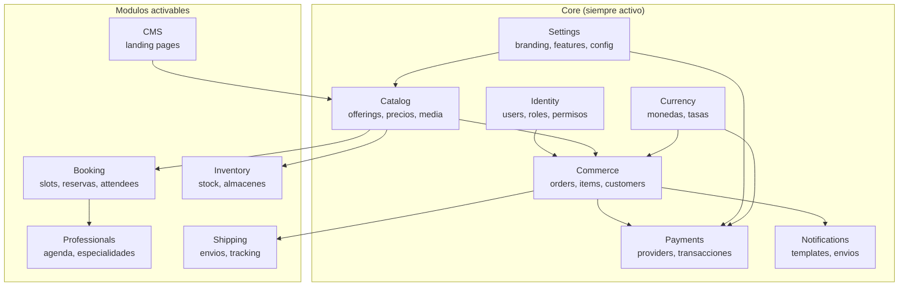
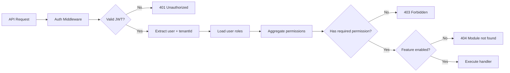
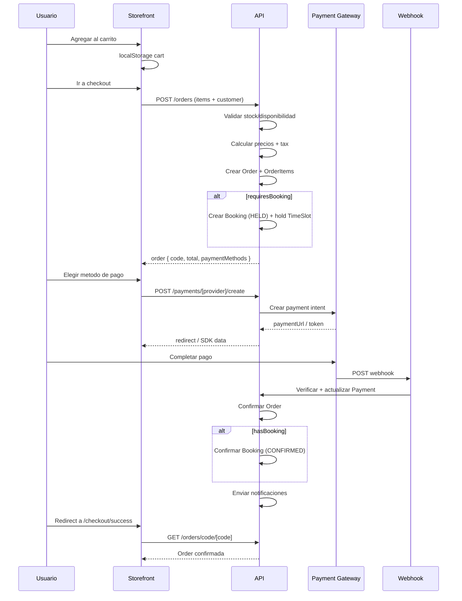
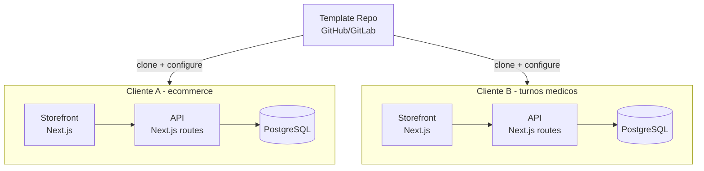
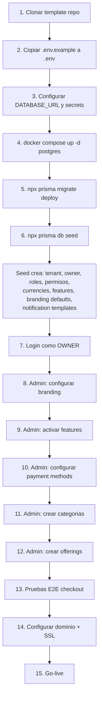

# PRD: SaaS Template de Gestion Comercial

## Documento de Requisitos de Producto (PRD) - Version 1.0

Este documento es la guia definitiva para convertir el repositorio actual (sitio de reservas de tours Antartur) en un **template SaaS generico de gestion de ventas** reutilizable para cualquier vertical: productos, servicios, turnos medicos, canchas deportivas, experiencias/tours, tratamientos, etc.

Cualquier agente o desarrollador que lea este documento debe poder crear epicas, historias de usuario y tareas concretas sin ambiguedad.

---

## Indice

1. [Decisiones de negocio cerradas](#1-decisiones-de-negocio-cerradas)
2. [Inventario actual del codigo fuente](#2-inventario-actual-del-codigo-fuente)
3. [Clasificacion de lo existente: generico vs vertical](#3-clasificacion-de-lo-existente-generico-vs-vertical)
4. [Arquitectura objetivo del SaaS template](#4-arquitectura-objetivo-del-saas-template)
5. [Modelo de datos target (Prisma schema completo)](#5-modelo-de-datos-target-prisma-schema-completo)
6. [Mapeo de migracion: entidades actuales -> nuevas](#6-mapeo-de-migracion-entidades-actuales---nuevas)
7. [API: endpoints actuales y su destino](#7-api-endpoints-actuales-y-su-destino)
8. [Sistema de permisos RBAC (matriz completa)](#8-sistema-de-permisos-rbac-matriz-completa)
9. [Frontend: estrategia de desacople y theming](#9-frontend-estrategia-de-desacople-y-theming)
10. [Pagos: arquitectura de providers](#10-pagos-arquitectura-de-providers)
11. [Multi-moneda y multi-idioma](#11-multi-moneda-y-multi-idioma)
12. [Facturacion e impuestos](#12-facturacion-e-impuestos)
13. [Notificaciones](#13-notificaciones)
14. [Diagramas Mermaid (todos)](#14-diagramas-mermaid)
15. [Epicas y tareas por fase](#15-epicas-y-tareas-por-fase)
16. [Bootstrap de nuevo cliente](#16-bootstrap-de-nuevo-cliente)
17. [Checklist de salida comercial](#17-checklist-de-salida-comercial)
18. [Riesgos y mitigacion](#18-riesgos-y-mitigacion)

---

## 1. Decisiones de negocio cerradas

| # | Decision | Valor |
|---|----------|-------|
| 1 | Modelo de despliegue | **Instancia aislada por cliente** (cada cliente tiene su DB, su deploy, su dominio). No multi-tenant compartido en V1. |
| 2 | Usuarios compartidos entre clientes | **No.** Cada instalacion tiene sus propios usuarios. |
| 3 | Sistema de permisos | **RBAC puro** (roles + permisos granulares). Sin ABAC en V1. |
| 4 | Facturacion fiscal | **Incluir estructura de impuestos/facturacion desde V1.** Interfaz adaptador por pais; empezar con Argentina (AFIP preparado pero no bloqueante). |
| 5 | Medios de pago V1 | **PayPal, Payway, MercadoPago**, transferencia bancaria, efectivo/manual. |
| 6 | Alcance funcional V1 | **Maximo posible** (productos, servicios con agenda, reservas de recursos, experiencias/tours). Luego se refina por cliente. |
| 7 | Frontend | **Desacoplado:** admin separado de storefront. White-label por configuracion. Cero hardcodes de marca. |

---

## 2. Inventario actual del codigo fuente

### 2.1 Stack tecnologico actual

| Componente | Tecnologia | Version |
|-----------|------------|---------|
| Framework | Next.js (App Router) | 15 |
| Lenguaje | TypeScript | strict |
| Estilos | CSS Modules + Sass | - |
| Base de datos | PostgreSQL | 16 |
| ORM | Prisma | 5 |
| Auth | JWT (jose) + bcryptjs + RefreshToken | - |
| Pagos | PayPal SDK + Payway/Decidir | - |
| Email | Nodemailer (Gmail/SMTP) | - |
| Rate limiting | rate-limiter-flexible (in-memory) | - |
| Deploy | Docker (standalone output) | - |
| Testing | Vitest + Supertest | - |

### 2.2 Modelos de base de datos actuales (Prisma)

**Enums existentes:**
- `OrderType`: RESERVATION, ENQUIRY
- `OrderStatus`: PENDING_PAYMENT, PAID, CANCELLED, EXPIRED, COMPLETED
- `BookingStatus`: HELD, CONFIRMED, CANCELLED
- `PassengerType`: ADULT, CHILD, INFANT
- `PaymentStatus`: PENDING, APPROVED, DECLINED, REFUNDED
- `NotificationType`: EMAIL, WHATSAPP
- `NotificationStatus`: PENDING, SENT, ERROR
- `ImageType`: FEATURED, HERO, GALLERY
- `ChildPriceType`: FULL_CHILD_PRICE, HALF_ADULT_PRICE, ADULT_PRICE
- `HomePrimarySeason`: SUMMER, WINTER, AUTO
- `UserRole`: ADMIN, OPERATOR

**Modelos existentes (20 tablas):**

| Modelo | Campos principales | Relaciones | Generico? |
|--------|-------------------|------------|-----------|
| `Currency` | code(PK), name, symbol, isDefault | tourPrices, tourAdditionalPrices, orders | **SI** (renombrar relaciones) |
| `Tour` | id, slug, name, subtitle, category, difficulty, durationHours, featuredImage, heroImage, shortDescription, longDescription, restrictionText, isActive, SEO fields, CTA fields, weekday booleans, defaultStartTime/EndTime | images, departures, prices, additionals, timelineItems, featuredInfos, testimonials, quickInfoItems, restrictions | **NO** - reemplazar por `Offering` |
| `TourPrice` | id, tourId, currency, priceAdult, priceChild, priceInfantFree, childAgeRange, childPriceType, infantMaxAge | tour, currencyRef | **NO** - reemplazar por `OfferingPrice` |
| `TourImage` | id, tourId, imageType, url, altText, sortOrder | tour | **NO** - reemplazar por `OfferingMedia` |
| `TourDeparture` | id, tourId, departureDate, seatsTotal, seatsHeld, seatsConfirmed, isActive | tour, bookings | **NO** - reemplazar por `TimeSlot` |
| `TourTimelineItem` | id, tourId, timeLabel, title, description, sortOrder | tour | **NO** - reemplazar por `OfferingContentBlock` |
| `TourFeaturedInfo` | id, tourId, icon, title, description, sortOrder | tour | **NO** - reemplazar por `OfferingContentBlock` |
| `TourTestimonial` | id, tourId, text, author, avatar, country, sortOrder | tour | **NO** - reemplazar por `Testimonial` (generico) |
| `TourQuickInfoItem` | id, tourId, icon, label, value, sortOrder | tour | **NO** - reemplazar por `OfferingAttribute` |
| `TourRestriction` | id, tourId, text, sortOrder | tour | **NO** - reemplazar por `OfferingContentBlock` |
| `TourAdditional` | id, tourId, name, description, isActive, sortOrder | tour, prices | **NO** - reemplazar por `OfferingExtra` |
| `TourAdditionalPrice` | id, tourAdditionalId, currency, priceAdult, priceChild | tourAdditional, currencyRef | **NO** - reemplazar por `OfferingExtraPrice` |
| `Order` | id, code, type, status, customerName/Email/Phone, currency, totalAmount, expiresAt, notes | currencyRef, bookings, payments, notifications | **SI** (agregar tenantId, customerId, orderItems, subtotal/tax/discount) |
| `Booking` | id, orderId, tourDepartureId, status, numAdults/Children, totalSeats, unitPriceAdult/Child, currency, snapshots | order, tourDeparture, passengers | **PARCIAL** (desacoplar de tourDeparture, vincular a timeSlot + orderItem) |
| `Passenger` | id, bookingId, type, firstName, lastName, birthDate, documentType/Number, nationality, email, phone, restrictions(JSON) | booking | **PARCIAL** (renombrar a `BookingAttendee`, hacer campos mas flexibles) |
| `Payment` | id, orderId, provider, providerPaymentId, status, amount, currency, paidAt, rawRequest/Response | order | **SI** (agregar tenantId) |
| `Notification` | id, orderId, type, recipient, templateKey, subject, body, status, errorMessage, sentAt, retryCount, maxRetries, nextRetryAt | order | **SI** (agregar tenantId, bookingId) |
| `User` | id, email, passwordHash, name, role, isActive, lastLoginAt | refreshTokens | **PARCIAL** (agregar tenantId, reemplazar role enum por tabla roles) |
| `RefreshToken` | id, token, userId, expiresAt | user | **SI** |
| `PaymentGateway` | id, provider, isActive, isSandbox, displayName, currency, config(JSON) | - | **SI** (renombrar a PaymentMethod, agregar tenantId) |
| `BankTransfer` | id, isActive, accountName, accountNumber, bank, cuit, cbu, alias | - | **PARCIAL** (fusionar en PaymentMethod.config) |
| `SiteSettings` | id("global"), homePrimarySeason, minimumAdvanceBookingHours, gtmId, ga4Id, phone, whatsappNumber, email, address, city, country, socialUrls | - | **PARCIAL** (dividir en TenantSettings + TenantBranding + TenantContact) |

### 2.3 Modulos del codigo (`src/modules/`)

| Modulo | Archivos | Proposito | Generico? |
|--------|----------|-----------|-----------|
| `admin` | 16 archivos: layout (sidebar, header), PaymentGatewayCard, TourForm, hooks (useAdminAuth, useDashboardStats, useDataTable), lib (adminApiClient, authHelpers, types) | UI y logica del panel admin | **PARCIAL** - layout generico, TourForm NO |
| `auth` | 1 archivo: authService.ts | Login, refresh, logout, logoutAll, cleanupTokens | **SI** |
| `booking` | ~45 archivos: Calendar, CheckoutForm, MiniCart, PaymentModal, TourAdditionalsSelector, hooks (useBookingFlow, useCalendarState, etc.), domain, infra | Flujo completo de reservas | **PARCIAL** - checkout generico, Calendar/TourAdditionals NO |
| `currency` | 2 archivos: types.ts, currencyRepository.ts | Monedas y tasas | **SI** |
| `departures` | 5 archivos: controller, dto, validators, service, repository | Disponibilidad de tours | **NO** - reemplazar por `availability` generico |
| `layout` | 4 archivos: Header, Footer, datos JSON | Header/Footer del sitio publico | **PARCIAL** - estructura si, contenido/datos NO |
| `notifications` | 9 archivos: emailService, notificationService, repository, templates (enquiry/reservation/payment), utils | Emails transaccionales | **PARCIAL** - motor si, templates de tour NO |
| `orders` | 6 archivos: controller, dto, service, repository, client, types | Ordenes | **SI** (necesita order_items) |
| `passengers` | 5 archivos: controller, dto, validators, service, repository | Pasajeros por booking | **PARCIAL** - renombrar a attendees, flexibilizar campos |
| `payments` | 12 archivos: paypalService, paywayService, paymentService, gatewayConfigService, repository, hooks, components (PaywayCardForm, PaywayPaymentModal) | Pagos online | **PARCIAL** - agregar MercadoPago, patron adaptador |
| `settings` | 2 archivos: repository.ts, types.ts | Config global del sitio | **PARCIAL** - dividir en tenant_settings/branding/contact |
| `tours` | ~40 archivos: tourService, tourPriceService, repositories, admin components (TourForm, AvailabilityManager, GalleryManager, etc.), public components (ToursGrid, TourCard, etc.) | CRUD de tours completo | **NO** - reemplazar por `catalog` generico |
| `ui` | 12 archivos: Hero, Banner, ContactForm, ContactInfo, Testimonials, WindyWidget | Componentes UI del sitio publico | **PARCIAL** - Hero/Banner generico, WindyWidget/datos Antartur NO |

### 2.4 Rutas API actuales (55 endpoints)

**Auth (4):**
- `POST /api/auth/login`
- `POST /api/auth/logout`
- `GET /api/auth/me`
- `POST /api/auth/refresh`

**Admin (12):**
- `POST /api/admin/orders/expire-pending`
- `GET|PATCH /api/admin/settings/bank-transfer`
- `GET|PATCH /api/admin/settings/payments/[provider]`
- `POST /api/admin/settings/payments/[provider]/test`
- `GET /api/admin/settings/payments`
- `GET|PATCH /api/admin/settings/site`
- `GET /api/admin/stats`
- `POST /api/admin/upload`
- `POST /api/admin/upload/testimonial`
- `GET|POST /api/admin/users`
- `DELETE /api/admin/users/[id]`
- `PATCH /api/admin/users/[id]/password`

**Tours (7):**
- `GET|POST /api/tours`
- `GET|PUT|DELETE /api/tours/[id]`
- `GET /api/tours/slug/[slug]`
- `GET /api/tours/[id]/availability`
- `GET /api/tours/[id]/availability/[date]`
- `GET|POST /api/tours/[id]/prices`
- `PUT|DELETE /api/tours/[id]/prices/[priceId]`

**Orders (5):**
- `GET|POST /api/orders`
- `GET /api/orders/[id]`
- `PATCH /api/orders/[id]/status`
- `GET /api/orders/code/[code]`

**Bookings (5):**
- `GET|POST /api/bookings`
- `GET /api/bookings/[id]`
- `PATCH /api/bookings/[id]/status`
- `GET /api/bookings/[id]/passengers`
- `GET /api/bookings/order/[orderId]`

**Payments (9):**
- `GET|POST /api/payments`
- `GET /api/payments/[id]`
- `GET /api/payments/available`
- `GET /api/payments/order/[orderId]`
- `POST /api/payments/paypal/create`
- `POST /api/payments/paypal/capture`
- `POST /api/payments/payway/process`
- `POST /api/payments/webhook/paypal`
- `POST /api/payments/webhook/payway`

**Notifications (4):**
- `GET|POST /api/notifications`
- `GET|PATCH /api/notifications/[id]`
- `GET /api/notifications/order/[orderId]`

**Other (9):**
- `GET /api/availability/[id]`
- `GET /api/bank-details`
- `POST /api/contact`
- `GET /api/config/payway`
- `POST /api/cron/cancel-expired-orders`
- `POST /api/cron/retry-notifications`
- `GET /api/docs`
- `GET /api/health`
- `GET /api/passengers/[id]`
- `GET /api/test-db`
- `POST /api/test-email`

### 2.5 Paginas admin actuales (17)

| Ruta | Proposito |
|------|-----------|
| `/admin` | Redirect a dashboard |
| `/admin/login` | Login |
| `/admin/dashboard` | Metricas |
| `/admin/tours` | Lista de tours |
| `/admin/tours/[id]` | Editar tour |
| `/admin/tours/new` | Crear tour |
| `/admin/orders` | Lista de ordenes |
| `/admin/orders/[id]` | Detalle de orden |
| `/admin/bookings` | Lista de reservas |
| `/admin/bookings/[id]` | Detalle de reserva |
| `/admin/notifications` | Lista de notificaciones |
| `/admin/notifications/[id]` | Detalle de notificacion |
| `/admin/users` | Gestion de usuarios |
| `/admin/settings` | Redirect |
| `/admin/settings/site` | Config general |
| `/admin/settings/payments` | Config de medios de pago |
| `/admin/email-preview` | Preview de emails |

### 2.6 Paginas publicas actuales (23)

| Ruta | Proposito | Generico? |
|------|-----------|-----------|
| `/` | Home con grids de tours | **NO** - contenido Antartur |
| `/tours` | Listado de tours | **NO** -> `/catalog` |
| `/tours/[id]` | Detalle de tour | **NO** -> `/catalog/[slug]` |
| `/checkout` | Checkout | **PARCIAL** |
| `/checkout/success` | Exito | **SI** |
| `/checkout/transfer` | Transferencia | **SI** |
| `/checkout/paypal/return` | Return PayPal | **SI** |
| `/checkout/error` | Error checkout | **SI** |
| `/checkout/payment-error` | Error pago | **SI** |
| `/contacto` | Formulario contacto | **SI** |
| `/verano`, `/invierno` | Temporadas | **NO** - Antartur |
| `/antartida`, `/turismo-corporativo` | Paginas info | **NO** - Antartur |
| `/ushuaia`, `/ushuaia/hoteles`, `/ushuaia/gastronomia` | Paginas info | **NO** - Antartur |
| `/clima` | Widget clima | **NO** - Antartur |
| `/carrito` | Carrito | **SI** |
| `/politicas-de-privacidad` | Legal | **PARCIAL** |
| `/terminos-y-condiciones` | Legal | **PARCIAL** |
| `/docs` | Swagger docs | **SI** |

### 2.7 Componentes compartidos actuales (`src/components/common/` - 32 componentes)

**100% generico (reutilizar tal cual):** Badge, Button, Card, Chart, ChartCard, CookieBanner, DataTable, ErrorBoundary (3 variantes), FiltersBar, FooterSection, Heading, Input, LoadingOverlay, Message, MetricCard, Modal, Pagination, Select, StatusBadge, Table, Textarea, Tooltip, WhatsAppButton, ArrayFieldManager, SocialIcon.

**Parcialmente generico (adaptar):** CurrencySwitcher (hardcodea ARS/USD), OrderDetails (tour-specific labels), OrderSummaryCard (tour references), PaymentDetails, Testimonials.

**Tour-specific (reescribir):** TourInfo, ContactItem.

### 2.8 Audit de hardcodes de marca "Antartur"

Archivos con referencia directa a "Antartur" o contenido especifico del cliente:

| Archivo | Que tiene hardcodeado |
|---------|----------------------|
| `src/app/layout.tsx` | metadata title "Antartur", description, keywords, OpenGraph, Twitter |
| `src/app/page.tsx` | metadata, textos de heading, contenido de temporadas |
| `src/modules/admin/components/layout/AdminSidebar/AdminSidebar.tsx` | `<h2>Antartur</h2>` en logo, item "Tours" hardcodeado |
| `src/modules/layout/components/Header/headerdata.json` | Links de navegacion Antartur |
| `src/modules/layout/components/Footer/Footer.tsx` | Marca y datos de contacto |
| `src/modules/layout/components/Footer/footerdata.json` | Datos de contacto Antartur |
| `src/modules/ui/components/Hero/herodata.json` | Imagenes y textos de hero Antartur |
| `src/modules/ui/components/Testimonials/testimonialsdata.json` | Testimonios reales Antartur |
| `src/contexts/CurrencyContext.tsx` | `CURRENCY_STORAGE_KEY = "antartur_selected_currency"` |
| `src/lib/api/swagger.ts` | titulo "Antartur API" |
| `prisma/seed.ts` | Email/password admin por defecto |
| `docker-compose.yml` | network "antartur_network", credenciales |
| `README.md` | Todo el contenido |
| Paginas publicas | `/verano`, `/invierno`, `/antartida`, `/turismo-corporativo`, `/ushuaia/*`, `/clima` |

---

## 3. Clasificacion de lo existente: generico vs vertical

### 3.1 Reutilizar tal cual (con refactors menores)

- **Auth completo:** `src/lib/auth/*`, `src/modules/auth/*`, endpoints `/api/auth/*`
- **Orders core:** `src/modules/orders/*` (agregar order_items y tenantId)
- **Payments core:** `src/modules/payments/domain/*`, `src/modules/payments/infra/*` (patron adaptador)
- **Notifications core:** `src/modules/notifications/domain/*`, `src/modules/notifications/infra/*`
- **Currency:** `src/modules/currency/*`
- **Settings repository pattern:** `src/modules/settings/*` (adaptar schema)
- **Lib completa:** `src/lib/api/*`, `src/lib/auth/*`, `src/lib/middleware/*`, `src/lib/db.ts`, `src/lib/services/logger.ts`, `src/lib/validation/schemas.ts`
- **32 componentes comunes** en `src/components/common/`
- **Admin layout** (sidebar, header, layout) - adaptar para ser dinamico
- **Admin hooks:** useDataTable, useDashboardStats (adaptar queries)
- **Admin lib:** adminApiClient (extender), authHelpers, types (extender)
- **Prisma infra:** migrations pattern, seed pattern, docker-compose pattern

### 3.2 Refactorizar significativamente

- **Booking module:** desacoplar de Tour, vincular a TimeSlot + OrderItem generico
- **Departures module:** generalizar como `availability` module con Resources + TimeSlots
- **Checkout flow:** usar OrderItems genericos en vez de tour-specific
- **MiniCart:** pricing generico, no tour-specific
- **Layout (Header/Footer):** datos desde DB/config, no JSON hardcodeado
- **SiteSettings:** dividir en TenantSettings + TenantBranding + TenantContact
- **User model:** agregar tenantId, migrar de enum role a tabla roles + permisos

### 3.3 Eliminar o mover a vertical "tours"

- **Todo `src/modules/tours/`** (40+ archivos) -> vertical de ejemplo
- **Paginas publicas Antartur:** `/verano`, `/invierno`, `/antartida`, `/turismo-corporativo`, `/ushuaia/*`, `/clima`
- **Datos hardcodeados:** herodata.json, footerdata.json, headerdata.json, testimonialsdata.json
- **WindyWidget** (clima Ushuaia)
- **Tour-specific admin pages:** `/admin/tours/*`

---

## 4. Arquitectura objetivo del SaaS template

### 4.1 Estructura de directorios target

```
src/
├── app/
│   ├── api/
│   │   ├── v1/                          # API versionada
│   │   │   ├── auth/                    # login, logout, refresh, me
│   │   │   ├── catalog/                 # offerings CRUD
│   │   │   │   └── [id]/
│   │   │   │       ├── prices/
│   │   │   │       ├── extras/
│   │   │   │       ├── media/
│   │   │   │       └── availability/
│   │   │   ├── categories/              # categorias
│   │   │   ├── orders/                  # ordenes + order_items
│   │   │   │   └── [id]/
│   │   │   │       └── status/
│   │   │   ├── bookings/                # reservas genericas
│   │   │   ├── payments/                # pagos + webhooks
│   │   │   │   ├── [provider]/
│   │   │   │   │   ├── create/
│   │   │   │   │   ├── capture/
│   │   │   │   │   └── webhook/
│   │   │   │   └── available/
│   │   │   ├── notifications/
│   │   │   ├── customers/
│   │   │   ├── resources/               # recursos bookables
│   │   │   ├── professionals/           # profesionales
│   │   │   └── availability/            # time_slots
│   │   ├── admin/                       # endpoints admin
│   │   │   ├── settings/
│   │   │   ├── users/
│   │   │   ├── stats/
│   │   │   └── upload/
│   │   ├── cron/
│   │   ├── health/
│   │   └── contact/
│   ├── admin/                           # paginas admin
│   │   ├── dashboard/
│   │   ├── catalog/                     # reemplaza /admin/tours
│   │   │   ├── [id]/
│   │   │   └── new/
│   │   ├── orders/
│   │   │   └── [id]/
│   │   ├── bookings/
│   │   │   └── [id]/
│   │   ├── customers/
│   │   ├── resources/
│   │   ├── professionals/
│   │   ├── notifications/
│   │   ├── users/
│   │   └── settings/
│   │       ├── general/
│   │       ├── branding/
│   │       ├── payments/
│   │       ├── locales/
│   │       └── features/
│   ├── (storefront)/                    # grupo de rutas publicas
│   │   ├── page.tsx                     # home
│   │   ├── catalog/
│   │   │   └── [slug]/
│   │   ├── checkout/
│   │   ├── cart/
│   │   ├── contact/
│   │   └── legal/
│   └── layout.tsx
├── modules/
│   ├── auth/                            # MANTENER
│   ├── catalog/                         # NUEVO (reemplaza tours)
│   │   ├── domain/
│   │   │   ├── types.ts
│   │   │   ├── catalogService.ts
│   │   │   └── pricingService.ts
│   │   ├── infra/
│   │   │   ├── offeringRepository.ts
│   │   │   └── categoryRepository.ts
│   │   ├── api/
│   │   │   ├── controllers/
│   │   │   ├── dto/
│   │   │   └── validators/
│   │   └── components/
│   │       ├── OfferingCard/
│   │       ├── OfferingGrid/
│   │       ├── OfferingDetail/
│   │       └── admin/
│   │           ├── OfferingForm/
│   │           ├── MediaManager/
│   │           └── PricingManager/
│   ├── commerce/                        # NUEVO (extiende orders)
│   │   ├── domain/
│   │   │   ├── types.ts
│   │   │   ├── orderService.ts
│   │   │   ├── customerService.ts
│   │   │   └── taxService.ts
│   │   ├── infra/
│   │   │   ├── orderRepository.ts
│   │   │   ├── orderItemRepository.ts
│   │   │   └── customerRepository.ts
│   │   └── components/
│   │       ├── Cart/
│   │       ├── Checkout/
│   │       └── OrderDetail/
│   ├── booking/                         # REFACTORIZAR
│   │   ├── domain/
│   │   │   ├── types.ts
│   │   │   ├── bookingService.ts
│   │   │   └── availabilityService.ts
│   │   ├── infra/
│   │   │   ├── bookingRepository.ts
│   │   │   ├── timeSlotRepository.ts
│   │   │   └── resourceRepository.ts
│   │   └── components/
│   │       ├── Calendar/
│   │       ├── SlotPicker/
│   │       └── admin/
│   │           ├── AvailabilityManager/
│   │           └── ResourceManager/
│   ├── professionals/                   # NUEVO
│   ├── payments/                        # REFACTORIZAR
│   ├── notifications/                   # REFACTORIZAR
│   ├── identity/                        # NUEVO (extiende auth + users)
│   │   ├── domain/
│   │   │   ├── types.ts
│   │   │   ├── userService.ts
│   │   │   ├── roleService.ts
│   │   │   └── permissionService.ts
│   │   └── infra/
│   │       ├── userRepository.ts
│   │       ├── roleRepository.ts
│   │       └── permissionRepository.ts
│   ├── settings/                        # REFACTORIZAR
│   ├── currency/                        # MANTENER
│   ├── layout/                          # REFACTORIZAR (datos desde DB)
│   └── ui/                              # REFACTORIZAR (eliminar Antartur)
├── components/
│   └── common/                          # MANTENER (32 componentes)
├── lib/                                 # MANTENER
├── styles/                              # MANTENER
└── contexts/                            # REFACTORIZAR
```

### 4.2 Modulos core (siempre instalados)

| Modulo | Responsabilidad |
|--------|----------------|
| `identity` | Users, Roles, Permissions, sesiones JWT, refresh tokens |
| `catalog` | Offerings (product/service/resource/experience), categories, pricing, media, extras, content blocks, attributes |
| `commerce` | Customers, Orders, OrderItems, tax calculation, discounts |
| `payments` | Payment methods config, transactions, provider adapters (PayPal/Payway/MercadoPago/Transfer/Cash), webhooks |
| `notifications` | Templates por evento+canal+locale, envio, retries, outbox |
| `settings` | TenantSettings, TenantBranding, TenantContact, TenantFeatures, TenantLocales, TenantCurrencies |
| `currency` | Monedas, tasas de cambio, formateo |

### 4.3 Modulos opcionales (activables por feature flag)

| Modulo | Feature key | Responsabilidad |
|--------|-------------|----------------|
| `booking` | `booking` | TimeSlots, Resources, Bookings, Attendees, AvailabilityRules |
| `professionals` | `professionals` | Professional entity, schedule, vinculo con resources |
| `inventory` | `inventory` | Stock, warehouse, stock movements (futuro) |
| `shipping` | `shipping` | Metodos de envio, tracking (futuro) |
| `cms` | `cms` | Landing pages, bloques editables (futuro) |

---

## 5. Modelo de datos target (Prisma schema completo)

### 5.1 Enums nuevos

```prisma
enum TenantStatus {
  ACTIVE
  SUSPENDED
  TRIAL
  CANCELLED
}

enum OfferingType {
  PRODUCT
  SERVICE
  BOOKABLE_RESOURCE
  EXPERIENCE
}

enum OfferingStatus {
  DRAFT
  ACTIVE
  ARCHIVED
}

enum OrderStatus {
  DRAFT
  PENDING_PAYMENT
  PAID
  PARTIALLY_PAID
  CANCELLED
  REFUNDED
  COMPLETED
}

enum OrderItemType {
  OFFERING
  EXTRA
  FEE
  DISCOUNT
  CUSTOM
}

enum OrderChannel {
  WEB
  ADMIN
  API
}

enum PaymentProvider {
  PAYPAL
  PAYWAY
  MERCADOPAGO
  BANK_TRANSFER
  CASH
  CUSTOM
}

enum PaymentStatus {
  PENDING
  AUTHORIZED
  CAPTURED
  DECLINED
  REFUNDED
  PARTIALLY_REFUNDED
  VOIDED
}

enum BookingStatus {
  HELD
  CONFIRMED
  CANCELLED
  NO_SHOW
  COMPLETED
}

enum AttendeeType {
  ADULT
  CHILD
  INFANT
  GENERIC
}

enum ResourceType {
  COURT
  ROOM
  PROFESSIONAL
  VEHICLE
  GENERIC
}

enum SlotStatus {
  OPEN
  BLOCKED
  CANCELLED
}

enum MediaType {
  IMAGE
  VIDEO
  DOCUMENT
}

enum ContentBlockType {
  TIMELINE
  FEATURED_INFO
  RESTRICTION
  FAQ
  CUSTOM
}

enum NotificationChannel {
  EMAIL
  WHATSAPP
  SMS
  PUSH
}

enum NotificationStatus {
  PENDING
  SENT
  ERROR
  RETRYING
}

enum InvoiceStatus {
  DRAFT
  ISSUED
  PAID
  CANCELLED
  VOIDED
}
```

### 5.2 Modelos target (campos exactos con tipos)

```prisma
// ========================================
// TENANT & IDENTITY
// ========================================

model Tenant {
  id              String       @id @default(cuid())
  slug            String       @unique
  name            String
  status          TenantStatus @default(ACTIVE)
  planCode        String       @default("free")
  defaultLocale   String       @default("es-AR") @db.VarChar(10)
  defaultCurrency String       @default("ARS") @db.VarChar(3)
  timezone        String       @default("America/Argentina/Buenos_Aires") @db.VarChar(60)

  settings    TenantSettings?
  branding    TenantBranding?
  contact     TenantContact?
  features    TenantFeature[]
  locales     TenantLocale[]
  currencies  TenantCurrency[]
  users       User[]
  roles       Role[]
  offerings   Offering[]
  categories  Category[]
  priceLists  PriceList[]
  customers   Customer[]
  orders      Order[]
  payments    Payment[]
  resources   Resource[]
  professionals Professional[]
  notifications Notification[]
  notificationTemplates NotificationTemplate[]
  exchangeRates ExchangeRate[]
  paymentMethods PaymentMethod[]
  taxRules    TaxRule[]

  createdAt DateTime @default(now())
  updatedAt DateTime @updatedAt
}

model TenantSettings {
  tenantId                 String  @id
  bookingMinAdvanceHours   Int?
  bookingMaxAdvanceDays    Int?
  allowGuestCheckout       Boolean @default(true)
  taxIncluded              Boolean @default(true)
  invoiceEnabled           Boolean @default(false)
  orderExpirationHours     Int     @default(1)
  transferExpirationHours  Int     @default(24)

  // Analytics
  gtmId String?
  ga4Id String?

  tenant    Tenant   @relation(fields: [tenantId], references: [id], onDelete: Cascade)
  createdAt DateTime @default(now())
  updatedAt DateTime @updatedAt
}

model TenantBranding {
  tenantId       String @id
  brandName      String
  logoUrl        String?
  logoAltText    String?
  faviconUrl     String?
  primaryColor   String @default("#1a1a2e")
  secondaryColor String @default("#16213e")
  accentColor    String @default("#e94560")
  fontHeading    String @default("Work Sans")
  fontBody       String @default("Roboto")
  heroImageUrl   String?
  footerText     String?

  tenant    Tenant   @relation(fields: [tenantId], references: [id], onDelete: Cascade)
  createdAt DateTime @default(now())
  updatedAt DateTime @updatedAt
}

model TenantContact {
  tenantId       String @id
  phone          String?
  whatsappNumber String?
  email          String?
  address        String?
  city           String?
  country        String?
  facebookUrl    String?
  instagramUrl   String?
  whatsappUrl    String?
  tiktokUrl      String?
  youtubeUrl     String?

  tenant    Tenant   @relation(fields: [tenantId], references: [id], onDelete: Cascade)
  createdAt DateTime @default(now())
  updatedAt DateTime @updatedAt
}

model TenantFeature {
  id        String  @id @default(cuid())
  tenantId  String
  key       String  // "booking", "professionals", "inventory", "shipping", "cms"
  isEnabled Boolean @default(false)

  tenant Tenant @relation(fields: [tenantId], references: [id], onDelete: Cascade)

  @@unique([tenantId, key])
}

model TenantLocale {
  id        String  @id @default(cuid())
  tenantId  String
  locale    String  @db.VarChar(10) // "es-AR", "en-US", "pt-BR"
  isDefault Boolean @default(false)
  isActive  Boolean @default(true)

  tenant Tenant @relation(fields: [tenantId], references: [id], onDelete: Cascade)

  @@unique([tenantId, locale])
}

model TenantCurrency {
  id           String  @id @default(cuid())
  tenantId     String
  currencyCode String  @db.VarChar(3)
  symbol       String
  name         String
  isDefault    Boolean @default(false)
  isEnabled    Boolean @default(true)
  decimalPlaces Int    @default(2)

  tenant Tenant @relation(fields: [tenantId], references: [id], onDelete: Cascade)

  @@unique([tenantId, currencyCode])
}

model ExchangeRate {
  id            String  @id @default(cuid())
  tenantId      String
  baseCurrency  String  @db.VarChar(3)
  quoteCurrency String  @db.VarChar(3)
  rate          Decimal @db.Decimal(18, 8)
  source        String  @default("MANUAL") // MANUAL, PROVIDER
  effectiveAt   DateTime

  tenant Tenant @relation(fields: [tenantId], references: [id], onDelete: Cascade)

  @@unique([tenantId, baseCurrency, quoteCurrency, effectiveAt])
}

// ========================================
// IDENTITY & RBAC
// ========================================

model User {
  id           String    @id @default(cuid())
  tenantId     String
  email        String
  passwordHash String
  name         String?
  isActive     Boolean   @default(true)
  lastLoginAt  DateTime?

  tenant        Tenant         @relation(fields: [tenantId], references: [id], onDelete: Cascade)
  userRoles     UserRole[]
  refreshTokens RefreshToken[]

  createdAt DateTime @default(now())
  updatedAt DateTime @updatedAt

  @@unique([tenantId, email])
  @@index([tenantId])
}

model Role {
  id       String  @id @default(cuid())
  tenantId String
  code     String  // OWNER, ADMIN, MANAGER, SALES, SCHEDULER, SUPPORT, VIEWER
  name     String
  isSystem Boolean @default(false) // system roles cannot be deleted

  tenant          Tenant           @relation(fields: [tenantId], references: [id], onDelete: Cascade)
  rolePermissions RolePermission[]
  userRoles       UserRole[]

  createdAt DateTime @default(now())
  updatedAt DateTime @updatedAt

  @@unique([tenantId, code])
}

model Permission {
  id       String @id @default(cuid())
  resource String // catalog, orders, bookings, payments, users, settings, reports, notifications, customers, resources, professionals
  action   String // read, create, update, delete, publish, approve, export, refund, configure, manage_roles, invite

  rolePermissions RolePermission[]

  @@unique([resource, action])
}

model RolePermission {
  roleId       String
  permissionId String

  role       Role       @relation(fields: [roleId], references: [id], onDelete: Cascade)
  permission Permission @relation(fields: [permissionId], references: [id], onDelete: Cascade)

  @@id([roleId, permissionId])
}

model UserRole {
  userId String
  roleId String

  user User @relation(fields: [userId], references: [id], onDelete: Cascade)
  role Role @relation(fields: [roleId], references: [id], onDelete: Cascade)

  @@id([userId, roleId])
}

model RefreshToken {
  id        String   @id @default(cuid())
  token     String   @unique
  userId    String
  expiresAt DateTime
  revokedAt DateTime?

  user User @relation(fields: [userId], references: [id], onDelete: Cascade)

  createdAt DateTime @default(now())

  @@index([token])
  @@index([userId])
  @@index([expiresAt])
}

// ========================================
// CATALOG
// ========================================

model Category {
  id       String  @id @default(cuid())
  tenantId String
  parentId String?
  slug     String
  name     String
  sortOrder Int    @default(0)
  isActive Boolean @default(true)

  tenant   Tenant    @relation(fields: [tenantId], references: [id], onDelete: Cascade)
  parent   Category? @relation("CategoryTree", fields: [parentId], references: [id])
  children Category[] @relation("CategoryTree")
  offeringLinks OfferingCategoryLink[]

  createdAt DateTime @default(now())
  updatedAt DateTime @updatedAt

  @@unique([tenantId, slug])
  @@index([tenantId, parentId])
}

model Offering {
  id               String         @id @default(cuid())
  tenantId         String
  type             OfferingType
  slug             String
  sku              String?
  name             String
  subtitle         String?
  shortDescription String?        @db.Text
  longDescription  String?        @db.Text
  status           OfferingStatus @default(DRAFT)
  isPublished      Boolean        @default(false)
  requiresBooking  Boolean        @default(false)
  trackInventory   Boolean        @default(false)
  durationMinutes  Int?           // duracion en minutos (para servicios/experiencias)
  maxCapacity      Int?           // capacidad maxima (asientos, plazas, etc.)
  sortOrder        Int            @default(0)

  // SEO
  metaTitle       String? @db.VarChar(200)
  metaDescription String? @db.Text
  canonicalUrl    String?
  ogImage         String?

  tenant         Tenant                 @relation(fields: [tenantId], references: [id], onDelete: Cascade)
  translations   OfferingTranslation[]
  media          OfferingMedia[]
  prices         OfferingPrice[]
  extras         OfferingExtra[]
  attributes     OfferingAttribute[]
  contentBlocks  OfferingContentBlock[]
  categoryLinks  OfferingCategoryLink[]
  offeringResources OfferingResource[]
  testimonials   Testimonial[]
  orderItems     OrderItem[]
  timeSlots      TimeSlot[]

  createdAt DateTime @default(now())
  updatedAt DateTime @updatedAt

  @@unique([tenantId, slug])
  @@index([tenantId, type])
  @@index([tenantId, status])
  @@index([tenantId, isPublished])
}

model OfferingTranslation {
  id               String  @id @default(cuid())
  offeringId       String
  locale           String  @db.VarChar(10)
  name             String
  subtitle         String?
  shortDescription String? @db.Text
  longDescription  String? @db.Text

  offering Offering @relation(fields: [offeringId], references: [id], onDelete: Cascade)

  @@unique([offeringId, locale])
}

model OfferingMedia {
  id         String    @id @default(cuid())
  offeringId String
  mediaType  MediaType @default(IMAGE)
  url        String
  altText    String?
  sortOrder  Int       @default(0)
  isFeatured Boolean   @default(false)
  isHero     Boolean   @default(false)

  offering Offering @relation(fields: [offeringId], references: [id], onDelete: Cascade)

  @@index([offeringId, sortOrder])
}

model OfferingCategoryLink {
  offeringId String
  categoryId String

  offering Offering @relation(fields: [offeringId], references: [id], onDelete: Cascade)
  category Category @relation(fields: [categoryId], references: [id], onDelete: Cascade)

  @@id([offeringId, categoryId])
}

model PriceList {
  id           String    @id @default(cuid())
  tenantId     String
  name         String
  currencyCode String    @db.VarChar(3)
  isDefault    Boolean   @default(false)
  validFrom    DateTime?
  validTo      DateTime?

  tenant         Tenant              @relation(fields: [tenantId], references: [id], onDelete: Cascade)
  offeringPrices OfferingPrice[]
  extraPrices    OfferingExtraPrice[]

  @@unique([tenantId, name, currencyCode])
  @@index([tenantId])
}

model OfferingPrice {
  id              String   @id @default(cuid())
  offeringId      String
  priceListId     String
  unitAmount      Decimal  @db.Decimal(12, 2)
  compareAtAmount Decimal? @db.Decimal(12, 2) // precio tachado
  taxCode         String?  // para calculo fiscal

  offering  Offering  @relation(fields: [offeringId], references: [id], onDelete: Cascade)
  priceList PriceList @relation(fields: [priceListId], references: [id], onDelete: Cascade)

  createdAt DateTime @default(now())
  updatedAt DateTime @updatedAt

  @@unique([offeringId, priceListId])
}

model OfferingExtra {
  id         String  @id @default(cuid())
  offeringId String
  name       String
  description String? @db.Text
  isRequired Boolean @default(false)
  isActive   Boolean @default(true)
  maxQty     Int?
  sortOrder  Int     @default(0)

  offering Offering             @relation(fields: [offeringId], references: [id], onDelete: Cascade)
  prices   OfferingExtraPrice[]

  @@index([offeringId, isActive])
}

model OfferingExtraPrice {
  id              String  @id @default(cuid())
  offeringExtraId String
  priceListId     String
  unitAmount      Decimal @db.Decimal(12, 2)

  offeringExtra OfferingExtra @relation(fields: [offeringExtraId], references: [id], onDelete: Cascade)
  priceList     PriceList     @relation(fields: [priceListId], references: [id], onDelete: Cascade)

  @@unique([offeringExtraId, priceListId])
}

model OfferingAttribute {
  id         String @id @default(cuid())
  offeringId String
  icon       String?
  label      String
  value      String
  sortOrder  Int    @default(0)

  offering Offering @relation(fields: [offeringId], references: [id], onDelete: Cascade)

  @@index([offeringId, sortOrder])
}

model OfferingContentBlock {
  id         String           @id @default(cuid())
  offeringId String
  blockType  ContentBlockType
  title      String?
  content    String           @db.Text
  icon       String?
  timeLabel  String?          // para timeline blocks
  sortOrder  Int              @default(0)

  offering Offering @relation(fields: [offeringId], references: [id], onDelete: Cascade)

  @@index([offeringId, blockType, sortOrder])
}

model Testimonial {
  id         String  @id @default(cuid())
  offeringId String?
  tenantId   String
  text       String  @db.Text
  author     String
  avatar     String?
  location   String?
  rating     Int?
  sortOrder  Int     @default(0)

  offering Offering? @relation(fields: [offeringId], references: [id], onDelete: SetNull)

  @@index([tenantId, sortOrder])
}

// ========================================
// COMMERCE
// ========================================

model Customer {
  id        String  @id @default(cuid())
  tenantId  String
  email     String?
  phone     String?
  fullName  String
  locale    String? @db.VarChar(10)
  notes     String? @db.Text

  tenant Tenant  @relation(fields: [tenantId], references: [id], onDelete: Cascade)
  orders Order[]

  createdAt DateTime @default(now())
  updatedAt DateTime @updatedAt

  @@unique([tenantId, email])
  @@index([tenantId])
}

model Order {
  id             String      @id @default(cuid())
  tenantId       String
  code           String
  customerId     String?
  channel        OrderChannel @default(WEB)
  status         OrderStatus  @default(PENDING_PAYMENT)
  currencyCode   String       @db.VarChar(3)
  subtotalAmount Decimal      @db.Decimal(12, 2)
  discountAmount Decimal      @db.Decimal(12, 2) @default(0)
  taxAmount      Decimal      @db.Decimal(12, 2) @default(0)
  totalAmount    Decimal      @db.Decimal(12, 2)
  expiresAt      DateTime?
  notes          String?      @db.Text
  customerName   String       // snapshot
  customerEmail  String       // snapshot
  customerPhone  String?      // snapshot

  tenant        Tenant         @relation(fields: [tenantId], references: [id], onDelete: Cascade)
  customer      Customer?      @relation(fields: [customerId], references: [id])
  items         OrderItem[]
  payments      Payment[]
  notifications Notification[]
  invoices      Invoice[]

  createdAt DateTime @default(now())
  updatedAt DateTime @updatedAt

  @@unique([tenantId, code])
  @@index([tenantId, status])
  @@index([tenantId, status, expiresAt])
}

model OrderItem {
  id              String        @id @default(cuid())
  orderId         String
  offeringId      String?
  itemType        OrderItemType @default(OFFERING)
  nameSnapshot    String
  description     String?
  qty             Int           @default(1)
  unitAmount      Decimal       @db.Decimal(12, 2)
  lineTotalAmount Decimal       @db.Decimal(12, 2)
  metadata        Json?         // datos extras: attendee counts, extras selected, etc.

  order    Order     @relation(fields: [orderId], references: [id], onDelete: Cascade)
  offering Offering? @relation(fields: [offeringId], references: [id])
  booking  Booking?

  @@index([orderId])
}

model TaxRule {
  id           String  @id @default(cuid())
  tenantId     String
  name         String  // "IVA 21%", "IVA 10.5%"
  rate         Decimal @db.Decimal(5, 4) // 0.2100 = 21%
  region       String? // "AR", "US-NY"
  appliesToAll Boolean @default(true)
  isActive     Boolean @default(true)

  tenant Tenant @relation(fields: [tenantId], references: [id], onDelete: Cascade)

  @@index([tenantId, isActive])
}

model Invoice {
  id            String        @id @default(cuid())
  tenantId      String
  orderId       String
  invoiceNumber String
  status        InvoiceStatus @default(DRAFT)
  subtotal      Decimal       @db.Decimal(12, 2)
  taxAmount     Decimal       @db.Decimal(12, 2)
  totalAmount   Decimal       @db.Decimal(12, 2)
  issuedAt      DateTime?
  fiscalData    Json?         // datos AFIP, CUIT, punto de venta, etc.

  order Order @relation(fields: [orderId], references: [id])

  createdAt DateTime @default(now())
  updatedAt DateTime @updatedAt

  @@unique([tenantId, invoiceNumber])
}

// ========================================
// PAYMENTS
// ========================================

model PaymentMethod {
  id                  String  @id @default(cuid())
  tenantId            String
  provider            PaymentProvider
  displayName         String
  isActive            Boolean @default(false)
  isSandbox           Boolean @default(true)
  supportedCurrencies Json    // ["ARS", "USD"]
  configJson          Json?   // config no sensible: bank details, instructions, etc.

  tenant Tenant @relation(fields: [tenantId], references: [id], onDelete: Cascade)

  @@unique([tenantId, provider])
  @@index([tenantId, isActive])
}

model Payment {
  id                String        @id @default(cuid())
  tenantId          String
  orderId           String
  provider          PaymentProvider
  providerPaymentId String?
  status            PaymentStatus @default(PENDING)
  amount            Decimal       @db.Decimal(12, 2)
  currencyCode      String        @db.VarChar(3)
  paidAt            DateTime?
  rawRequest        Json?
  rawResponse       Json?

  tenant Tenant @relation(fields: [tenantId], references: [id], onDelete: Cascade)
  order  Order  @relation(fields: [orderId], references: [id], onDelete: Cascade)

  createdAt DateTime @default(now())
  updatedAt DateTime @updatedAt

  @@index([tenantId, orderId])
  @@index([provider, providerPaymentId])
  @@index([tenantId, status])
}

// ========================================
// BOOKING & RESOURCES (optional module)
// ========================================

model Resource {
  id           String       @id @default(cuid())
  tenantId     String
  resourceType ResourceType @default(GENERIC)
  name         String
  capacity     Int?
  isActive     Boolean      @default(true)
  metadata     Json?

  tenant            Tenant             @relation(fields: [tenantId], references: [id], onDelete: Cascade)
  offeringResources OfferingResource[]
  timeSlots         TimeSlot[]
  availabilityRules AvailabilityRule[]

  @@index([tenantId, resourceType])
}

model Professional {
  id        String  @id @default(cuid())
  tenantId  String
  name      String
  email     String?
  phone     String?
  specialty String?
  isActive  Boolean @default(true)
  avatarUrl String?

  tenant            Tenant             @relation(fields: [tenantId], references: [id], onDelete: Cascade)
  offeringResources OfferingResource[]

  @@index([tenantId, isActive])
}

model OfferingResource {
  id                String  @id @default(cuid())
  offeringId        String
  resourceId        String
  professionalId    String?
  slotDurationMin   Int     @default(60)
  bufferBeforeMin   Int     @default(0)
  bufferAfterMin    Int     @default(0)

  offering     Offering      @relation(fields: [offeringId], references: [id], onDelete: Cascade)
  resource     Resource      @relation(fields: [resourceId], references: [id], onDelete: Cascade)
  professional Professional? @relation(fields: [professionalId], references: [id])

  @@index([offeringId])
  @@index([resourceId])
}

model AvailabilityRule {
  id         String    @id @default(cuid())
  tenantId   String
  resourceId String?
  offeringId String?
  weekday    Int       // 0=sunday, 1=monday, ..., 6=saturday
  startTime  String    @db.VarChar(5) // "09:00"
  endTime    String    @db.VarChar(5) // "18:00"
  validFrom  DateTime? @db.Date
  validTo    DateTime? @db.Date

  resource Resource? @relation(fields: [resourceId], references: [id], onDelete: Cascade)

  @@index([tenantId, resourceId])
}

model TimeSlot {
  id                String     @id @default(cuid())
  tenantId          String
  resourceId        String?
  offeringId        String?
  startsAt          DateTime
  endsAt            DateTime
  capacityTotal     Int
  capacityHeld      Int        @default(0)
  capacityConfirmed Int        @default(0)
  status            SlotStatus @default(OPEN)

  resource Resource? @relation(fields: [resourceId], references: [id])
  offering Offering? @relation(fields: [offeringId], references: [id])
  bookings Booking[]

  @@unique([resourceId, startsAt])
  @@index([tenantId, offeringId, startsAt])
  @@index([tenantId, status, startsAt])
}

model Booking {
  id             String        @id @default(cuid())
  tenantId       String
  orderItemId    String        @unique
  timeSlotId     String
  status         BookingStatus @default(HELD)
  attendeesCount Int           @default(1)
  snapshot       Json          // datos historicos: nombre offering, fecha, hora, etc.

  orderItem  OrderItem          @relation(fields: [orderItemId], references: [id], onDelete: Cascade)
  timeSlot   TimeSlot           @relation(fields: [timeSlotId], references: [id])
  attendees  BookingAttendee[]
  notifications Notification[]

  createdAt DateTime @default(now())
  updatedAt DateTime @updatedAt

  @@index([tenantId, status])
  @@index([timeSlotId])
}

model BookingAttendee {
  id             String       @id @default(cuid())
  bookingId      String
  type           AttendeeType @default(GENERIC)
  firstName      String
  lastName       String
  birthDate      DateTime?    @db.Date
  documentType   String?
  documentNumber String?
  nationality    String?
  email          String?
  phone          String?
  metadata       Json?        // restricciones, preferencias, etc.

  booking Booking @relation(fields: [bookingId], references: [id], onDelete: Cascade)

  @@index([bookingId])
}

// ========================================
// NOTIFICATIONS
// ========================================

model NotificationTemplate {
  id        String              @id @default(cuid())
  tenantId  String
  eventKey  String              // "order.created", "booking.confirmed", "payment.captured"
  channel   NotificationChannel
  locale    String              @db.VarChar(10)
  subject   String?
  body      String              @db.Text
  isActive  Boolean             @default(true)

  tenant Tenant @relation(fields: [tenantId], references: [id], onDelete: Cascade)

  @@unique([tenantId, eventKey, channel, locale])
}

model Notification {
  id           String              @id @default(cuid())
  tenantId     String
  orderId      String?
  bookingId    String?
  channel      NotificationChannel
  recipient    String
  templateKey  String?
  subject      String?
  body         String?             @db.Text
  status       NotificationStatus  @default(PENDING)
  errorMessage String?             @db.Text
  sentAt       DateTime?
  retryCount   Int                 @default(0)
  maxRetries   Int                 @default(5)
  nextRetryAt  DateTime?

  tenant  Tenant   @relation(fields: [tenantId], references: [id], onDelete: Cascade)
  order   Order?   @relation(fields: [orderId], references: [id], onDelete: SetNull)
  booking Booking? @relation(fields: [bookingId], references: [id], onDelete: SetNull)

  createdAt DateTime @default(now())
  updatedAt DateTime @updatedAt

  @@index([tenantId, status])
  @@index([tenantId, status, nextRetryAt])
}

// ========================================
// I18N
// ========================================

model Translation {
  id        String @id @default(cuid())
  tenantId  String
  locale    String @db.VarChar(10)
  namespace String // "common", "checkout", "booking", "admin", "emails"
  key       String
  value     String @db.Text

  @@unique([tenantId, locale, namespace, key])
  @@index([tenantId, locale, namespace])
}
```

---

## 6. Mapeo de migracion: entidades actuales -> nuevas

### 6.1 Tour -> Offering (campo por campo)

| Campo Tour actual | Campo Offering nuevo | Transformacion |
|-------------------|---------------------|----------------|
| `id` | `id` | conservar |
| *(no existe)* | `tenantId` | inyectar tenant default |
| *(no existe)* | `type` | `EXPERIENCE` |
| `slug` | `slug` | conservar |
| *(no existe)* | `sku` | null |
| `name` | `name` | conservar |
| `subtitle` | `subtitle` | conservar |
| `shortDescription` | `shortDescription` | conservar |
| `longDescription` | `longDescription` | conservar |
| `isActive` | `status` + `isPublished` | isActive=true -> ACTIVE+published |
| `category` | -> `OfferingCategoryLink` | crear Category por valor ("summer","winter") y linkear |
| `difficulty` | -> `OfferingAttribute` | `{label:"Dificultad", value:"Media", icon:"mountain"}` |
| `durationHours` | `durationMinutes` | `durationHours * 60` |
| `featuredImage` | -> `OfferingMedia` | `{isFeatured:true}` |
| `heroImage` | -> `OfferingMedia` | `{isHero:true}` |
| `heroSubheadline` | -> `OfferingContentBlock` | `{blockType:CUSTOM}` o subtitle |
| `restrictionText` | -> `OfferingContentBlock` | no migrar si hay TourRestriction |
| SEO fields | SEO fields | 1:1 |
| CTA fields | -> `OfferingAttribute` o metadata | migrar a atributo |
| alternative pricing | -> `OfferingAttribute` | migrar |
| `timelineImportantNote` | -> `OfferingContentBlock` | `{blockType:CUSTOM}` |
| `minAge`, `minPassengers`, `allowsInfants` | metadata Json en Offering o OfferingAttribute | flexibilizar |
| weekday booleans | -> `AvailabilityRule` | crear 1 regla por dia activo |
| `defaultStartTime/EndTime` | -> `AvailabilityRule.startTime/endTime` | migrar |

### 6.2 TourPrice -> OfferingPrice

| Campo actual | Destino | Nota |
|-------------|---------|------|
| `tourId` | `offeringId` | |
| `currency` | -> `PriceList.currencyCode` | crear PriceList por moneda |
| `priceAdult` | `OfferingPrice.unitAmount` | precio base adulto |
| `priceChild` | metadata o segundo OfferingPrice con label | decidir: OfferingPrice por tipo de pasajero o metadata |
| age-related fields | metadata de la PriceList o OfferingPrice | |

### 6.3 TourImage -> OfferingMedia

1:1 con mapeo `tourId->offeringId`, `imageType->isFeatured/isHero/neither`

### 6.4 TourDeparture -> TimeSlot

| Campo TourDeparture | Campo TimeSlot |
|---------------------|----------------|
| `tourId` | `offeringId` |
| `departureDate` | `startsAt` (combinado con hora) |
| *(no existe)* | `endsAt` (startsAt + durationMinutes) |
| `seatsTotal` | `capacityTotal` |
| `seatsHeld` | `capacityHeld` |
| `seatsConfirmed` | `capacityConfirmed` |
| `isActive` | `status` (OPEN/BLOCKED) |

### 6.5 TourAdditional -> OfferingExtra

1:1 con `tourId->offeringId`

### 6.6 TourAdditionalPrice -> OfferingExtraPrice

`tourAdditionalId->offeringExtraId`, `currency->priceListId`

### 6.7 TourTimelineItem -> OfferingContentBlock

`blockType=TIMELINE`, `timeLabel` preservado

### 6.8 TourFeaturedInfo -> OfferingContentBlock

`blockType=FEATURED_INFO`

### 6.9 TourRestriction -> OfferingContentBlock

`blockType=RESTRICTION`

### 6.10 TourQuickInfoItem -> OfferingAttribute

1:1

### 6.11 TourTestimonial -> Testimonial

`tourId->offeringId`, agregar `tenantId`

### 6.12 Order -> Order (misma tabla, extendida)

Agregar: `tenantId`, `customerId`, `channel`, `subtotalAmount`, `discountAmount`, `taxAmount`, `customerPhone` nullable.
Los bookings actuales se migran a `OrderItem` + `Booking`.

### 6.13 Booking -> OrderItem + Booking

Cada Booking actual se convierte en:
1. Un `OrderItem` con `itemType=OFFERING`, `offeringId=tour.id(migrado)`, snapshots en metadata
2. Un `Booking` vinculado a ese OrderItem + TimeSlot correspondiente

### 6.14 Passenger -> BookingAttendee

`type` pasa de `PassengerType` a `AttendeeType`, `restrictions` JSON -> `metadata` JSON

### 6.15 User -> User (extendido)

Agregar `tenantId`. Migrar `role` enum a `UserRole` join table + `Role` correspondiente.

### 6.16 PaymentGateway + BankTransfer -> PaymentMethod

Fusionar en una sola tabla. BankTransfer data va en `configJson`.

### 6.17 SiteSettings -> TenantSettings + TenantBranding + TenantContact

Dividir campos segun responsabilidad.

---

## 7. API: endpoints actuales y su destino

### Endpoints que se mantienen (con prefijo `/api/v1/`)

| Actual | Nuevo | Cambios |
|--------|-------|---------|
| `/api/auth/*` (4) | `/api/v1/auth/*` | agregar tenantId en JWT |
| `/api/orders` (GET, POST) | `/api/v1/orders` | agregar order_items en POST |
| `/api/orders/[id]` | `/api/v1/orders/[id]` | incluir items en response |
| `/api/orders/[id]/status` | `/api/v1/orders/[id]/status` | sin cambios |
| `/api/orders/code/[code]` | `/api/v1/orders/code/[code]` | sin cambios |
| `/api/bookings/*` (5) | `/api/v1/bookings/*` | vincular a timeSlot en vez de tourDeparture |
| `/api/payments/*` (9) | `/api/v1/payments/*` | agregar MercadoPago endpoints |
| `/api/notifications/*` (4) | `/api/v1/notifications/*` | agregar bookingId |
| `/api/admin/users/*` (4) | `/api/v1/admin/users/*` | roles dinamicos |
| `/api/admin/settings/*` (5) | `/api/v1/admin/settings/*` | dividir en settings/branding/contact/features |
| `/api/admin/stats` | `/api/v1/admin/stats` | queries genericas |
| `/api/admin/upload` | `/api/v1/admin/upload` | sin cambios |
| `/api/health` | `/api/v1/health` | sin cambios |
| `/api/contact` | `/api/v1/contact` | sin cambios |
| `/api/cron/*` (2) | `/api/v1/cron/*` | sin cambios |

### Endpoints que se reemplazan

| Actual | Nuevo | Razon |
|--------|-------|-------|
| `/api/tours` (GET, POST) | `/api/v1/catalog` | generico |
| `/api/tours/[id]` (GET, PUT, DELETE) | `/api/v1/catalog/[id]` | generico |
| `/api/tours/slug/[slug]` | `/api/v1/catalog/slug/[slug]` | generico |
| `/api/tours/[id]/availability` | `/api/v1/catalog/[id]/availability` | generico |
| `/api/tours/[id]/availability/[date]` | `/api/v1/catalog/[id]/availability/[date]` | generico |
| `/api/tours/[id]/prices` | `/api/v1/catalog/[id]/prices` | generico |
| `/api/tours/[id]/prices/[priceId]` | `/api/v1/catalog/[id]/prices/[priceId]` | generico |
| `/api/availability/[id]` | `/api/v1/availability/[id]` | renombrar |

### Endpoints nuevos

| Endpoint | Metodos | Descripcion |
|----------|---------|-------------|
| `/api/v1/catalog/[id]/extras` | GET, POST | Extras del offering |
| `/api/v1/catalog/[id]/extras/[extraId]` | PUT, DELETE | CRUD extra |
| `/api/v1/catalog/[id]/media` | GET, POST | Media del offering |
| `/api/v1/categories` | GET, POST | Categorias |
| `/api/v1/categories/[id]` | GET, PUT, DELETE | CRUD categoria |
| `/api/v1/customers` | GET, POST | Clientes |
| `/api/v1/customers/[id]` | GET, PUT | Detalle/editar |
| `/api/v1/resources` | GET, POST | Recursos bookables |
| `/api/v1/resources/[id]` | GET, PUT, DELETE | CRUD recurso |
| `/api/v1/professionals` | GET, POST | Profesionales |
| `/api/v1/professionals/[id]` | GET, PUT, DELETE | CRUD profesional |
| `/api/v1/availability/rules` | GET, POST | Reglas de disponibilidad |
| `/api/v1/payments/mercadopago/create` | POST | Crear pago MP |
| `/api/v1/payments/mercadopago/webhook` | POST | Webhook MP |
| `/api/v1/admin/settings/branding` | GET, PATCH | Branding |
| `/api/v1/admin/settings/contact` | GET, PATCH | Contacto |
| `/api/v1/admin/settings/features` | GET, PATCH | Feature flags |
| `/api/v1/admin/settings/locales` | GET, POST, DELETE | Idiomas |
| `/api/v1/admin/settings/currencies` | GET, POST, DELETE | Monedas |
| `/api/v1/admin/roles` | GET, POST | Roles |
| `/api/v1/admin/roles/[id]` | GET, PUT, DELETE | CRUD rol |
| `/api/v1/admin/roles/[id]/permissions` | GET, PUT | Permisos del rol |
| `/api/v1/invoices` | GET, POST | Facturas |
| `/api/v1/invoices/[id]` | GET, PATCH | Detalle/actualizar |

### Endpoints a eliminar

| Endpoint | Razon |
|----------|-------|
| `/api/test-db` | dev only |
| `/api/test-email` | dev only |
| `/api/docs` | mover a Swagger standalone |
| `/api/config/payway` | unificar en payment methods |
| `/api/bank-details` | unificar en payment methods |
| `/api/admin/upload/testimonial` | unificar en upload generico |
| `/api/admin/orders/expire-pending` | mantener como cron pero mover path |

---

## 8. Sistema de permisos RBAC (matriz completa)

### 8.1 Permissions seed (31 permisos)

| resource | action |
|----------|--------|
| catalog | read |
| catalog | create |
| catalog | update |
| catalog | delete |
| catalog | publish |
| orders | read |
| orders | create |
| orders | update_status |
| orders | refund |
| orders | export |
| bookings | read |
| bookings | create |
| bookings | cancel |
| bookings | manage_slots |
| payments | read |
| payments | configure |
| customers | read |
| customers | create |
| customers | update |
| users | read |
| users | invite |
| users | manage_roles |
| users | delete |
| settings | read |
| settings | update |
| reports | read |
| reports | export |
| notifications | read |
| notifications | manage |
| resources | read |
| resources | manage |
| professionals | read |
| professionals | manage |

### 8.2 Roles por defecto y su matriz

| Permiso | OWNER | ADMIN | MANAGER | SALES | SCHEDULER | SUPPORT | VIEWER |
|---------|:-----:|:-----:|:-------:|:-----:|:---------:|:-------:|:------:|
| catalog.read | X | X | X | X | X | X | X |
| catalog.create | X | X | X | | | | |
| catalog.update | X | X | X | | | | |
| catalog.delete | X | X | | | | | |
| catalog.publish | X | X | X | | | | |
| orders.read | X | X | X | X | | X | X |
| orders.create | X | X | X | X | | | |
| orders.update_status | X | X | X | X | | X | |
| orders.refund | X | X | | | | | |
| orders.export | X | X | X | | | | |
| bookings.read | X | X | X | X | X | X | X |
| bookings.create | X | X | X | X | X | | |
| bookings.cancel | X | X | X | | X | X | |
| bookings.manage_slots | X | X | X | | X | | |
| payments.read | X | X | X | X | | X | X |
| payments.configure | X | X | | | | | |
| customers.read | X | X | X | X | | X | X |
| customers.create | X | X | X | X | | | |
| customers.update | X | X | X | X | | | |
| users.read | X | X | | | | | |
| users.invite | X | X | | | | | |
| users.manage_roles | X | X | | | | | |
| users.delete | X | | | | | | |
| settings.read | X | X | X | | | | |
| settings.update | X | X | | | | | |
| reports.read | X | X | X | | | | X |
| reports.export | X | X | X | | | | |
| notifications.read | X | X | X | | | X | |
| notifications.manage | X | X | | | | | |
| resources.read | X | X | X | | X | | |
| resources.manage | X | X | X | | X | | |
| professionals.read | X | X | X | | X | | |
| professionals.manage | X | X | X | | | | |

---

## 9. Frontend: estrategia de desacople y theming

### 9.1 Admin: cambios concretos

**AdminSidebar actual (hardcodeado):**
```typescript
const navItems = [
  { href: "/admin/dashboard", label: "Dashboard", icon: "calendar" },
  { href: "/admin/tours", label: "Tours", icon: "map-route" },       // ELIMINAR
  { href: "/admin/orders", label: "Ordenes y Reservas", icon: "credit-card" },
  { href: "/admin/notifications", label: "Notificaciones", icon: "email" },
  { href: "/admin/users", label: "Usuarios", icon: "users" },
];
```

**AdminSidebar nuevo (dinamico por features + permisos):**
```typescript
// Se construye dinamicamente con:
// 1. Features activas del tenant (de TenantFeature)
// 2. Permisos del usuario logueado
// Ejemplo de configuracion:
const allNavItems = [
  { href: "/admin/dashboard", label: "Dashboard", icon: "layout-dashboard", permission: null },
  { href: "/admin/catalog", label: "Catalogo", icon: "package", permission: "catalog.read" },
  { href: "/admin/orders", label: "Ordenes", icon: "receipt", permission: "orders.read" },
  { href: "/admin/bookings", label: "Reservas", icon: "calendar-check", permission: "bookings.read", feature: "booking" },
  { href: "/admin/customers", label: "Clientes", icon: "users", permission: "customers.read" },
  { href: "/admin/resources", label: "Recursos", icon: "building", permission: "resources.read", feature: "booking" },
  { href: "/admin/professionals", label: "Profesionales", icon: "user-check", permission: "professionals.read", feature: "professionals" },
  { href: "/admin/notifications", label: "Notificaciones", icon: "bell", permission: "notifications.read" },
  { href: "/admin/users", label: "Usuarios", icon: "shield", permission: "users.read" },
];
// Filtrar: item.feature ? isFeatureEnabled(item.feature) : true
// Filtrar: item.permission ? hasPermission(user, item.permission) : true
```

**Logo sidebar:** reemplazar `<h2>Antartur</h2>` por `tenantBranding.brandName` + `tenantBranding.logoUrl`

### 9.2 Storefront: paginas del template generico

| Pagina | Ruta | Proposito |
|--------|------|-----------|
| Home | `/` | Hero + grids de offerings por categoria |
| Catalogo | `/catalog` | Grid filtrable de offerings |
| Detalle | `/catalog/[slug]` | Detalle de offering + booking/cart |
| Carrito | `/cart` | Items seleccionados |
| Checkout | `/checkout` | Datos cliente + pago |
| Checkout success | `/checkout/success` | Confirmacion |
| Checkout transfer | `/checkout/transfer` | Info transferencia |
| Contacto | `/contact` | Formulario |
| Legal | `/legal/privacy`, `/legal/terms` | Textos legales |

**Paginas a ELIMINAR del template:**
`/verano`, `/invierno`, `/antartida`, `/turismo-corporativo`, `/ushuaia/*`, `/clima`, `/admin-api-docs`

### 9.3 Theming por configuracion

Todas las variables visuales salen de `TenantBranding`:

```scss
// src/styles/_variables.scss -> generado o inyectado desde branding
:root {
  --color-primary: var(--tenant-primary, #1a1a2e);
  --color-secondary: var(--tenant-secondary, #16213e);
  --color-accent: var(--tenant-accent, #e94560);
  --font-heading: var(--tenant-font-heading, 'Work Sans');
  --font-body: var(--tenant-font-body, 'Roboto');
}
```

El layout carga branding desde la DB y lo inyecta como CSS custom properties en `<html>`.

### 9.4 Datos dinamicos (no mas JSON hardcodeado)

| Dato actual | Archivo actual | Destino |
|-------------|---------------|---------|
| Links header | `headerdata.json` | DB: navigation config en TenantSettings o tabla Navigation |
| Links footer | `footerdata.json` | DB: TenantContact + TenantBranding.footerText |
| Hero data | `herodata.json` | DB: TenantBranding.heroImageUrl + Offerings destacados |
| Testimonios | `testimonialsdata.json` | DB: tabla Testimonial |

---

## 10. Pagos: arquitectura de providers

### 10.1 Interface comun

```typescript
interface PaymentProviderAdapter {
  createPaymentIntent(input: CreatePaymentInput): Promise<PaymentIntentResult>;
  capturePayment(input: CaptureInput): Promise<CaptureResult>;
  handleWebhook(rawBody: string, headers: Record<string,string>): Promise<WebhookResult>;
  refundPayment?(input: RefundInput): Promise<RefundResult>;
  testConnection?(): Promise<boolean>;
}
```

### 10.2 Implementaciones V1

| Provider | Archivo actual | Archivo nuevo |
|----------|---------------|--------------|
| PayPal | `modules/payments/infra/paypalService.ts` | `modules/payments/adapters/paypalAdapter.ts` implementando `PaymentProviderAdapter` |
| Payway | `modules/payments/infra/paywayService.ts` | `modules/payments/adapters/paywayAdapter.ts` implementando `PaymentProviderAdapter` |
| MercadoPago | *(no existe)* | `modules/payments/adapters/mercadopagoAdapter.ts` implementando `PaymentProviderAdapter` |
| Bank Transfer | listo parcialmente | `modules/payments/adapters/bankTransferAdapter.ts` (manual flow) |
| Cash | *(no existe)* | `modules/payments/adapters/cashAdapter.ts` (manual confirmation) |

### 10.3 Factory

```typescript
function getPaymentAdapter(provider: PaymentProvider): PaymentProviderAdapter {
  switch (provider) {
    case "PAYPAL": return new PayPalAdapter();
    case "PAYWAY": return new PaywayAdapter();
    case "MERCADOPAGO": return new MercadoPagoAdapter();
    case "BANK_TRANSFER": return new BankTransferAdapter();
    case "CASH": return new CashAdapter();
    default: throw new Error(`Unknown provider: ${provider}`);
  }
}
```

---

## 11. Multi-moneda y multi-idioma

### 11.1 Multi-moneda (cambios concretos)

**Actual:** CurrencyContext hardcodea ARS/USD, `CURRENCY_STORAGE_KEY = "antartur_selected_currency"`.

**Nuevo:**
- Monedas habilitadas vienen de `TenantCurrency` (API `/api/v1/admin/settings/currencies`)
- `CurrencyContext` carga monedas dinamicamente al inicializar
- `CURRENCY_STORAGE_KEY` pasa a ser generico: `"saas_selected_currency"`
- `PriceList` por moneda permite precios independientes (no conversion automatica salvo que se active)

### 11.2 Multi-idioma (cambios concretos)

**Actual:** todo hardcodeado en espanol.

**Nuevo:**
- Tabla `Translation` con namespace/key/value por locale
- Helper `t(namespace, key, locale)` que busca en DB con fallback
- Server Components usan `t()` directamente
- Client Components reciben traducciones como props o via context
- `OfferingTranslation` para nombre/descripcion de offerings
- `NotificationTemplate` por locale para emails

---

## 12. Facturacion e impuestos

### 12.1 Modelo

- `TaxRule`: reglas por region, tasa, aplicabilidad
- `Invoice`: vinculada a Order, con numeracion, estado, datos fiscales (JSON flexible)
- `TenantSettings.taxIncluded`: si precios ya incluyen impuesto
- `TenantSettings.invoiceEnabled`: si se generan facturas

### 12.2 Flujo

1. Al crear Order, calcular `taxAmount` segun `TaxRule` aplicables
2. Si `invoiceEnabled`, generar Invoice en estado DRAFT
3. Al confirmar pago, marcar Invoice como ISSUED
4. `fiscalData` JSON para datos AFIP (CUIT, punto de venta, CAE) - permite adaptador por pais sin cambiar schema

---

## 13. Notificaciones

### 13.1 Eventos que disparan notificaciones

| Evento | Canales posibles | Template key |
|--------|-----------------|-------------|
| Orden creada | EMAIL | `order.created` |
| Pago confirmado | EMAIL, WHATSAPP | `payment.captured` |
| Booking confirmado | EMAIL | `booking.confirmed` |
| Booking cancelado | EMAIL | `booking.cancelled` |
| Orden expirada | EMAIL | `order.expired` |
| Consulta recibida | EMAIL | `enquiry.received` |

### 13.2 Templates

Cada template vive en `NotificationTemplate` con variables interpolables:
`{{customerName}}`, `{{orderCode}}`, `{{totalAmount}}`, `{{offeringName}}`, `{{bookingDate}}`, `{{brandName}}`

Seed incluye templates por defecto en espanol. Cada tenant puede customizarlos.

---

## 14. Diagramas Mermaid

### 14.1 Arquitectura de modulos



### 14.2 ERD completo

```mermaid
erDiagram
  TENANT ||--|| TENANT_SETTINGS : config
  TENANT ||--|| TENANT_BRANDING : branding
  TENANT ||--|| TENANT_CONTACT : contact
  TENANT ||--o{ TENANT_FEATURE : enables
  TENANT ||--o{ TENANT_LOCALE : supports
  TENANT ||--o{ TENANT_CURRENCY : supports
  TENANT ||--o{ EXCHANGE_RATE : rates

  TENANT ||--o{ USER : has
  TENANT ||--o{ ROLE : has
  ROLE ||--o{ ROLE_PERMISSION : grants
  PERMISSION ||--o{ ROLE_PERMISSION : maps
  USER ||--o{ USER_ROLE : assigned
  ROLE ||--o{ USER_ROLE : assigned
  USER ||--o{ REFRESH_TOKEN : sessions

  TENANT ||--o{ CATEGORY : organizes
  CATEGORY ||--o{ CATEGORY : parent_child
  TENANT ||--o{ OFFERING : sells
  OFFERING ||--o{ OFFERING_TRANSLATION : i18n
  OFFERING ||--o{ OFFERING_MEDIA : media
  OFFERING ||--o{ OFFERING_PRICE : priced
  OFFERING ||--o{ OFFERING_EXTRA : has
  OFFERING ||--o{ OFFERING_ATTRIBUTE : has
  OFFERING ||--o{ OFFERING_CONTENT_BLOCK : has
  OFFERING ||--o{ OFFERING_CATEGORY_LINK : linked
  CATEGORY ||--o{ OFFERING_CATEGORY_LINK : linked
  TENANT ||--o{ PRICE_LIST : defines
  PRICE_LIST ||--o{ OFFERING_PRICE : scoped
  OFFERING_EXTRA ||--o{ OFFERING_EXTRA_PRICE : priced
  PRICE_LIST ||--o{ OFFERING_EXTRA_PRICE : scoped
  OFFERING ||--o{ TESTIMONIAL : has

  TENANT ||--o{ CUSTOMER : owns
  TENANT ||--o{ ORDER : owns
  CUSTOMER ||--o{ ORDER : places
  ORDER ||--o{ ORDER_ITEM : has
  OFFERING ||--o{ ORDER_ITEM : references

  TENANT ||--o{ PAYMENT_METHOD : config
  ORDER ||--o{ PAYMENT : has
  TENANT ||--o{ TAX_RULE : owns
  ORDER ||--o{ INVOICE : generates

  TENANT ||--o{ RESOURCE : owns
  TENANT ||--o{ PROFESSIONAL : owns
  OFFERING ||--o{ OFFERING_RESOURCE : binds
  RESOURCE ||--o{ OFFERING_RESOURCE : binds
  PROFESSIONAL ||--o{ OFFERING_RESOURCE : optional
  RESOURCE ||--o{ AVAILABILITY_RULE : rules
  RESOURCE ||--o{ TIME_SLOT : generates
  OFFERING ||--o{ TIME_SLOT : for
  ORDER_ITEM ||--o| BOOKING : may_create
  TIME_SLOT ||--o{ BOOKING : reserves
  BOOKING ||--o{ BOOKING_ATTENDEE : has

  TENANT ||--o{ NOTIFICATION_TEMPLATE : defines
  ORDER ||--o{ NOTIFICATION : context
  BOOKING ||--o{ NOTIFICATION : context
```



### 14.3 Flujo de autorizacion RBAC



### 14.4 Flujo de checkout generico



### 14.5 Deployment por cliente



### 14.6 Flujo de bootstrap de nuevo cliente



---

## 15. Epicas y tareas por fase

### FASE 0: Preparacion (1-2 semanas)

**Epica 0.1: Congelar baseline**
- [ ] Tag git del estado actual como `v0-antartur-baseline`
- [ ] Backup de base de datos de produccion Antartur
- [ ] Documentar todas las env vars actuales y sus valores por entorno

**Epica 0.2: Setup de branch y CI**
- [ ] Crear branch `feat/saas-template` desde main
- [ ] Configurar que Antartur prod sigue funcionando desde main

### FASE 1: Modelo generico paralelo (3-4 semanas)

**Epica 1.1: Crear tablas de tenant y config**
- [ ] Crear migracion Prisma para: `Tenant`, `TenantSettings`, `TenantBranding`, `TenantContact`, `TenantFeature`, `TenantLocale`, `TenantCurrency`, `ExchangeRate`
- [ ] Crear seed de tenant default con valores actuales de SiteSettings
- [ ] Crear repository y service para tenant settings
- [ ] Crear endpoints admin CRUD para tenant config

**Epica 1.2: RBAC completo**
- [ ] Crear migracion para: `Role`, `Permission`, `RolePermission`, `UserRole`
- [ ] Agregar `tenantId` a tabla `User` (migracion no-destructiva, default al tenant seed)
- [ ] Crear seed de permissions (31 permisos) y roles default (7 roles con sus permisos)
- [ ] Migrar usuarios existentes: asignar role ADMIN a los que tienen `role=ADMIN`, OPERATOR -> crear rol equivalente
- [ ] Refactorizar `withAuth` middleware para leer permisos en vez de roles enum
- [ ] Crear helper `hasPermission(user, resource, action)` que consulte UserRole -> RolePermission
- [ ] Actualizar JWTPayload para incluir `tenantId`
- [ ] Refactorizar TODAS las rutas API que usan `{ roles: ["ADMIN"] }` para usar permisos granulares (ejemplo: `{ permission: "settings.update" }`)
- [ ] Crear endpoints: GET/POST /admin/roles, GET/PUT/DELETE /admin/roles/[id], GET/PUT /admin/roles/[id]/permissions

**Epica 1.3: Crear modelo de catalogo generico**
- [ ] Crear migracion Prisma para: `Category`, `Offering`, `OfferingTranslation`, `OfferingMedia`, `OfferingCategoryLink`, `PriceList`, `OfferingPrice`, `OfferingExtra`, `OfferingExtraPrice`, `OfferingAttribute`, `OfferingContentBlock`, `Testimonial`
- [ ] Crear `OfferingRepository` con: findAll (filtros por type/status/category), findById, findBySlug, create, update, delete
- [ ] Crear `CatalogService` con: list, getById, getBySlug, create, update, delete, publish/unpublish
- [ ] Crear `PricingService` con: getPrices, upsertPrice, deletePrice
- [ ] Crear DTOs y validators (Zod) para catalog endpoints
- [ ] Crear endpoints API v1 para catalog (ver seccion 7)

**Epica 1.4: OrderItems y Customer**
- [ ] Crear migracion para: `Customer`, `OrderItem`, agregar `tenantId`+`customerId`+`channel`+`subtotalAmount`+`discountAmount`+`taxAmount` a `Order`
- [ ] Crear `CustomerRepository` y `CustomerService`
- [ ] Crear `OrderItemRepository`
- [ ] Refactorizar `OrderService.createReservation` para crear OrderItems
- [ ] Mantener campos snapshot en Order (`customerName`, `customerEmail`, `customerPhone`) por robustez

**Epica 1.5: Booking desacoplado**
- [ ] Crear migracion para: `Resource`, `Professional`, `OfferingResource`, `AvailabilityRule`, `TimeSlot`, nuevo `Booking` (con `orderItemId` + `timeSlotId`), `BookingAttendee`
- [ ] Crear `ResourceRepository`, `TimeSlotRepository`, `AvailabilityService`
- [ ] Refactorizar `BookingService` para usar TimeSlot en vez de TourDeparture
- [ ] Refactorizar `BookingAttendee` (ex Passenger) repository

### FASE 2: Migracion de datos y frontend admin (3-4 semanas)

**Epica 2.1: Script de migracion Tour -> Offering**
- [ ] Escribir script TypeScript (`prisma/scripts/migrate-tours-to-offerings.ts`) que:
  - Lee todos los Tours
  - Crea Categories por cada `category` unico ("summer", "winter")
  - Crea un Offering por Tour (type=EXPERIENCE) con mapeo campo a campo (seccion 6.1)
  - Crea OfferingMedia por cada TourImage
  - Crea PriceList por cada moneda encontrada en TourPrice
  - Crea OfferingPrice por cada TourPrice
  - Crea OfferingExtra por cada TourAdditional
  - Crea OfferingExtraPrice por cada TourAdditionalPrice
  - Crea OfferingAttribute por cada TourQuickInfoItem
  - Crea OfferingContentBlock por cada TourTimelineItem (TIMELINE), TourFeaturedInfo (FEATURED_INFO), TourRestriction (RESTRICTION)
  - Crea Testimonial por cada TourTestimonial
  - Crea TimeSlot por cada TourDeparture
  - Migra Bookings existentes a nuevo modelo (OrderItem + Booking + BookingAttendee)
- [ ] Escribir tests para el script de migracion
- [ ] Ejecutar migracion en entorno de staging y validar datos

**Epica 2.2: Admin - Catalog Manager**
- [ ] Crear pagina `/admin/catalog` con DataTable de offerings (reutilizar useDataTable)
- [ ] Crear pagina `/admin/catalog/new` con OfferingForm generico (type selector, campos base, SEO)
- [ ] Crear pagina `/admin/catalog/[id]` con OfferingForm en modo edicion + tabs (info, pricing, media, extras, content, availability)
- [ ] Crear componente `MediaManager` (reutilizar GalleryManager adaptado)
- [ ] Crear componente `PricingManager` (list de precios por PriceList)
- [ ] Crear componente `ExtrasManager` (CRUD de extras con precios)
- [ ] Crear componente `ContentBlocksManager` (timeline, featured info, restrictions, FAQ)
- [ ] Crear componente `AttributesManager` (key-value con iconos)

**Epica 2.3: Admin - Sidebar dinamico y branding**
- [ ] Refactorizar AdminSidebar para construir menu segun features + permisos del usuario
- [ ] Reemplazar `<h2>Antartur</h2>` por branding desde API
- [ ] Crear pagina `/admin/settings/branding` para editar nombre, logo, colores, fonts
- [ ] Crear pagina `/admin/settings/features` para activar/desactivar modulos
- [ ] Crear pagina `/admin/settings/locales` y `/admin/settings/currencies`

**Epica 2.4: Admin - Resources y Professionals**
- [ ] Crear pagina `/admin/resources` (CRUD de recursos bookables)
- [ ] Crear pagina `/admin/professionals` (CRUD de profesionales)
- [ ] Crear componente `AvailabilityRulesEditor` para definir horarios por recurso
- [ ] Crear `AvailabilityManager` generico (reutilizar patron de AvailabilityManager actual pero para TimeSlots)

### FASE 3: Checkout generico y storefront (3-4 semanas)

**Epica 3.1: Checkout con OrderItems**
- [ ] Refactorizar `CheckoutForm` para trabajar con OrderItems genericos
- [ ] Refactorizar `MiniCart` para mostrar items genericos (no tour-specific)
- [ ] Refactorizar `useMiniCartPricing` para calcular desde PriceList
- [ ] Adaptar `PaymentMethods` para leer desde `PaymentMethod` tabla
- [ ] Crear flujo condicional: si offering.requiresBooking -> mostrar slot picker, si no -> directo al carrito

**Epica 3.2: Storefront generico**
- [ ] Crear layout root que inyecte branding como CSS custom properties
- [ ] Crear Header dinamico (logo + nav desde DB)
- [ ] Crear Footer dinamico (contacto + social desde DB)
- [ ] Crear Home generico (hero desde branding + grids por categoria)
- [ ] Crear `/catalog` con grid filtrable de offerings
- [ ] Crear `/catalog/[slug]` con detalle de offering (media, descripcion, atributos, content blocks, pricing, slot picker o add-to-cart)
- [ ] Eliminar paginas Antartur-specific (/verano, /invierno, /antartida, /ushuaia/*, /clima, /turismo-corporativo)

**Epica 3.3: Eliminar hardcodes de marca**
- [ ] `src/app/layout.tsx`: metadata desde TenantBranding
- [ ] `src/contexts/CurrencyContext.tsx`: storage key generico, monedas desde API
- [ ] `src/lib/api/swagger.ts`: titulo desde branding
- [ ] `docker-compose.yml`: network y credenciales genericas
- [ ] `prisma/seed.ts`: tenant generico, no Antartur
- [ ] Eliminar todos los archivos JSON de datos (herodata, footerdata, headerdata, testimonialsdata)

### FASE 4: Pagos y fiscalidad (2-3 semanas)

**Epica 4.1: Patron adaptador de pagos**
- [ ] Definir interface `PaymentProviderAdapter` en `modules/payments/domain/types.ts`
- [ ] Refactorizar `paypalService.ts` a `adapters/paypalAdapter.ts` implementando la interface
- [ ] Refactorizar `paywayService.ts` a `adapters/paywayAdapter.ts` implementando la interface
- [ ] Crear `adapters/mercadopagoAdapter.ts` implementando la interface
- [ ] Crear `adapters/bankTransferAdapter.ts` (flujo manual)
- [ ] Crear `adapters/cashAdapter.ts` (flujo manual)
- [ ] Crear factory `getPaymentAdapter(provider)`
- [ ] Refactorizar `PaymentService` para usar factory
- [ ] Crear endpoints webhooks para MercadoPago
- [ ] Migrar PaymentGateway + BankTransfer a PaymentMethod unica tabla

**Epica 4.2: Impuestos y facturacion**
- [ ] Crear migracion para `TaxRule`, `Invoice`
- [ ] Crear `TaxService` con calculo de impuestos por region
- [ ] Integrar calculo de tax en OrderService al crear orden
- [ ] Crear `InvoiceService` con generacion de factura
- [ ] Crear endpoints admin para CRUD de tax rules
- [ ] Crear endpoints para facturas
- [ ] Crear pagina admin `/admin/settings/taxes` para configurar reglas fiscales

### FASE 5: Multi-idioma y notificaciones (2-3 semanas)

**Epica 5.1: i18n**
- [ ] Crear migracion para `Translation`
- [ ] Crear `TranslationService` con `t(tenantId, locale, namespace, key)` con fallback
- [ ] Crear seed de traducciones default (es-AR) para namespaces: common, checkout, booking, admin, emails
- [ ] Integrar en layout: detectar locale del usuario, pasar a componentes
- [ ] Crear admin UI para editar traducciones

**Epica 5.2: Notification templates**
- [ ] Crear migracion para `NotificationTemplate`
- [ ] Crear seed de templates por defecto para cada evento x canal x locale
- [ ] Refactorizar `NotificationService` para usar templates de DB con interpolacion
- [ ] Refactorizar email templates (enquiry, reservation, paymentConfirmation) para ser genericos
- [ ] Crear admin UI para editar notification templates

### FASE 6: Productizacion (2 semanas)

**Epica 6.1: Bootstrap script**
- [ ] Crear script `scripts/bootstrap-client.ts` que:
  - Recibe: nombre del tenant, email del owner, password, moneda default, locale default
  - Crea Tenant
  - Crea TenantSettings, TenantBranding (defaults), TenantContact
  - Crea TenantFeature (todos desactivados por default)
  - Crea TenantLocale y TenantCurrency
  - Crea roles y permisos default
  - Crea user OWNER
  - Crea PriceList default
  - Crea NotificationTemplates default
  - Crea Translations default

**Epica 6.2: Documentacion**
- [ ] README de instalacion actualizado para template SaaS
- [ ] Guia de operacion del admin
- [ ] Guia de como agregar un nuevo PaymentProvider
- [ ] Guia de como crear un nuevo modulo/vertical

**Epica 6.3: Limpieza final**
- [ ] Eliminar todo codigo muerto de tours que no se reutiliza
- [ ] Eliminar tablas legacy de Tour* (o dejar como migracion opcional para verticales "experience")
- [ ] Asegurar que `npm run build` funciona sin errores
- [ ] Asegurar que seed crea un estado funcional limpio
- [ ] Tag git `v1.0-saas-template`

---

## 16. Bootstrap de nuevo cliente

### 16.1 Requisitos previos
- Docker + Docker Compose
- Node.js 20+
- PostgreSQL 16 (via Docker o externo)

### 16.2 Pasos exactos

```bash
# 1. Clonar template
git clone <template-repo-url> mi-cliente
cd mi-cliente

# 2. Configurar entorno
cp .env.example .env
# Editar .env: DATABASE_URL, JWT_SECRET, SMTP, payment credentials

# 3. Levantar DB
docker compose up -d postgres

# 4. Migraciones
nvm use 20
npm install
npx prisma generate
npx prisma migrate deploy

# 5. Bootstrap del tenant
npx tsx scripts/bootstrap-client.ts \
  --name "Mi Cliente" \
  --slug "mi-cliente" \
  --owner-email "admin@micliente.com" \
  --owner-password "SecureP@ss123" \
  --currency "ARS" \
  --locale "es-AR"

# 6. Iniciar
npm run dev
# Abrir http://localhost:3000/admin/login
```

### 16.3 Configuracion post-bootstrap (desde admin)

1. Settings > Branding: subir logo, colores, fonts
2. Settings > Features: activar modulos necesarios (booking, professionals, etc.)
3. Settings > Payments: activar y configurar medios de pago
4. Settings > Currencies: agregar monedas adicionales
5. Catalog: crear categorias
6. Catalog: crear offerings con precios, media, extras
7. Si booking activo: crear resources + availability rules
8. Si professionals activo: crear profesionales
9. Probar checkout completo
10. Configurar dominio y SSL en produccion

---

## 17. Checklist de salida comercial

### Core obligatorio

- [ ] Login + refresh tokens + logout funcionando
- [ ] RBAC: 7 roles seed + 31 permisos + guards en todos los endpoints
- [ ] Catalog: CRUD offerings con media, precios, extras, atributos, content blocks
- [ ] Orders: create con OrderItems, status transitions, expiracion
- [ ] Checkout: cart -> datos -> pago -> confirmacion
- [ ] PayPal integrado y testeado
- [ ] Payway integrado y testeado
- [ ] MercadoPago integrado y testeado
- [ ] Bank transfer flow manual
- [ ] Notificaciones email en: order created, payment captured, booking confirmed
- [ ] Multi-moneda: 2+ monedas con price lists
- [ ] Admin dashboard con metricas basicas
- [ ] Admin sidebar dinamico por features + permisos
- [ ] Branding configurable sin tocar codigo
- [ ] Seed + bootstrap script funcional
- [ ] Build Docker sin errores
- [ ] Cero referencias a "Antartur" en codigo

### Deseado para V1

- [ ] Booking modulo activo: resources + time_slots + calendar UI
- [ ] Professionals modulo activo
- [ ] Multi-idioma: 2 locales funcionales
- [ ] Tax rules configurables
- [ ] Invoice generation basica
- [ ] Notification templates editables desde admin
- [ ] Testimonials gestionables desde admin

---

## 18. Riesgos y mitigacion

| # | Riesgo | Probabilidad | Impacto | Mitigacion |
|---|--------|-------------|---------|------------|
| 1 | Regresiones al migrar Tour -> Offering | Alta | Alto | Dual-write durante transicion. Script de migracion con tests. Validar en staging antes de eliminar tablas legacy. |
| 2 | Exceso de abstraccion en catalog | Media | Medio | Validar modelo con 3 verticales concretos (producto, servicio con agenda, tour). No agregar campos que ningun vertical necesite. |
| 3 | Checkout roto durante refactor | Alta | Alto | Feature flag para nuevo vs viejo checkout. Tests E2E del flujo completo. |
| 4 | Permisos incompletos en algun endpoint | Media | Alto | Script de auditoria que verifica que TODOS los endpoints tienen guard de permiso. Tabla de permisos x endpoint como test. |
| 5 | Performance de queries con tenantId | Baja | Medio | Indices compuestos en todas las tablas con tenantId. Analizar EXPLAIN en queries frecuentes. |
| 6 | MercadoPago SDK con breaking changes | Baja | Medio | Patron adaptador aisla el impacto. Pinear version de SDK. |
| 7 | Templates de notificacion insuficientes | Media | Bajo | Variables de interpolacion extensibles. Admin puede editar templates. |
| 8 | Brand leak (hardcodes olvidados) | Media | Medio | Script grep que busca "antartur" en todo el codigo. CI check que falle si encuentra matches. |
