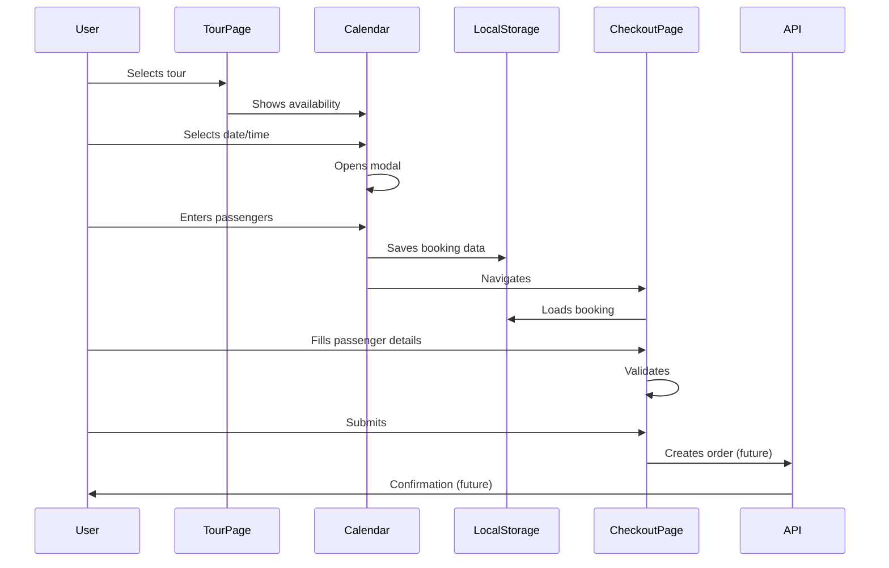
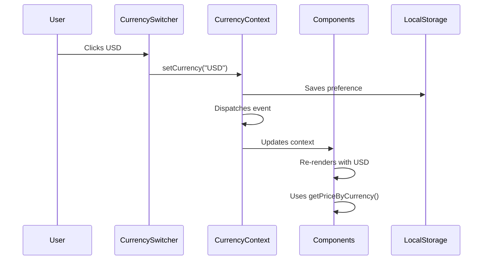

# Antartur Site - Technical Documentation

**Version:** 0.1.0  
**Last Updated:** November 2025  
**Authors:** Development Team

---

## Table of Contents

1. [Executive Summary](#executive-summary)
2. [Technology Stack](#technology-stack)
3. [Architecture Overview](#architecture-overview)
4. [Project Structure](#project-structure)
5. [Core Systems](#core-systems)
6. [Data Flow](#data-flow)
7. [Key Components](#key-components)
8. [State Management](#state-management)
9. [Styling Architecture](#styling-architecture)
10. [Performance Optimizations](#performance-optimizations)
11. [Security Considerations](#security-considerations)
12. [Development Workflow](#development-workflow)
13. [Deployment](#deployment)
14. [Testing](#testing)
15. [Known Limitations](#known-limitations)

---

## Executive Summary

Antartur is a modern booking website for tour experiences in Ushuaia, Tierra del Fuego, built with Next.js 15 and TypeScript. The site is currently in migration from a WordPress/Elementor stack to a fully custom Next.js implementation, focusing on performance, maintainability, and user experience.

**Current State:**
- **Lines of Code:** ~7,500 (88 TS/TSX files)
- **Tours Data:** 156KB JSON file (16 tours with full details)
- **Pages:** 15+ routes
- **Components:** 50+ reusable components
- **Build Target:** Static export with server-side capabilities

**Key Features:**
- Multi-currency support (ARS/USD)
- Interactive booking calendar with multiple time slots
- Dynamic tour pages with galleries and timelines
- Contact form with rate limiting
- Checkout flow with passenger management
- Responsive design (mobile-first)

---

## Technology Stack

### Core Framework
```json
{
  "next": "^15.0.3",
  "react": "^18.3.1",
  "react-dom": "^18.3.1",
  "typescript": "^5.6.3"
}
```

**Next.js 15 Features Used:**
- App Router (RSC - React Server Components)
- Server Actions
- Route Handlers for API endpoints
- Image Optimization (next/image)
- Built-in CSS support
- TypeScript integration

### Styling
```json
{
  "sass": "^1.80.4"
}
```

**Approach:**
- CSS Modules with Sass (`.module.scss`)
- Flexbox-first layout (avoiding Grid by design choice)
- BEM-inspired naming conventions
- Scoped component styles
- Global variables and mixins

### UI & Utilities
```json
{
  "lucide-react": "^0.468.0"
}
```

**Icons:** Lucide React (lightweight, tree-shakeable)

### Backend Utilities
```json
{
  "nodemailer": "^7.0.10",
  "rate-limiter-flexible": "^8.2.1",
  "react-google-recaptcha": "^3.1.0"
}
```

**Purpose:**
- `nodemailer`: Email sending for contact form
- `rate-limiter-flexible`: API rate limiting
- `react-google-recaptcha`: Bot protection

### Development Tools
```json
{
  "eslint": "^8.57.1",
  "eslint-config-next": "^15.0.3",
  "@types/node": "^22.7.5",
  "@types/react": "^18.3.5"
}
```

---

## Architecture Overview

### Architectural Pattern

The project follows a **Domain-Driven Design (DDD)** inspired architecture with clear separation of concerns:

```
┌─────────────────────────────────────────────────────────────┐
│                         Presentation Layer                   │
│  (src/app/* - Pages using App Router)                       │
└────────────────────┬────────────────────────────────────────┘
                     │
┌────────────────────▼────────────────────────────────────────┐
│                      Component Layer                         │
│  ┌──────────────────┬──────────────────┬─────────────────┐ │
│  │ Common UI        │ Layout Module    │ Content Module  │ │
│  │ (buttons, cards) │ (header, footer) │ (booking, tours)│ │
│  └──────────────────┴──────────────────┴─────────────────┘ │
└────────────────────┬────────────────────────────────────────┘
                     │
┌────────────────────▼────────────────────────────────────────┐
│                      Business Logic Layer                    │
│  ┌──────────────────┬──────────────────┬─────────────────┐ │
│  │ Contexts         │ Utils            │ Types           │ │
│  │ (currency state) │ (pricing format) │ (interfaces)    │ │
│  └──────────────────┴──────────────────┴─────────────────┘ │
└────────────────────┬────────────────────────────────────────┘
                     │
┌────────────────────▼────────────────────────────────────────┐
│                       Data Layer                             │
│  ┌──────────────────┬──────────────────┬─────────────────┐ │
│  │ Static JSON      │ LocalStorage     │ API Routes      │ │
│  │ (tour data)      │ (booking state)  │ (contact, etc)  │ │
│  └──────────────────┴──────────────────┴─────────────────┘ │
└─────────────────────────────────────────────────────────────┘
```

### Key Principles

1. **Server-First Architecture:**
   - Default to Server Components for better performance
   - Client Components only when necessary (`"use client"`)
   - Minimize client-side JavaScript bundle

2. **Type Safety:**
   - Strict TypeScript mode enabled
   - Comprehensive interface definitions
   - No `any` types (with rare exceptions)

3. **Component Isolation:**
   - Each component in its own directory
   - Co-located styles and types
   - Single Responsibility Principle

4. **Domain Segregation:**
   - `src/app/` - Routes and pages
   - `src/modules/` - Domain-specific features
   - `src/components/` - Generic UI components
   - `src/lib/` - Utilities and helpers

---

## Project Structure

```
src/
├── app/                          # Next.js App Router pages
│   ├── layout.tsx                # Root layout with providers
│   ├── page.tsx                  # Home page
│   ├── api/                      # API routes
│   │   └── contact/route.ts      # Contact form endpoint
│   ├── tours/
│   │   ├── page.tsx              # Tours listing
│   │   └── [id]/page.tsx         # Dynamic tour detail
│   ├── checkout/page.tsx         # Checkout flow
│   ├── invierno/page.tsx         # Winter tours
│   ├── verano/page.tsx           # Summer tours
│   ├── antartida/page.tsx        # Antarctica tours
│   ├── clima/page.tsx            # Weather info
│   ├── contacto/page.tsx         # Contact page
│   └── ushuaia/                  # Ushuaia info pages
│       ├── page.tsx
│       ├── gastronomia/page.tsx
│       └── hoteles/page.tsx
│
├── modules/                      # Domain-specific modules
│   ├── layout/                   # Layout components
│   │   └── components/
│   │       ├── Header/
│   │       └── Footer/
│   └── content/                  # Content & booking domain
│       └── components/
│           ├── Banner/
│           ├── Calendar/         # Booking calendar
│           ├── CheckoutForm/     # Checkout logic
│           ├── Hero/
│           ├── MiniCart/         # Cart sidebar
│           ├── ToursGrid/        # Tour listing
│           │   ├── TourCard.tsx
│           │   ├── toursData.json      # Basic tour data
│           │   ├── tourExample.json    # Full tour data (156KB)
│           │   ├── tourTypes.ts
│           │   └── tourFullData.ts
│           └── ... (20+ components)
│
├── components/                   # Generic UI components
│   ├── common/
│   │   ├── Button/
│   │   ├── Card/
│   │   ├── Input/
│   │   ├── Modal/
│   │   ├── Select/
│   │   ├── Message/
│   │   ├── Tooltip/
│   │   └── ... (15+ components)
│   └── icons/
│       └── Icon.tsx              # Icon wrapper for Lucide
│
├── contexts/                     # React Contexts
│   └── CurrencyContext.tsx       # Currency switching (ARS/USD)
│
├── lib/                          # Utilities and types
│   ├── types/
│   │   └── order.ts              # Booking/Order types
│   └── utils/
│       ├── priceFormat.ts        # Currency formatting
│       └── orderStorage.ts       # LocalStorage helpers
│
└── styles/                       # Global styles
    ├── globals.scss              # Global styles
    ├── _variables.scss           # Design tokens
    ├── _mixins.scss              # Sass mixins
    └── _fonts.scss               # Font declarations
```

### File Naming Conventions

- **Components:** PascalCase (e.g., `TourCard.tsx`)
- **Utilities:** camelCase (e.g., `priceFormat.ts`)
- **Styles:** `ComponentName.module.scss`
- **Types:** `types.ts` or `order.ts` (descriptive)
- **Pages:** `page.tsx` (Next.js convention)

---

## Core Systems

### 1. Booking System

**Location:** `src/modules/content/components/`

**Components:**
- `Calendar/` - Date and time slot selection
- `BannerBooking/` - Booking widget
- `CheckoutForm/` - Multi-step passenger form
- `MiniCart/` - Order summary sidebar
- `PaymentModal/` - Payment simulation

**Data Flow:**
```
Tour Page → Calendar → Select Date/Time → Modal (Passengers)
  → Save to localStorage → Navigate to Checkout
  → CheckoutForm (passenger details) → MiniCart (summary)
  → Submit → PaymentModal → Confirmation
```

**Key Features:**
- Multiple time slots per day
- Availability checking
- Passenger restrictions validation
- "Consulta" flow for exceeded capacity
- Currency-aware pricing

### 2. Currency System

**Location:** `src/contexts/CurrencyContext.tsx`

**Architecture:**
- Global React Context with localStorage persistence
- Supports ARS and USD
- Custom event system for cross-component updates
- SSR-safe with hydration handling

**Data Structure:**
```typescript
interface Pricing {
  currency: "ARS" | "USD";
  priceAdult: number;        // Always ARS value
  priceChild: number;        // Always ARS value
  priceAdultUSD?: number;    // Optional USD value
  priceChildUSD?: number;    // Optional USD value
}
```

**Critical Rule:** `priceAdult` and `priceChild` are ALWAYS in ARS and never modified. USD values are in separate fields.

### 3. Tour Data System

**Location:** `src/modules/content/components/ToursGrid/`

**Files:**
- `toursData.json` - Basic tour cards data (lightweight)
- `tourExample.json` - Full tour data (156KB, 16 tours)
- `tourTypes.ts` - TypeScript interfaces
- `tourFullData.ts` - Data access functions

**Data Structure:**
```typescript
interface Tour {
  card: TourCardData;           // Card preview
  hero: TourHero;               // Hero section
  quickInfo: TourQuickInfo;     // Pricing, duration, etc
  description: TourDescription;  // Long description
  featuredInfo?: FeaturedInfoItem[];  // Highlights
  gallery: GalleryImage[];      // Image gallery
  timeline: { items: TimelineItem[] };  // Itinerary
  testimonials?: Testimonial[];  // Reviews
  seo: SEOData;                 // Meta tags
  booking?: BookingData;        // Pricing & availability
}
```

### 4. Contact System

**Location:** `src/app/api/contact/route.ts`

**Features:**
- Server-side rate limiting (10 requests/hour per IP)
- reCAPTCHA v2 verification
- Email sending via Nodemailer
- Error handling and logging

**Security:**
- Rate limiting to prevent abuse
- CAPTCHA to prevent bots
- Input validation
- No sensitive data exposure

---

## Data Flow

### Booking Flow Detailed



### Currency Switch Flow



---

## Key Components

### Calendar Component

**File:** `src/modules/content/components/Calendar/Calendar.tsx`  
**Lines:** 529  
**Type:** Client Component

**Responsibilities:**
- Display monthly calendar with navigation
- Show available/disabled dates
- Support multiple time slots per day
- Handle passenger selection
- Calculate subtotal in correct currency
- Save booking to localStorage

**State:**
```typescript
const [currentDate, setCurrentDate] = useState(new Date());
const [selectedDate, setSelectedDate] = useState<string | null>(null);
const [selectedTimeSlot, setSelectedTimeSlot] = useState<TimeSlot | null>(null);
const [adults, setAdults] = useState(1);
const [children, setChildren] = useState(0);
```

**Props:**
```typescript
interface CalendarProps {
  tourId: string;
  tourTitle: string;
  availability: AvailabilityDate[];
  pricing: Pricing;
}
```

### MiniCart Component

**File:** `src/modules/content/components/MiniCart/MiniCart.tsx`  
**Lines:** 332  
**Type:** Client Component

**Responsibilities:**
- Display order summary
- Show payment method options (currency-aware)
- Calculate totals in correct currency
- Handle submit to checkout
- Manage payment method state

**Currency Logic:**
- Maintains full pricing object with ARS and USD values
- Uses `getPriceByCurrency()` for display calculations
- Auto-switches payment method based on currency

### CheckoutForm Component

**File:** `src/modules/content/components/CheckoutForm/CheckoutForm.tsx`  
**Type:** Client Component

**Responsibilities:**
- Multi-passenger form management
- Validation for each passenger
- Restriction checks (pregnancy, health)
- Billing information collection
- Dynamic passenger add/remove
- Submit order creation

**Validation Rules:**
- All fields required except optional ones
- Date of birth validation
- Restriction acknowledgment
- Email format validation

---

## State Management

### Global State (Context)

**Currency:**
- Managed by `CurrencyContext`
- Persisted in localStorage
- Synced across all components via custom events

**Booking:**
- Stored in localStorage as `pendingBooking`
- Loaded in Checkout page
- Cleared after order submission

### Local State (useState)

**Component-level:**
- Form inputs
- Modal visibility
- Loading states
- Validation errors

**Why not Redux/Zustand?**
- Minimal global state needs
- Context API sufficient for current scale
- Reduces bundle size
- Simpler architecture

---

## Styling Architecture

### CSS Modules Approach

**File Structure:**
```
ComponentName/
├── ComponentName.tsx
├── ComponentName.module.scss
└── index.ts (if needed)
```

**Naming Convention:**
```scss
.componentName {        // Component root
  .element {            // Child element
    &:hover { }         // Pseudo-states
    &.modifier { }      // BEM-style modifiers
  }
}
```

### Global Variables

**File:** `src/styles/_variables.scss`

```scss
// Colors
$primary: #007991;
$secondary: #439a86;
$tertiary: #bcd8c1;

// Typography
$font-family-base: var(--font-work-sans);
$font-size-base: 1rem;

// Spacing
$spacing-unit: 8px;

// Breakpoints
$breakpoint-mobile: 768px;
$breakpoint-tablet: 1024px;
$breakpoint-desktop: 1280px;
```

### Mixins

**File:** `src/styles/_mixins.scss`

```scss
@mixin mobile {
  @media (max-width: $breakpoint-mobile) {
    @content;
  }
}

@mixin tablet {
  @media (min-width: $breakpoint-mobile + 1) and (max-width: $breakpoint-tablet) {
    @content;
  }
}

@mixin desktop {
  @media (min-width: $breakpoint-tablet + 1) {
    @content;
  }
}
```

### Flexbox Strategy

**Why Flexbox over Grid?**
- Project rule: Prefer Flexbox
- Better browser support legacy
- Simpler mental model for team
- Sufficient for most layouts

**Common Patterns:**
```scss
// Horizontal center
.container {
  display: flex;
  justify-content: center;
  align-items: center;
}

// Responsive grid simulation
.grid {
  display: flex;
  flex-wrap: wrap;
  gap: 1rem;
  
  .item {
    flex: 1 1 calc(33.333% - 1rem);
    
    @include mobile {
      flex: 1 1 100%;
    }
  }
}
```

---

## Performance Optimizations

### Current Optimizations

1. **Server Components by Default:**
   - Most pages are Server Components
   - Reduces client-side JavaScript
   - Better initial load time

2. **Next.js Image Optimization:**
   - Configured formats: AVIF, WebP
   - Device-specific sizes
   - Lazy loading built-in

3. **Code Splitting:**
   - Automatic by Next.js App Router
   - Each route is a separate chunk
   - Dynamic imports for heavy components (when needed)

4. **Compression:**
   - Gzip compression enabled
   - Minimized HTML/CSS/JS in production

5. **Caching:**
   - Static assets cached (images, fonts)
   - Image cache TTL: 60 seconds minimum

### Configuration

**next.config.ts:**
```typescript
images: {
  formats: ["image/avif", "image/webp"],
  deviceSizes: [640, 750, 828, 1080, 1200, 1920, 2048, 3840],
  minimumCacheTTL: 60,
}
```

### Performance Metrics (Lighthouse)

**Note:** Run `npm run lighthouse` for current metrics.

---

## Security Considerations

### Current Security Measures

1. **Headers:**
   ```typescript
   X-DNS-Prefetch-Control: on
   X-Frame-Options: SAMEORIGIN
   X-Content-Type-Options: nosniff
   Referrer-Policy: origin-when-cross-origin
   ```

2. **Rate Limiting:**
   - Contact API: 10 requests/hour per IP
   - Implemented via `rate-limiter-flexible`

3. **reCAPTCHA:**
   - Contact form protected
   - Prevents automated submissions

4. **Input Validation:**
   - All form inputs validated
   - TypeScript type checking
   - Sanitization before API calls

5. **No Sensitive Data in Client:**
   - API keys in environment variables
   - Server-side processing only

### Security Gaps (To Address)

- **No authentication system** (needed for admin)
- **No CSRF protection** (add when API is live)
- **No SQL injection protection** (no database yet)
- **Payment security** (mock only, needs real integration)

---

## Development Workflow

### Setup

```bash
# Install Node 20 (use nvm)
nvm use 20

# Install dependencies
npm install

# Run development server
npm run dev

# Open http://localhost:3000
```

### Available Scripts

```bash
npm run dev       # Development server
npm run build     # Production build
npm run start     # Start production server
npm run lint      # ESLint check
npm run lighthouse # Performance audit
```

### Environment Variables

**Required:**
```env
# Contact form
SMTP_HOST=smtp.example.com
SMTP_PORT=587
SMTP_USER=user@example.com
SMTP_PASS=password
CONTACT_EMAIL=contact@antartur.com

# reCAPTCHA
NEXT_PUBLIC_RECAPTCHA_SITE_KEY=your-site-key
RECAPTCHA_SECRET_KEY=your-secret-key
```

### Code Quality

**ESLint Configuration:**
- Next.js recommended rules
- TypeScript strict mode
- React hooks rules

**TypeScript Configuration:**
```json
{
  "strict": true,
  "noEmit": true,
  "esModuleInterop": true,
  "moduleResolution": "bundler"
}
```

---

## Deployment

### Current Setup

**Platform:** (To be determined - likely Vercel)

**Build Output:**
```bash
npm run build
# Generates .next/ folder
# Optimized for Node.js server or static export
```

### Deployment Checklist

- [ ] Set environment variables
- [ ] Configure custom domain
- [ ] Set up SSL certificate
- [ ] Configure CDN for images
- [ ] Set up monitoring (Vercel Analytics, Sentry, etc.)
- [ ] Configure error tracking
- [ ] Set up backup strategy

### CI/CD

**Recommended:**
- GitHub Actions for automated testing
- Automatic deployment on merge to main
- Preview deployments for PRs

---

## Testing

### Current State

**❌ No tests implemented yet**

### Recommended Testing Strategy

1. **Unit Tests (Jest + React Testing Library):**
   - Utility functions (`priceFormat.ts`)
   - Pure components
   - Type guards and validators

2. **Integration Tests:**
   - Booking flow
   - Currency switching
   - Form submissions

3. **E2E Tests (Playwright):**
   - Complete booking flow
   - Contact form submission
   - Navigation and routing

4. **Visual Regression (Chromatic):**
   - Component appearance consistency
   - Responsive design validation

---

## Known Limitations

### Technical Debt

1. **No Database:**
   - Tours stored in 156KB JSON file
   - Availability not real-time
   - No order persistence

2. **Mock Payment:**
   - PaymentModal is simulation only
   - No real payment processing

3. **No Authentication:**
   - No admin area
   - No user accounts
   - No order history

4. **Limited Booking Logic:**
   - Availability stored statically
   - No conflict resolution
   - No capacity management

5. **No Tests:**
   - No unit tests
   - No integration tests
   - No E2E coverage

6. **Large JSON Bundle:**
   - 156KB tour data loaded on every page
   - Should be split or fetched on-demand

7. **Console Logs:**
   - Many debug logs in production
   - Should be removed or gated

### Performance Issues

1. **Bundle Size:**
   - Tour data adds significant weight
   - All tours loaded upfront

2. **Image Optimization:**
   - Not using next/image everywhere
   - Manual `` tags in places

3. **No Code Splitting:**
   - Heavy components not lazy-loaded
   - Could split Calendar and CheckoutForm

### UX/UI Issues

1. **No Loading States:**
   - Some async operations lack loaders

2. **Error Handling:**
   - Limited error messages
   - No retry mechanisms

3. **Accessibility:**
   - Not fully WCAG compliant
   - Needs ARIA improvements

---

## Next Steps

### Immediate Priorities

1. **Database Integration:**
   - Move tour data to database
   - Implement real availability management
   - Add order persistence

2. **API Development:**
   - Create backend API (see API proposals doc)
   - Replace static data with API calls
   - Implement CRUD operations

3. **Authentication:**
   - Add admin authentication
   - Implement user accounts (optional)
   - Secure admin routes

4. **Payment Integration:**
   - Integrate real payment providers
   - Implement PayPal SDK
   - Add Payway integration

5. **Testing:**
   - Set up testing framework
   - Write critical path tests
   - Add E2E coverage

### Medium Term

- Image optimization improvements
- Code splitting for heavy components
- Performance monitoring
- Error tracking setup
- Backup and disaster recovery

### Long Term

- Multi-language support
- Mobile app (React Native)
- Advanced analytics
- CRM integration
- Email automation

---

## Appendix

### Dependencies Justification

- **Next.js 15:** Latest features, best performance
- **TypeScript:** Type safety, better DX
- **Sass:** More powerful than plain CSS, team familiarity
- **Lucide React:** Lightweight icons, tree-shakeable
- **Nodemailer:** Industry standard for Node.js email
- **Rate Limiter Flexible:** Flexible, well-maintained
- **reCAPTCHA:** Google's standard bot protection

### Resources

- [Next.js Documentation](https://nextjs.org/docs)
- [React Documentation](https://react.dev)
- [TypeScript Handbook](https://www.typescriptlang.org/docs/)
- [CSS Modules](https://github.com/css-modules/css-modules)

---

**Document Version:** 1.0  
**Maintainers:** Development Team  
**Last Review:** November 2025

